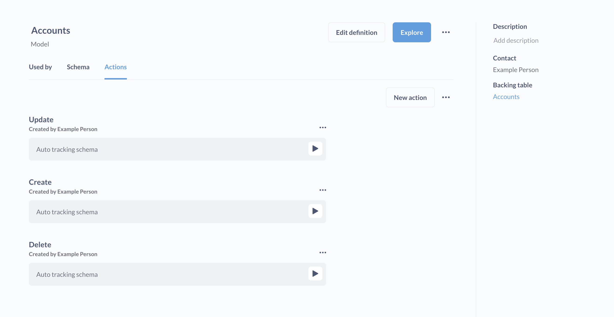
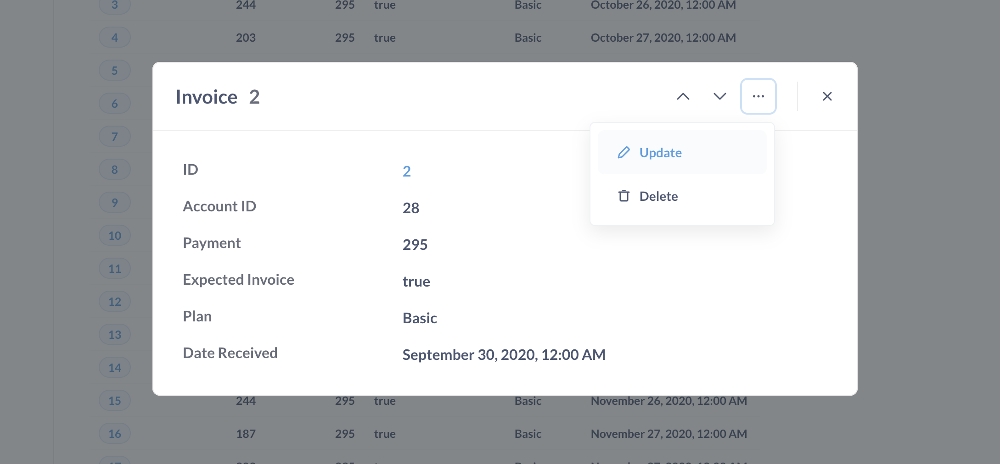

# Grundlegende Aktionen

Grundlegende Aktionen sind "implizite" [Aktionen](./introduction.md), die Dinge tun, die man typischerweise tun möchte, wenn man mit einer Datenbank interagiert: Erstellen, Aktualisieren, Löschen. Grundlegende Aktionen verfolgen automatisch das Schema der Quelltabelle, die dem Modell zugrunde liegt. Mit der automatischen Verfolgung des Schemas ist gemeint, dass Metabase Aktionsformulare zum Ausfüllen erstellt, die alle Felder der primären Quelltabelle enthalten, die diesem Modell zugrunde liegt.

Wenn Sie den Benutzern nur die Möglichkeit geben wollen, eine Teilmenge von Spalten zu aktualisieren, oder Spalten in mehreren Tabellen zu aktualisieren, können Sie eine [custom action](./custom.md) schreiben.

## Erstellen einfacher Aktionen

Sobald Aktionen aktiviert sind, können Sie grundlegende Aktionen für ein neues oder bestehendes [Modell](../data-modeling/models.md) erstellen, das nur eine einzige Datenbanktabelle umschließt.

1. Wählen Sie ein Modell aus und klicken Sie auf die Schaltfläche **Info** und dann auf **Modelldetails**.
2. Klicken Sie auf der Modelldetailseite auf die Registerkarte **Aktionen**.
3. Klicken Sie auf das Symbol **...** neben **Neue Aktion** und wählen Sie **Grundlegende Aktionen erstellen**.

### Einschränkungen für Basis-Aktionen

Basisaktionen sind nur für "einfache" Modelle verfügbar:

- Modelle, die mit dem grafischen Query Builder erstellt wurden. Für Modelle, die mit nativen Abfragen (SQL) erstellt wurden, sind keine grundlegenden Aktionen verfügbar.
- Das Modell muss eine einzelne Rohtabelle in einer Datenbank "verpacken". Die Abfrage sollte einfach diese Tabelle im Datenschritt des Notizbuch-Editors auswählen und nichts weiter: keine Verknüpfungen, keine benutzerdefinierten Spalten, keine Filter oder Zusammenfassungen, keine Sortierung.
- Die zugrundeliegende Tabelle kann nur einen Primärschlüssel (Entitätsschlüssel) haben.

## Grundlegende Aktionstypen

Grundlegende Aktionen umfassen:

- [Aktualisieren](#update)
- [Löschen](#delete)
- [Erstellen](#create)

### Aktualisieren

Die Aktualisierungsaktion zeigt den Personen ein Formular mit bearbeitbaren Feldern für jede Spalte in der Primärquellentabelle an.

Wenn Sie eine Aktualisierungsaktion auf einem Dashboard einrichten, müssen Sie einen Entitätsschlüssel (z. B. eine ID) aus einem Dashboardfilter an die Aktion übergeben. Für andere Werte können Sie entweder die Person auffordern, einen Wert für jedes Feld einzugeben, oder ein Feld automatisch über Parameter ausfüllen lassen (z. B. über Werte, die in Dashboard-Filtern festgelegt wurden).

### Löschen

Die Aktion "Löschen" erstellt ein Formular, das zur Eingabe eines Entitätsschlüssels auffordert, und löscht den dieser ID entsprechenden Datensatz (Zeile) in der dem Modell zugrunde liegenden Tabelle.

### Erstellen

Die Aktion "Erstellen" ist die Aktion "INSERT INTO". Mit der Aktion "Erstellen" wird ein Formular mit bearbeitbaren Feldern für jede Spalte in der primären Quelltabelle, die dem Modell zugrunde liegt, angezeigt. Nach dem Ausfüllen fügt die Aktion den Datensatz in die primäre Tabelle ein, die dem Modell zugrunde liegt.

## Grundlegende Aktionen auf Dashboards

Beim Einrichten von Aktionen auf einer Eigenschaftenleiste können Sie entweder die Person auffordern, einen Wert für jedes Feld einzugeben, oder Sie können ein Feld automatisch über Parameter ausfüllen lassen (z. B. über Werte, die in Dashboard-Filtern festgelegt wurden).

Bei der Basisaktion Aktualisieren müssen Sie einen Wert für den Entitätsschlüssel übergeben.

Siehe [Aktionen in Dashboards](../dashboards/actions.md).

## Archivierung von Basisaktionen

Da die Basisaktionen aus Magie bestehen, können Sie sie nicht archivieren. Sie können sie nur ein- oder ausschalten. Klicken Sie auf der Modell-Detailseite neben der Schaltfläche **Neue Aktion** auf das Menü **...** und dann auf **Grundlegende Aktionen deaktivieren**.

## Grundlegende Aktionen aus der Objekt-Detailansicht

Wenn Sie grundlegende Aktionen für ein Modell aktiviert haben, können Sie auf einen einzelnen Datensatz klicken, um dessen Objektdetails anzuzeigen. In diesem Objektdetailmodell können Sie auf die Ellipsen(**...**) klicken und "Aktualisieren" oder "Löschen" wählen, um den betreffenden Datensatz zu ändern.

## Weitere Lektüre

- [Einführung in Aktionen](./introduction.md)
- [Benutzerdefinierte Aktionen](./custom.md)
- [Aktionen in Dashboards](../dashboards/actions.md)---
Titel: Grundlegende Aktionen
---

# Grundlegende Aktionen

Grundlegende Aktionen sind "implizite" [Aktionen](./introduction.md), die Dinge tun, die man typischerweise tun möchte, wenn man mit einer Datenbank interagiert: Erstellen, Aktualisieren, Löschen. Grundlegende Aktionen verfolgen automatisch das Schema der Quelltabelle, die dem Modell zugrunde liegt. Mit der automatischen Verfolgung des Schemas ist gemeint, dass Metabase Aktionsformulare zum Ausfüllen erstellt, die alle Felder der primären Quelltabelle enthalten, die diesem Modell zugrunde liegt.

Wenn Sie den Benutzern nur die Möglichkeit geben wollen, eine Teilmenge von Spalten zu aktualisieren, oder Spalten in mehreren Tabellen zu aktualisieren, können Sie eine [custom action](./custom.md) schreiben.

## Erstellen einfacher Aktionen

Sobald Aktionen aktiviert sind, können Sie grundlegende Aktionen für ein neues oder bestehendes [Modell](../data-modeling/models.md) erstellen, das nur eine einzige Datenbanktabelle umschließt.

1. Wählen Sie ein Modell aus und klicken Sie auf die Schaltfläche **Info** und dann auf **Modelldetails**.
2. Klicken Sie auf der Modelldetailseite auf die Registerkarte **Aktionen**.
3. Klicken Sie auf das Symbol **...** neben **Neue Aktion** und wählen Sie **Grundlegende Aktionen erstellen**.

### Einschränkungen für Basis-Aktionen

Basisaktionen sind nur für "einfache" Modelle verfügbar:

-  Modelle, die mit dem grafischen Query Builder erstellt wurden. Für Modelle, die mit nativen Abfragen (SQL) erstellt wurden, sind keine grundlegenden Aktionen verfügbar.
-  Das Modell muss eine einzelne Rohtabelle in einer Datenbank "verpacken". Die Abfrage sollte einfach diese Tabelle im Datenschritt des Notizbuch-Editors auswählen und nichts weiter: keine Verknüpfungen, keine benutzerdefinierten Spalten, keine Filter oder Zusammenfassungen, keine Sortierung.
-  Die zugrundeliegende Tabelle kann nur einen Primärschlüssel (Entitätsschlüssel) haben.

## Grundlegende Aktionstypen

Grundlegende Aktionen umfassen:

- [Aktualisieren](#update)
- [Löschen](#delete)
- [Erstellen](#create)

### Aktualisieren

Die Aktualisierungsaktion zeigt den Personen ein Formular mit bearbeitbaren Feldern für jede Spalte in der Primärquellentabelle an.

Wenn Sie eine Aktualisierungsaktion auf einem Dashboard einrichten, müssen Sie einen Entitätsschlüssel (z. B. eine ID) aus einem Dashboardfilter an die Aktion übergeben. Für andere Werte können Sie entweder die Person auffordern, einen Wert für jedes Feld einzugeben, oder ein Feld automatisch über Parameter ausfüllen lassen (z. B. über Werte, die in Dashboard-Filtern festgelegt wurden).

### Löschen

Die Aktion "Löschen" erstellt ein Formular, das zur Eingabe eines Entitätsschlüssels auffordert, und löscht den dieser ID entsprechenden Datensatz (Zeile) in der dem Modell zugrunde liegenden Tabelle.

### Erstellen

Die Aktion "Erstellen" ist die Aktion "INSERT INTO". Mit der Aktion "Erstellen" wird ein Formular mit bearbeitbaren Feldern für jede Spalte in der primären Quelltabelle, die dem Modell zugrunde liegt, angezeigt. Nach dem Ausfüllen fügt die Aktion den Datensatz in die primäre Tabelle ein, die dem Modell zugrunde liegt.

## Grundlegende Aktionen auf Dashboards

Beim Einrichten von Aktionen auf einer Eigenschaftenleiste können Sie entweder die Person auffordern, einen Wert für jedes Feld einzugeben, oder Sie können ein Feld automatisch über Parameter ausfüllen lassen (z. B. über Werte, die in Dashboard-Filtern festgelegt wurden).

Bei der Basisaktion Aktualisieren müssen Sie einen Wert für den Entitätsschlüssel übergeben.

Siehe [Aktionen in Dashboards](../dashboards/actions.md).

## Archivierung von Basisaktionen

Da die Basisaktionen aus Magie bestehen, können Sie sie nicht archivieren. Sie können sie nur ein- oder ausschalten. Klicken Sie auf der Modell-Detailseite neben der Schaltfläche **Neue Aktion** auf das Menü **...** und dann auf **Grundlegende Aktionen deaktivieren**.

## Grundlegende Aktionen aus der Objekt-Detailansicht

Wenn Sie grundlegende Aktionen für ein Modell aktiviert haben, können Sie auf einen einzelnen Datensatz klicken, um dessen Objektdetails anzuzeigen. In diesem Objektdetailmodell können Sie auf die Ellipsen(**...**) klicken und "Aktualisieren" oder "Löschen" wählen, um den betreffenden Datensatz zu ändern.

## Weitere Lektüre

- [Einführung in Aktionen](./introduction.md)
- [Benutzerdefinierte Aktionen](./custom.md)
- [Aktionen in Dashboards](../dashboards/actions.md)
