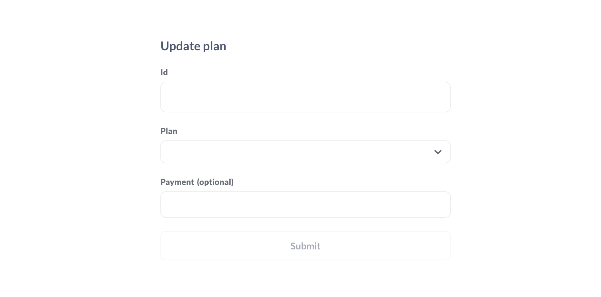

---
# Benutzerdefinierte Aktionen


Schreiben Sie SQL, um Datensätze in Ihren Datenbanken zu aktualisieren.


## Erstellen einer benutzerdefinierten Aktion


> Um eine Aktion zu erstellen, müssen Sie einer Gruppe angehören, die Zugriff auf die Bearbeitung von nativen Abfragen hat.


Es gibt zwei Möglichkeiten, eine benutzerdefinierte Aktion zu erstellen:


Über die Befehlspalette:


1. Drücken Sie Befehl-K (Mac) oder ctrl-K (Windows), um die Befehlspalette zu öffnen.
2. Suchen Sie nach **Neue Aktion**.


Von einem Modell aus:


1. Zunächst [ein Modell erstellen](../data-modeling/models.md).
2. Besuchen Sie das Modell und klicken Sie auf die Schaltfläche **Info**.
3. Klicken Sie auf die Registerkarte **Aktionen**.


Im Aktionseditor können Sie Ihren eigenen Code schreiben, um eine Aktion zu erstellen, z. B. eine Aktion, die nur eine Teilmenge der Spalten in einer Tabelle aktualisiert. Siehe [Beispiel-Aktionen](#example-custom-actions).


## Feldtypen für Aktionsvariablen


Für jede {{ variable }}, die Sie in einer Aktion setzen, müssen Sie den Feldtyp festlegen.


Jeder dieser variablen Feldtypen bietet unterschiedliche Optionen. Klicken Sie auf das Zahnradsymbol, um die Optionen zu ändern.


Wenn Sie keine Variable benötigen, können Sie optional einen Standardwert angeben, den die Metabase verwenden soll, wenn das Feld nicht ausgefüllt wird. Denken Sie daran, im SQL-Code alle optionalen Variablen und Kommas in Klammern einzuschließen, z. B. `[[, column = {{ optional_variable }}]] `.


Sie können Platzhaltertext für alle Felder im Aktionsformular einfügen.


**Text**


- Text
- Langer Text
- Dropdown
- Inline auswählen


**Nummer**


- Nummer
- Dropdown
- Inline auswählen


**Datum**


- Datum
- Datum + Uhrzeit


Sowohl für **Dropdown** als auch für **Inline select** können Sie eine Liste von Optionen angeben, die auf dem Formular angezeigt werden sollen, wobei jede Option in einer eigenen Zeile steht.


## Erscheinungsbild



### Beispiel ` INSERT` Aktion


Einfügeanweisungen sind ziemlich einfach:


```sql

INSERT INTO rechnungen (
konto_id
,Zahlung
,expected_invoice
,plan
,Datum_erhalten
)
VALUES (
{{ account_id }}
,{{ payment }}
,CAST ({{erwartete_Rechnung}} AS boolean)
,{{plan}}
,({{date_received}}
);

```


### Casting von Feldwerten in Aktionen


Wenn Sie beim Absenden eines Formulars einen Typfehler erhalten, müssen Sie möglicherweise den Datentyp in der Abfrage soumwandeln, dass er mit dem Datentyp des Zielfelds in der Datenbank übereinstimmt. Hier wandeln wir einen Wert in einen "booleschen" Wert um:


``sql

UPDATE Rechnungen
SET erwartete_Rechnung = CAST({{erwartete_Rechnung}} AS boolean)
WHERE id = {{id}};

```


### Bezugnahme auf gespeicherte Fragen in Aktionen


Sie können auch in Aktionen auf gespeicherte Fragen verweisen. Hier nehmen wir die Ergebnisse einer SELECT-Anweisung auf eine gespeicherte Frage ( "Potenzielle Kunden") und fügen die Ergebnisse in eine Tabelle "people_to_write" ein.


``sql

WITH prospects AS {{#6-potenzielle-Kunden}}


INSERT INTO
people_to_write (
vor_name
,nachname
,E-Mail
)
SELECT
vor_name
,nachname
,E-Mail
FROM Interessenten;

```


## Weitere Lektüre


- [Einführung in Aktionen](./introduction.md)
- [Grundlegende Aktionen](./basic.md)
- [Aktionen in Dashboards](../dashboards/actions.md)
