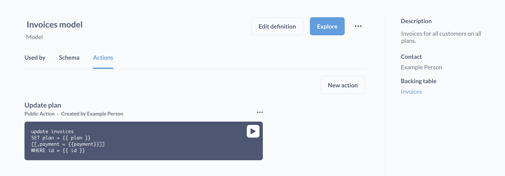
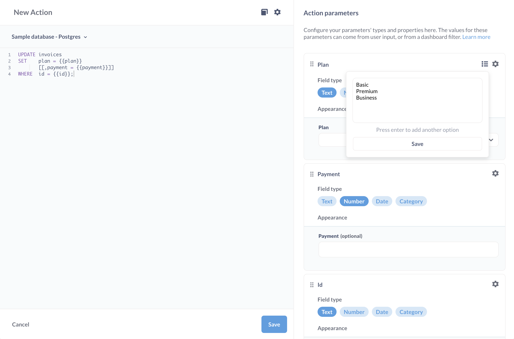

# Benutzerdefinierte Aktionen

Schreiben Sie SQL, um Datensätze in Ihren Datenbanken zu aktualisieren.

## Erstellen einer benutzerdefinierten Aktion

> Sie müssen einer Gruppe angehören, die Zugriff auf die Bearbeitung von nativen Abfragen hat, um eine Aktion zu erstellen.

Es gibt zwei Möglichkeiten, eine benutzerdefinierte Aktion zu erstellen:

Über die Befehlspalette:

1. Drücken Sie Befehl-K (Mac) oder ctrl-K (Windows), um die Befehlspalette zu öffnen.
2. Suchen Sie nach **Neue Aktion**.

Von einem Modell aus:

1. Zuerst [ein Modell erstellen](../data-modeling/models.md).
2. Besuchen Sie das Modell und klicken Sie auf die Schaltfläche **Info**.
3. Klicken Sie auf die Registerkarte **Aktionen**.

Im Aktionseditor können Sie Ihren eigenen Code schreiben, um eine Aktion zu erstellen, z. B. eine Aktion, die nur eine Teilmenge der Spalten in einer Tabelle aktualisiert. Siehe [Beispiel-Aktionen](#example-custom-actions).

## Feldtypen für Aktionsvariablen

Für jede {{ variable }}, die Sie in einer Aktion setzen, müssen Sie den Feldtyp festlegen.

Jeder dieser variablen Feldtypen bietet unterschiedliche Optionen. Klicken Sie auf das Zahnradsymbol, um die Optionen zu ändern.

Wenn Sie keine Variable benötigen, können Sie optional einen Standardwert angeben, den die Metabase verwenden soll, wenn das Feld nicht ausgefüllt wird. Denken Sie daran, im SQL-Code alle optionalen Variablen und Kommas in Klammern einzuschließen, z. B. `[[, column = {{ optional_variable }}]] `.

Sie können Platzhaltertext für alle Felder im Aktionsformular einfügen.

**Text**

- Text
- Langer Text
- Dropdown
- Inline auswählen

**Nummer**

- Nummer
- Dropdown
- Inline auswählen

**Datum**

- Datum
- Datum + Uhrzeit

Sowohl für **Dropdown** als auch für **Inline select** können Sie eine Liste von Optionen angeben, die auf dem Formular angezeigt werden sollen, wobei jede Option in einer eigenen Zeile steht.

## Erscheinungsbild

Auf der Registerkarte Erscheinungsbild im Aktionseditor-Modal wird eine Vorschau des Formularelements der Variablen angezeigt. In der Abbildung unten haben wir auf das **Zahnrad** der Variable geklickt und die Variable so eingestellt, dass sie eine Text > Dropdown-Liste verwendet. Der Abschnitt "Erscheinungsbild" bietet eine Vorschau darauf, wie das Formularelement aussehen würde:
