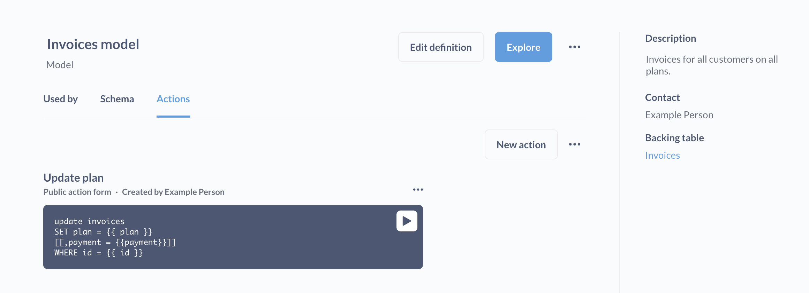

# Einführung in Aktionen

> Im Moment sind Aktionen nur für PostgreSQL und MySQL verfügbar.

## Was sind Aktionen?

**Aktionen** sind Entitäten in der Metabase, mit denen Sie benutzerdefinierte Formulare und Geschäftslogik erstellen können.

Mit Aktionen können Sie parametrisierte SQL schreiben, die in Ihre Datenbank zurückgeschrieben werden. Aktionen können an beigefügt werden [Knöpfe auf Dashboards](../dashboards/actions.md) So erstellen Sie benutzerdefinierte Workflows. Sie können sogar die parametrisierten Formulare, die Aktionen generieren, um Daten zu erstellen, öffentlich weitergeben.

Hier sind ein paar Ideen für das, was Sie mit Handlungen tun können:

- Markieren Sie den Kunden, den Sie in einem Dashboard als VIP anzeigen.
- Lassen Sie die Teammitglieder redundante Daten entfernen.
- Erstellen Sie ein Kundenfeedback -Formular und setzen Sie es in Ihre Website ein.

Aktionen müssen zu einem hinzugefügt werden [Modell](../data-modeling/models.md), aber Aktionen werden nur auf den Rohtabellen ausgeführt, die diese Modelle zurückerhalten (damit Aktionen niemals Ihre bearbeiten [Modelldefinition](../data-modeling/models.md#edit-a-models-query)).

## Aktivitäten für eine Datenbank aktivieren

Damit Aktionen arbeiten können, müssen Sie zunächst die folgenden zwei Dinge ausführen:

1. **Aktivieren Sie Modellaktionen für die Datenbankverbindung**. Um Aktionen für eine Datenbankverbindung zu aktivieren, sollten Administratoren auf die klicken **Passage** Symbol im oberen rechten und navigieren Sie zu **Admin -Einstellungen** > **Datenbanken**Klicken Sie dann auf die Datenbank, für die Sie Aktionen erstellen möchten. Schalten Sie die rechte Seite des Anschlusseinstellungsformulars um **Modellaktionen** Option. Damit Aktionen arbeiten können, muss das Datenbank -Benutzerkonto (das Konto, mit dem Sie eine Verbindung zur Datenbank herstellen) haben müssen [Berechtigungen schreiben](../databases/users-roles-privileges.md#privileges-to-enable-actions). Und vorerst werden Aktionen nur in Postgresql- und MySQL -Datenbanken unterstützt.
2. **Erstellen Sie mindestens ein Modell aus dieser Datenbank.** Aktionen sind Modellen zugeordnet, sodass Sie mindestens ein Modell erstellt (oder haben), bevor Sie Aktionen erstellen können.

## Wer kann Aktionen verwenden

- **Eine Aktion erstellen oder bearbeiten**, eine Person muss in einer Gruppe mit sein [Einheimische Abfragebearbeitung](../permissions/data.md) Privilegien für die entsprechende Datenbank.
- **Eine Aktion durchführen**Sie benötigen lediglich, dass Sie den Zugriff auf das Modell oder das Dashboard der Aktion (oder einen Link zu einer öffentlichen Aktion) anzeigen.

## Arten von Aktionen

Es gibt zwei Arten von Aktionen:

- [Basic](./basic.md)
- [Brauch](./custom.md)

## Ausführung von Aktionen

Es gibt mehrere Möglichkeiten, Aktionen auszuführen:

- [Auf der Seite Modelldetails](../data-modeling/models.md#model-details) durch Klicken auf die **laufen** Schmecken.
- Von a [öffentliche Form](./custom.md#make-public) einer Handlung.
- Von a [Taste auf dem Armaturenbrett](../dashboards/actions.md).

## Aktionen ändern Daten in Tabellen, die die Modelle beeinflussen

Nur etwas zu klären: Aktionen, obwohl sie zu Modellen hinzugefügt werden, nehmen Sie ihre Änderungen an der zugrunde liegenden Tabelle vor, die ein Modell abfragt. Dies bedeutet, dass jeder, der Zugang zur zugrunde liegenden Tabelle hat, oder auf Fragen oder andere Modelle, die auf dieser Tabelle basieren, die Auswirkungen einer Aktion erkennen können. Andere Tools als Metabase, die mit dieser Datenbank verbunden sind, werden diese Änderungen ebenfalls aufnehmen.

In diesem Sinne sind Modelle Container für Aktionen; Modelle sind eine Möglichkeit, Aktionen zu organisieren. In der Tat könnten Sie (theoretisch) a hinzufügen [benutzerdefinierte Aktion](./custom.md) zu einem Modell, das einige Aktualisierungen durchführt, die nicht mit den Daten seines Modells zu tun haben. Zum Beispiel können Sie eine benutzerdefinierte Aktion schreiben, die die aktualisiert `Konten` Tabelle und fügen Sie diese Aktion einem Modell hinzu, das nur eine nicht verwandte Tabelle abfragt (z. B. die `Bestellungen` Tisch). Aber wissen Sie, dass Sie das vielleicht nicht tun (es sei denn, Sie haben einen wirklich guten Grund). [Grundlegende Aktionen](./basic.md)jedoch aSeien Sie nur für Modelle verfügbar, die eine einzelne Rohtabelle einwickeln.

Bevor Sie in der Produktion von Aktionen in der Produktion verwendet werden, sollten Sie mit Aktionen in einigen Beispieldaten (z.

## Action Gotchas

- Wenn das zwischengegebene Tabelle oder Modell zwischengespeichert wird, sehen Sie möglicherweise erst die Auswirkungen einer Aktion in der Metabase, bis die Metabase die Daten aktualisiert (obwohl Sie die Daten jederzeit manuell aktualisieren können).
- Beim Erstellen von Datensätzen in einer Tabelle, in der ein automatisch generierter Primärschlüssel fehlt, müssen Sie eine verfügbare ID eingeben (d. H. Eine ID, die nicht bereits von einem anderen Datensatz verwendet wird).
- Sie können Aktionen nicht "rückgängig". Sie können jedoch eine Aktion erstellen und ausführen, um einen gelöschten Datensatz neu zu erstellen oder einen aktualisierten Datensatz wieder in die ursprünglichen Werte zu ändern (vorausgesetzt, Sie kennen die ursprünglichen Werte).
- Aktionen sind für öffentliche Dashboards und Dashboards in nicht verfügbar [statische Einbettungen](../embedding/static-embedding.md).

## Weitere Lesen

- [Grundlegende Aktionen](./basic.md)
- [Benutzerdefinierte Aktionen](./custom.md)
- [Aktionen in Dashboards](../dashboards/actions.md)
