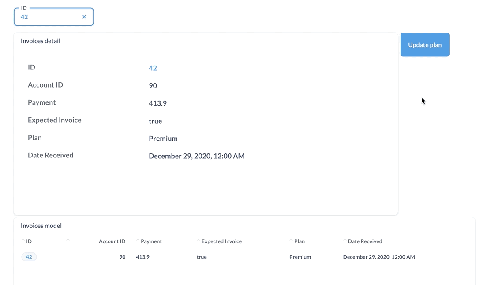

# Aktionen Übersicht

Mit Aktionen können Sie parametrisierte SQL schreiben, die dann an Schaltflächen, Klicks oder sogar auf der Seite als Formularelemente hinzugefügt werden können.

## [Einführung in Aktionen ](./introduction.md)

Verwenden Sie Aktionen, um Ihre Daten basierend auf Benutzereingaben oder Werten auf der Seite zu aktualisieren.

## [Grundlegende Aktionen](./basic.md)

Metabase erzeugt grundlegende Aktionen, die das Schema eines Modells automatisch übertragen.

## [Benutzerdefinierte Aktionen](./custom.md)

Schreiben Sie SQL, um neue Aktionen zu erstellen.

## [Aktionen auf Dashboards](../dashboards/actions.md)

Fügen Sie Aktionen auf Dashboards als Tasten hinzu, an die Sie Filterwerte übergeben können.
