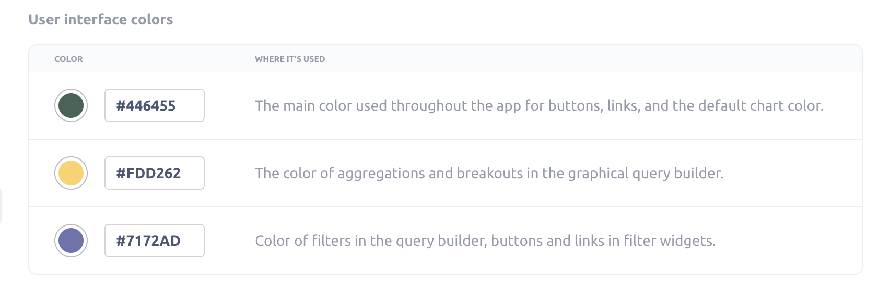
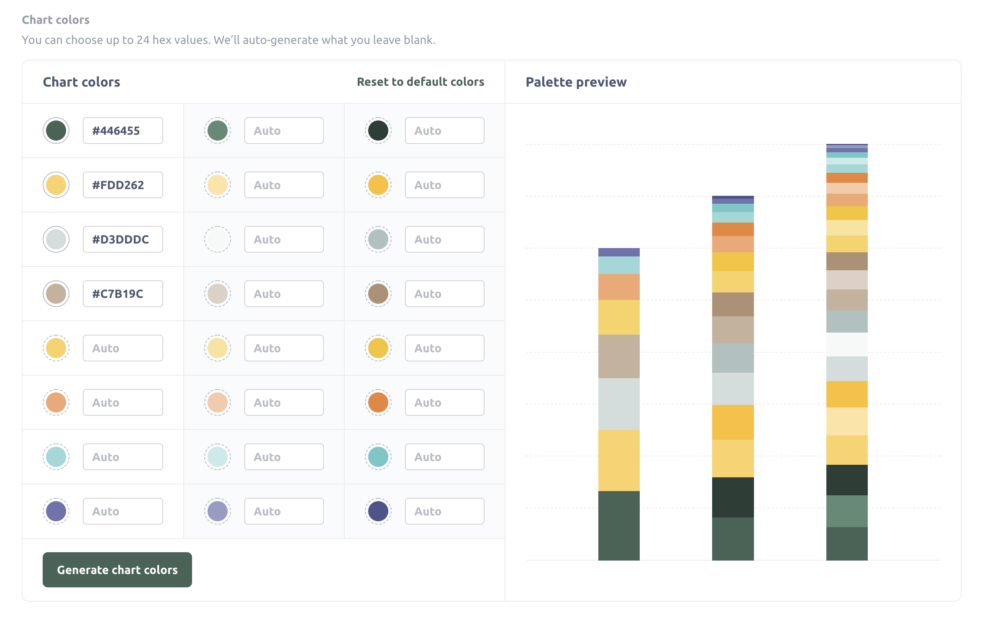
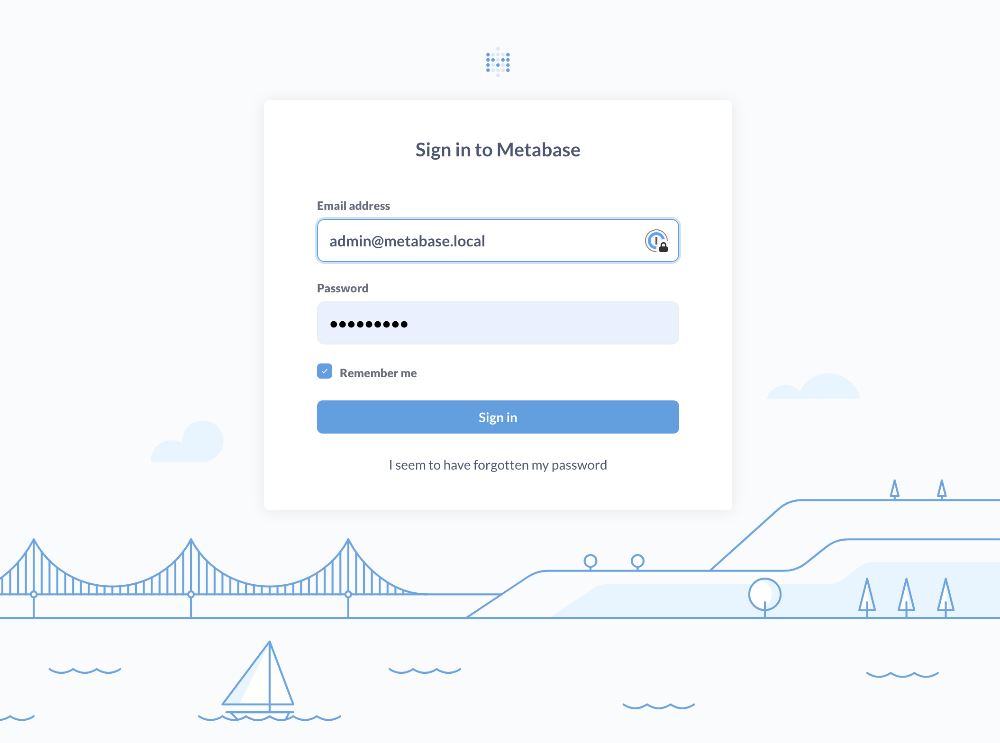

# Erscheinungsbild



Mit den Einstellungen für das Erscheinungsbild können Administratoren Metabase an das Branding Ihres Unternehmens anpassen.

Wenn Sie nach Formatierungen für Datum, Uhrzeit, Zahlen oder Währungen suchen, lesen Sie [Formatierungsstandards](../data-modeling/formatting.md).

## Ändern des Erscheinungsbilds von Metabase

Drücken Sie cmd/ctrl + k, um die Befehlspalette aufzurufen, suchen Sie nach „Erscheinungsbild“ und klicken Sie auf „Einstellungen“ -> „Erscheinungsbild“.

Sie können auch auf das Zahnradsymbol unten in der Navigationsleiste klicken und dann auf „Admin-Einstellungen“ > „Einstellungen“ > „Darstellung“ klicken.

Die Darstellungseinstellungen sind auf verschiedene Registerkarten verteilt:

- [Branding](#branding)
- [Metabase ausblenden](#conceal-metabase)

## Branding

Auf der Registerkarte „Branding“ können Sie Metabase an das Erscheinungsbild und den Tonfall Ihrer Marke anpassen.

- [Farbpalette](#color-palette)
- [Farben der Benutzeroberfläche](#user-interface-colors)
- [Diagrammfarben](#chart-colors)
- [Logo](#logo)
- [Schriftart](#font)
- [Lademeldung](#loading-message)
- [Favicon](#favicon)

## Farbpalette

Sie können die Farben sowohl in der Benutzeroberfläche der Anwendung als auch in den Metabase-Diagrammen anpassen.

### Farben der Benutzeroberfläche

Sie können die Farben anpassen, die Metabase in der gesamten App verwendet:

- **Erste Farbe:** Die Hauptfarbe, die in der gesamten App für Schaltflächen, Links und die Standardfarbe der Diagramme verwendet wird.
- **Zweite Farbe:** Die Farbe der Aggregationen und Aufschlüsselungen im grafischen Abfrage-Builder.
- **Dritte Farbe:** Farbe der Filter im Abfrage-Generator, der Schaltflächen und Links in Filter-Widgets.

### Diagrammfarben

Sie können bis zu 24 Hex-Werte auswählen. Wenn Sie weniger als 24 Farben auswählen, generiert Metabase automatisch Farben, um die restlichen Werte zu füllen. Sie müssen die Farben hier nicht in einer bestimmten Reihenfolge anordnen, da diese Reihenfolge nicht für die Reihenfolge der Farben in den Diagrammen gilt. Beim Erstellen eines Diagramms wählt Metabase Farben aus, damit die einzelnen Serien leicht zu unterscheiden sind.

Benutzerdefinierte Farben sind nicht verfügbar für:

- [Zahldiagramme](../questions/visualizations/numbers.md)
- [Trenddiagramme](../questions/visualizations/trend.md)
- [Trichterdiagramme](../questions/visualizations/funnel.md)
- Bedingte Formatierung ([Tabellen](../questions/visualizations/table.md) und [Pivot-Tabellen](../questions/visualizations/pivot-table.md))
- [Karten](../questions/visualizations/map.md)

## Logo

Sie können das bekannte, geschmackvolle, inspirierte und dennoch nicht bedrohlich avantgardistische gepunktete M-Logo von Metabase durch Ihr eigenes Logo ersetzen. Damit alles optimal funktioniert, sollte das von Ihnen hochgeladene Logo eine SVG-Datei sein, die bei einer Höhe von etwa 60 px gut aussieht. (Mit anderen Worten: Bitten Sie den nächsten Designer um Hilfe.)

## Schrift

Dies ist die primäre Schriftart, die in Diagrammen und in der gesamten Metabase-Anwendung verwendet wird (Ihre „Instanzschriftart“). Siehe [Schriftarten](./fonts.md).

## Lademeldung

Diese Meldung wird von Metabase angezeigt, wenn eine Abfrage geladen wird. Folgende Optionen stehen zur Auswahl:

- „Doing science...“ (Standard)
- „Abfrage wird ausgeführt ...“
- „Ergebnisse werden geladen ...“

## Favicon

Die URL oder das Bild, das Sie als Favicon verwenden möchten (das Logo, das in Browser-Registerkarten, Adressleisten, Lesezeichenlisten und an anderen Stellen angezeigt wird).

Wenn Sie einen relativen Pfad verwenden, bezieht sich dieser Pfad nicht auf die Metabase-JAR-Datei, sondern auf den Webserver. Sofern Sie keinen Reverse-Proxy verwenden, ist der Pfad relativ zu den Frontend-Ressourcen, die für die JAR verfügbar sind.

## Metabase ausblenden

Blenden Sie Teile des Metabase-Produkts aus oder passen Sie sie an, um die Benutzererfahrung an Ihre Marke und Ihre Anforderungen anzupassen.

- [Anwendungsname](#application-name)
- [Dokumentation und Referenzen](#documentation-and-references)
- [Hilfe-Link im Einstellungsmenü](#help-link-in-the-settings-menu)
- [Metabase-Illustrationen](#metabase-illustrations)

## Anwendungsname

Sie können alle Stellen in der App, an denen „Metabase“ steht, in „Acme Analytics“ oder einen anderen Namen Ihrer Metabase-App ändern.

## Dokumentation und Referenzen

Steuern Sie die Sichtbarkeit von Links zur offiziellen Metabase-Dokumentation und anderen Verweisen auf Metabase in Ihrer Instanz.

Diese Einstellung wirkt sich auf alle Links in der Produktumgebung aus, die auf URLs von Metabase.com verweisen (mit Ausnahme von Links und Verweisen in den Admin-Einstellungen).

## Hilfe-Link im Einstellungsmenü

Das Menü „Einstellungen“ (das Zahnrad-Menü oben rechts in Ihrer Metabase) enthält eine Option „Hilfe“, die standardmäßig zu einer [Metabase-Hilfeseite](https://www.metabase.com/help/) führt. Sie können diesen Menüpunkt „Hilfe“ ändern, indem Sie eine der folgenden Optionen auswählen:

- Link zur [Metabase-Hilfe](https://www.metabase.com/help/) (Standard)
- Ausblenden (die Option „Hilfe“ wird im Menü „Einstellungen“ nicht angezeigt).
- Zu einem benutzerdefinierten Ziel wechseln. Geben Sie eine URL ein, zu der die Option „Hilfe“ im Menü „Einstellungen“ verlinken soll. Gültige URLs sind http-, https- und mailto-URLs.

## Metabase-Illustrationen

Passen Sie jede der Abbildungen in Metabase an.

### Metabot-Begrüßung

Aktivieren oder deaktivieren Sie diesen Begrüßungstext:

### Anmelde- und Abmeldeseiten

Was Benutzer sehen, wenn Metabase sie zur Anmeldung auffordert.

- Leuchtturm
- Keine Illustration
- Benutzerdefiniert

### Startseite

Die Startseite wird angezeigt, wenn sich Benutzer anmelden. Sie können die URL auf eine Sammlung, eine Frage, ein Dashboard oder etwas anderes setzen. Stellen Sie nur sicher, dass alle Benutzer Zugriff auf diese URL haben.

- Leuchtturm
- Keine Illustration
- Benutzerdefiniert

### Wenn Berechnungen keine Ergebnisse liefern

Metabase zeigt diese Illustration an, wenn Fragen oder Dashboard-Karten keine Ergebnisse enthalten.

- Segelboot
- Keine Illustration
- Benutzerdefiniert

### Wenn keine Objekte gefunden werden können

Metabase zeigt diese Illustration an, wenn die Suche keine Ergebnisse liefert.

- Segelboot
- Keine Illustration
- Benutzerdefiniert

## Weiterführende Informationen

- [Kundenorientierte Analysen](https://www.metabase.com/learn/metabase-basics/embedding).
- [Einführung in die Einbettung](../embedding/start.md).
- [Branding Ihrer Metabase](https://www.metabase.com/learn/metabase-basics/embedding/brand).
