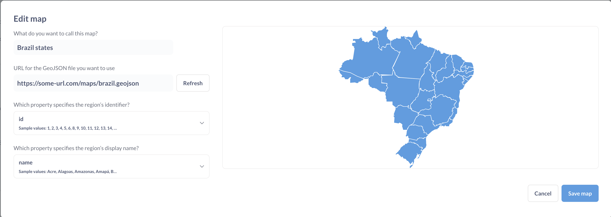

# Benutzerdefinierte Karten

Standardmäßig verwendet Metabase OpenStreetMaps für die Kartenvisualisierung, aber es gibt einige Anpassungsmöglichkeiten.

## Karteneinstellungen

So finden Sie die Karteneinstellungen:

1. Klicken Sie oben rechts auf dem Bildschirm auf das Symbol **Zahnrad** > **Verwaltungseinstellungen** > **Einstellungen**.
2. Wählen Sie "Karten" aus der Navigation auf der linken Seite.

Karteneinstellungen(images/MapSettings.png)

## Kachelserver für Karten

Metabase verwendet standardmäßig den [OpenStreetMaps](https://www.openstreetmap.org) Kachelserver für Pin- und Rasterkarten. Wenn Ihr Unternehmen ein anderes
Aussehen oder einen anderen Detaillierungsgrad für Ihre Kartenvisualisierungen benötigen, können Sie den Kachelserver ändern, indem Sie den Pfad zum Kachelserver in das erste Feld der Seite eingeben.

Der Pfad muss entweder eine URL sein, die mit "http://" oder "https://" beginnt, oder ein relativer Pfad zu einer lokalen Datei im Klassenpfad der JVM.

Derzeit verwendet Metabase einen einzigen Kachelserver pro Instanz. Sie können keine unterschiedlichen Kacheln für verschiedene Karten angeben.

## Benutzerdefinierte Regionskarten

Metabase wird mit zwei eingebauten [Regionskarten](../questions/visualizations/map.md#region-maps) geliefert: eine Weltkarte mit Ländern und eine Karte der Vereinigten Staaten mit Bundesstaaten.

Wenn Sie eine Karte anderer Regionen benötigen - wie EU-Länder oder NYC-Viertel - können Sie eine GeoJSON-Datei mit Regionsinformationen angeben. Sie können GeoJSON-Karten oft finden, indem Sie online nach "[Ihre Region] + geojson" suchen, z. B. "NYC neighborhoods GeoJSON". Viele Community-Mitglieder und Regierungsorganisationen haben bereits Kartendateien für gängige Regionen entwickelt. Sie können auch Ihr eigenes GeoJSON mit einem Tool wie [MapShaper](https://mapshaper.org/) oder [GeoJSON.io](http://geojson.io/) erstellen.

Ihre GeoJSON-Datei sollte:

- weniger als 5 MB groß sein.
- Polygonmerkmale enthalten, die Regionen definieren (nicht nur Punkte oder Koordinaten)
- Verwenden Sie geografische Koordinaten (Längen- und Breitengrad), um Regionenpolygone zu definieren. Metabase unterstützt keine projizierten Koordinaten, so dass Sie die projizierten Koordinaten in geografische Koordinaten umwandeln müssen.
- Erreichbar über eine öffentliche URL. Derzeit können Sie kein GeoJSON in die Metabase hochladen.

Um eine benutzerdefinierte Karte hinzuzufügen:

1. Gehen Sie zu **Admin-Einstellungen > Karten > Benutzerdefinierte Karten**.
2. Klicken Sie auf **Karte hinzufügen**.
3. Geben Sie einen Namen für Ihre Map ein.
4. Geben Sie die URL zu Ihrer GeoJSON-Datei an.
5. Geben Sie die JSON-Eigenschaften an, die als Regionsidentifikator und Regionsname dienen sollen.

- **DerName der Karte** wird im Regionsselektor für ["Custom Region Maps"](../questions/visualizations/map.md#custom-regions) angezeigt.
-Der Bezeichner der Region** ist ein GeoJSON-Feld, das Ihre Region identifiziert. Die Werte in diesem Feld sollten damit übereinstimmen, wie die Regionen in Ihren Daten referenziert werden. Das Feld muss nicht mit dem Anzeigenamen übereinstimmen.
- **Der Anzeigename der Region** ist ein GeoJSON-Feld, das angibt, wie der Name Ihrer Region auf einer Karte angezeigt wird. Dieses Feld kann sich vom Bezeichner der Region unterscheiden.

Um eine oder mehrere Regionskarten beim Start der Metabase vorzuladen, können Sie die Umgebungsvariable [`MB_CUSTOM_GEOJSON`](./environment-variables.md#mb_custom_geojson) oder eine [Konfigurationsdateioption](./config-file.md) `custom-geojson` verwenden.

Um die Erstellung von benutzerdefinierten Karten zu deaktivieren, verwenden Sie die [`MB_CUSTOM_GEOJSON_ENABLED`](./environment-variables.md#mb_custom_geojson_enabled) oder eine [Konfigurationsdateioption](./config-file.md ) `custom-geojson-enabled`.

