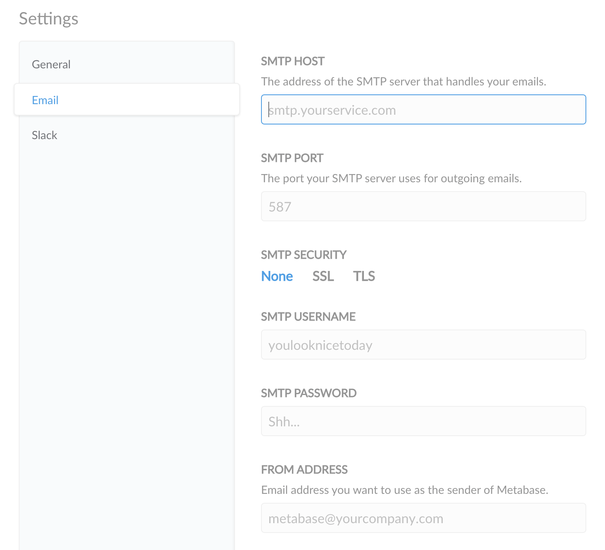

# E-Mail einrichten

Sobald Sie Ihre Datenbank mit Metabase verbunden haben, sollten Sie ein E-Mail-Konto konfigurieren, um Systembenachrichtigungen an die Benutzer Ihres Unternehmens zu senden. Metabase verwendet E-Mails, um Passwörter zurückzusetzen, neue Benutzer einzubinden und Sie zu benachrichtigen, wenn etwas passiert.

So bearbeiten Sie die E-Mail-Einstellungen:

1. Klicken Sie auf das Symbol **Zahnrad** in der oberen rechten Ecke.
2. Wählen Sie **Admin-Einstellungen**.
3. Klicken Sie auf der Standardregisterkarte **Einstellungen** auf **Benachrichtigungskanäle** in der linken Seitenleiste.
4. Wählen Sie **Email**.

## Metabase Cloud

Metabase Cloud verwaltet einen E-Mail-Server für Sie, so dass Sie keine E-Mails einrichten müssen (und auch keine SMTP-Einstellungen in Ihrer Admin-Konsole sehen).

Wenn Sie möchten, können Sie trotzdem etwas einrichten:

- Einen Namen für Ihr Cloud-E-Mail-Konto (Absendername)
- Eine E-Mail-Adresse für den Empfang von E-Mail-Antworten (Reply-to-Adresse)

## Konfigurieren des E-Mail-Kontos

Damit Metabase Nachrichten an die Benutzer Ihrer Organisation senden kann, müssen Sie ein E-Mail-Konto einrichten, um E-Mails über**SMTP** (Simple Mail Transfer Protocol) zu versenden. Dies ist ein E-Mail-Standard, der E-Mails mit SSL-Sicherheitsschutz sichert.

Gehen Sie dazu über das Dropdown-Menü oben rechts in der Metabase zum Admin-Panel und klicken Sie dann auf der Seite Einstellungen im linken Menü auf**E-Mail**.

Sie sollten dieses Formular sehen:

Hier stellen Sie ein:

- **SMTP HOST**: Die Adresse des SMTP-Servers, der Ihre E-Mails bearbeitet.
- **SMTP PORT**: Der Port, den Ihr SMTP-Server für ausgehende E-Mails verwendet.
- **SMTP SECURITY**:
- Keine
- SSL
- TLS
- STARTTLS
- **SMTP-Benutzername**.
-**SMTP-Kennwort**.

Außerdem müssen Sie Folgendes angeben:

- **Absenderadresse**: Die E-Mail-Adresse, die Sie für den Absender von E-Mails verwenden möchten.
- **Antwort an Adresse**: Die E-Mail-Adresse, an die die Antworten gehen sollen, wenn sie sich von der Absenderadresse unterscheidet.

## Empfänger als CC oder BCC hinzufügen

Standardmäßig versteckt Metabase E-Mail-Empfänger, indem es sie in die BCC-Liste (Blind Carbon Copy) der E-Mail aufnimmt. Wenn Sie jedoch Probleme damit haben, dass Ihr E-Mail-Provider E-Mails mit BCC-Empfängern blockiert, und es Ihnen nichts ausmacht, dass andere Personen sehen können, wer sonst noch in die von Metabase gesendete E-Mail kopiert wurde, können Sie Metabase anweisen, stattdessen CC-Empfänger (Carbon Copy) anzugeben.

### Empfohlene E-Mail-Einstellungen

- SSL wird dringend empfohlen, da es sicherer ist und Ihr Konto zusätzlich vor Bedrohungen schützt.
- Wenn Ihr E-Mail-Dienst über eine Whitelist mit E-Mail-Adressen verfügt, die zum Senden von E-Mails zugelassen sind, stellen Sie sicher, dass Sie die E-Mail-Adresse, die Sie in das Feld**Absenadresse** eingegeben haben, auf die Whitelist setzen, um sicherzustellen, dass Sie und Ihre Teammitglieder alle E-Mails von Metabase erhalten.

## Hinweise für gängige E-Mail-Dienste
