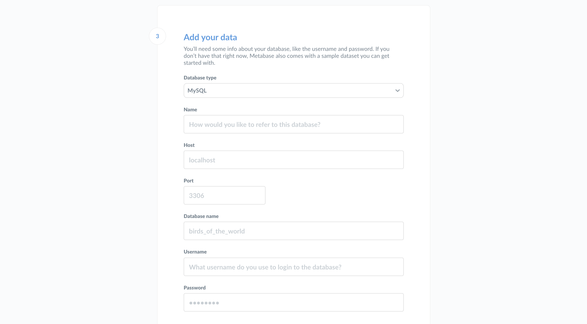

# Metabase einrichten

Diese Anleitung hilft Ihnen, Metabase einzurichten, sobald Sie sie installiert haben. Wenn Sie Metabase noch nicht installiert haben, können Sie [Metabase hier herunterladen](https://metabase.com/pricing/).

Wenn Sie Metabase zum ersten Mal starten, sehen Sie diesen Bildschirm:

Fahren Sie fort und klicken Sie auf ** Losgeht's**.

## Einrichten eines Administratorkontos

Als Erstes müssen Sie ein Administratorkonto einrichten. Das Konto, das Sie bei der Erstinstallation von Metabase erstellen, ist standardmäßig ein Admin-Konto - praktisch! Wenn Sie Metabase auf einem Produktionsserver installiert haben, sollten Sie sich das Kennwort für dieses Konto gut merken, da es zum Hinzufügen anderer Benutzer, zum Herstellen von Verbindungen zu Datenbanken, zum Einrichten von E-Mails und vielem mehr verwendet wird. Sie können später auch weitere Administratorkonten erstellen.

Im Moment wollen wir nur ein Konto für uns selbst erstellen, um Metabase zu erkunden. Geben Sie Ihre Daten ein, und klicken Sie auf die Schaltfläche**Weiter**, wenn Sie fortfahren möchten.

(images/AccountSetup.png)

## Wofür werden Sie Metabase verwenden?

Teilen Sie uns mit, was Sie mit Metabase vorhaben, damit wir Sie optimal beraten können.

(./images/what-will-you-use-metabase-for.png)

- Self-Service-Analysen für mein eigenes Unternehmen
- Einbettung von Analysen in meine Anwendung
- Ein bisschen von beidem
- Noch nicht sicher

Machen Sie sich keine Sorgen, dass Sie die falsche Option gewählt haben. Wenn Sie angeben, dass Sie an der Einbettung interessiert sind, zeigt Metabase eine Karte mit einem Link zu den Einbettungseinstellungen an, wenn Sie (als Administrator) sich zum ersten Mal bei Ihrer Instanz anmelden. Das ist nur eine kleine Erleichterung, mehr nicht.

## Sammeln von Datenbankinformationen

An dieser Stelle müssen Sie einige Informationen über die Datenbank erfassen, die Sie mit Metabase verwenden möchten. Ohne diese Informationen können wir keine Verbindung zu Ihrer Datenbank herstellen, aber wenn Sie sich mit all dem später beschäftigen möchten, ist das kein Problem: Klicken Sie einfach auf **Ich füge meine Daten später hinzu**. Metabase wird mit einer [Beispieldatenbank](https://www.metabase.com/glossary/sample_database) ausgeliefert, mit der Sie ein wenig herumspielen können, um ein Gefühl für die Funktionsweise von Metabase zu bekommen.

Wenn Sie bereit sind, eine Verbindung herzustellen, benötigen Sie folgende Angaben:

- Den**Hostnamen** des Servers, auf dem sich Ihre Datenbank befindet
- den**Port**, den der Datenbankserver verwendet
- Der**Datenbankname**
- Der**Benutzername**, den Sie für die Datenbank verwenden
- Das**Passwort**, das Sie für die Datenbank verwenden

Wenn Sie diese Informationen nicht zur Hand haben, sollte die Person, die für die Verwaltung der Datenbank zuständig ist, sie haben.

## Verbindung zu Ihrer Datenbank

Jetzt, da Sie Ihre Datenbankinformationen haben, können Sie eine Verbindung zu Ihrer Datenbank herstellen. Endlich süße, süße Daten. Geben Sie einfach Ihre Daten in dieses Formular ein und klicken Sie auf **Weiter**.

Weitere Informationen zum Verbinden mit Datenbanken finden Sie unter [Hinzufügen und Verwalten von Datenbanken](../databases/connecting.md).

## Aktivieren Sie Ihre Lizenz

Wenn Sie Metabase im Rahmen des [Pro](https://www.metabase.com/product/pro) oder [Enterprise](https://www.metabase.com/product/enterprise) selbst hosten, werden Sie von Metabase nach Ihrer Lizenz gefragt. Dieser Schritt dient lediglich der Bequemlichkeit. Sie brauchen Ihre Lizenz hier nicht einzugeben; Sie können [Ihre Lizenz aktivieren](../installation-and-operation/activating-the-enterprise-edition.md) jederzeit. Beachten Sie jedoch, dass alle Pro- und Enterprise-Funktionen erst nach der Aktivierung Ihrer Lizenz funktionieren.
