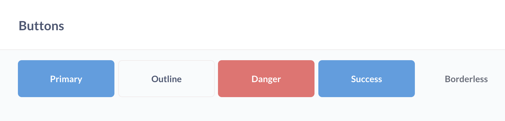
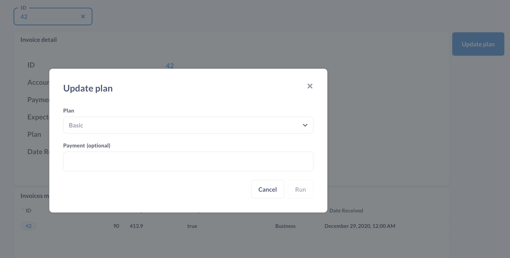

# Aktionen auf Dashboards

(./images/dashboard-filter-action.png)[Dashboard mit Filter, Aktionsschaltfläche und Detailkartenansicht]

Um [Aktionen](../actions/start.md) in Aktion zu setzen, können Sie sie mit einem [Modell](../data-modeling/models.md) und einem [Filter](./filters.md) auf einem Dashboard kombinieren.

## Hinzufügen einer Aktion zu einem Dashboard

Rufen Sie eine Dashboard-Seite auf und klicken Sie auf das Symbol**Bleistift** und dannmit dem Mauszeiger auf die**Box**, um eine Aktion hinzuzufügen.

Metabase fügt dem Dashboard-Raster eine Aktionsschaltfläche hinzu und öffnet eine Seitenleiste mit den Einstellungen der Schaltfläche.

### Schaltflächentext

Eine Beschriftung, die erklärt, was die Schaltfläche bewirkt, z. B. "Zündung".

### Schaltflächenvariante

Sie können aus einer Vielzahl von hübschen Schaltflächen wählen:

- Primär
- Gliederung
- Die Gefahr
- Erfolg
- Randlos

## Verbinden einer Aktion mit einem Dashboard-Filter

Bei den meisten Aktionen werden die Benutzer, wenn sie auf eine Schaltfläche klicken, aufgefordert, Werte in die von dieser Aktion definierten Felder einzugeben.

Bei vielen Arten von Aktionen muss die Entitäts-ID des Modells bekannt sein, um zu bestimmen, welche Datensätze aktualisiert oder gelöscht werden sollen. Damit die Benutzer die ID für die Aktion auswählen können, müssen Sie:

1. Klicken Sie auf das Bleistiftsymbol, um das Dashboard zu bearbeiten.
2. Fügen Sie dem Dashboard eine Aktion hinzu (falls Sie das noch nicht getan haben).
3. [Fügen Sie einen Filter(./filters.md) zu einem Dashboardhinzu, verbinden Sie ihn mit den gewünschten Karten und klicken Sie unten in der Seitenleiste auf **Fertig**.
4. Bewegen Sie den Mauszeiger über die Aktionsschaltfläche, klicken Sie auf das Symbol **Zahnrad** und wählen Sie **Aktion ändern**.
5. Klicken Sie auf das Dropdown-Feld des Feldes, um auszuwählen, woher die Aktion ihren Wert erhalten soll. Hier können Sie "Den Benutzer fragen" auswählen oder das Feld automatisch durch einen Dashboard-Filter füllen lassen. In diesem Fall wählen wir unseren "ID"-Filter.

(./images/id-value.png)[Verknüpfung einer Aktionsschaltfläche mit einem Dashboard-Filter].

Wenn Sie diesen Filter auch mit einer Karte mit einem Modell auf dem Dashboard verknüpfen, können Sie nach einzelnen Datensätzen in diesem Modell filtern, sie in der Karte des Modells anzeigen und die Aktionsschaltflächen automatisch die ID ausfüllen lassen.

Sie können beliebig viele Schaltflächen hinzufügen und sie mit einem oder mehreren Filtern verknüpfen.

## Aktionen sind für öffentliche Dashboards und Dashboards in statischen Einbettungen nicht verfügbar.

Sie können zwar Aktionen zu Dashboards hinzufügen und sie in Ihrer Metabase verwenden, aber Aktionen funktionieren nicht auf Dashboards, auf die über [öffentliche Links](./introduction.md#sharing-dashboards-with-public-links) zugegriffen wird, oder auf Dashboards in statischen Einbettungen.

Wenn Sie möchten, dass Personen außerhalb Ihrer Metabase eine Aktion verwenden können, können Sie ein [öffentliches Formular für eine Aktion](../actions/custom.md#make-public) erstellen oder Aktionen über [interaktive Einbettung](../embedding/interactive-embedding.md) zur Verfügung stellen.

## Weitere Lektüre

- [Aktionen](../actions/start.md)

