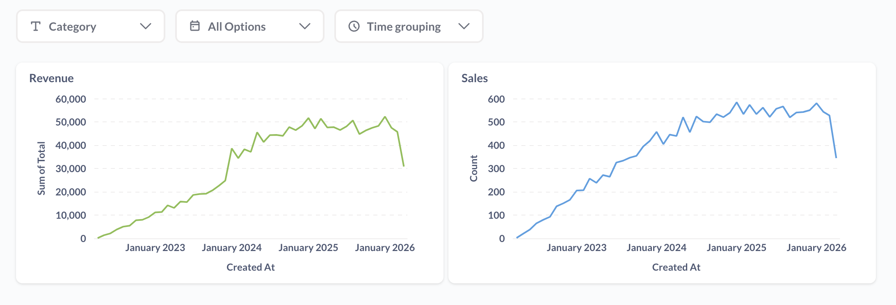
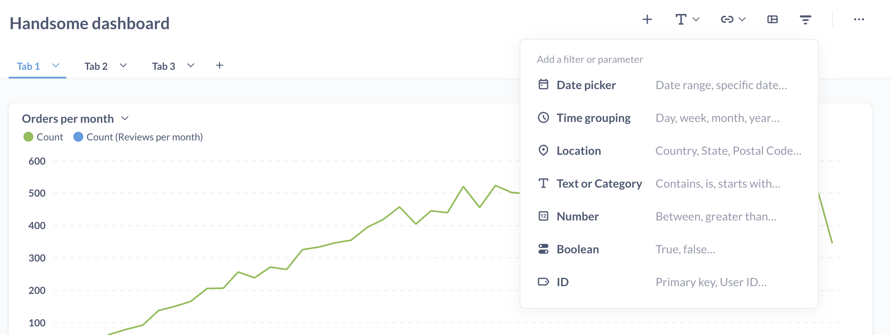
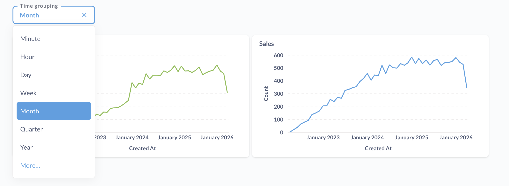

# Dashboard-Filter und -Parameter

Haben Sie sich schon einmal in einer Situation befunden, in der Sie fast identische Kopien desselben Dashboards erstellen müssen, nur mit einer anderen Variable? Vielleicht haben Sie ein Ergebnis-Dashboard, aber Sie möchten die Daten für jede Stadt, in der Ihr Unternehmen ansässig ist, sehen, oder Sie haben ein KPI-Dashboard, das Sie nach Monaten aufgeschlüsselt sehen möchten.

Anstatt doppelte Dashboards zu erstellen, können Sie Filter- oder Parameter-Widgets hinzufügen, damit die Benutzer die Variablen für Karten auf einem Dashboard ändern können.

## Hinzufügen eines Filters oder Parameters

- Klicken Sie auf das**Bleistiftsymbol**, um den Bearbeitungsmodus des Dashboards aufzurufen.
- Klicken Sie auf das**Filtersymbol**, das oben rechts erscheint, um einen Filter hinzuzufügen.
- Wählen Sie einen [Filtertyp](#filter-and-parameter-types)
- [Verbinden Sie Ihren Filter oder Ihr Parameter-Widget mit Dashboard-Karten](#connecting-a-filter-or-parameter-widget-to-dashboard-cards) mit einer oder mehreren Dashboard-Karten auf einer oder allen Registerkarten.
- [Konfigurieren Sie Ihren Filter](#editing-a-filter)
- **Speichern Sie** Ihre Änderungen.

Die Metabase zeigt den Filter nur an, wenn der Filter mit einer Karte auf der aktuellen Dashboard-Registerkarte verbunden ist.

## Filter- und Parametertypen

Der Typ des Filter- oder Parameter-Widgets, den Sie wählen, bestimmt die Funktionsweise des Widgets, einschließlich der Felder, nach denen Sie Ihre Karten filtern können.

### Filter-Widgets

**Filter** bestimmen, welche Daten angezeigt werden sollen. Ein Datumsfilter kann zum Beispiel nur die Daten der letzten 30 Tage anzeigen, oder ein Kategoriefilter kann nur bestimmte Produktkategorien anzeigen.

- [Datumsauswahl](#date-picker-filters)
- [Ort](#location-filters)
- [ID](#id-filter)
- [Zahl](#number-filter)
- [Text oder Kategorie](#text-or-category-filter)
- [Boolescher](#boolean-filter)

### Parameter-Widgets

**Parameter** legen fest, wie die Daten dargestellt werden sollen. Der Parameter "Zeitgruppierung" ändert beispielsweise die Granularität der zeitbasierten Visualisierung (z. B. Anzeige der Daten nach Monat statt nach Tag), ohne dass Datenpunkte entfernt werden.

- [Zeitgruppierung](#time-grouping-parameter)

## Datumsauswahlfilter

Bei der Auswahl eines Zeitfilters werden Sie von Metabase aufgefordert, einen bestimmten Typ von Datumsauswahl-Widget auszuwählen:

- Monat und Jahr
- Quartal und Jahr
- Einzelnes Datum
- Datumsbereich
- Relatives Datum
- Alle Optionen

Einzeldatum und Datumsbereich bieten ein Kalender-Widget, während die anderen Optionen alle leicht unterschiedliche Dropdown-Schnittstellen für die Auswahl von Werten bieten. Um ein Widget zu erhalten, das genau wie der Zeitfilter im Query Builder ist, wählen Sie Alle Optionen.

## Parameter Zeitgruppierung

Sie können ein Zeitgruppierungs-Widget zu einem Dashboard hinzufügen, um die Gruppierung der Diagramme nach Zeit zu ändern. So können Sie beispielsweise die Zeitreihendiagramme standardmäßig nach Monat gruppieren, den Benutzern aber die Möglichkeit geben, die Ergebnisse nach anderen Gruppierungen anzuzeigen: nach Woche, nach Quartal usw.
