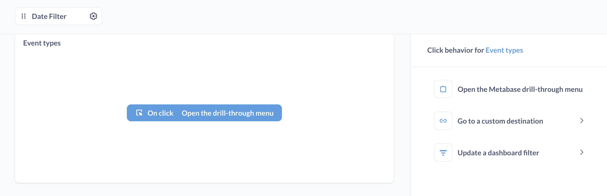
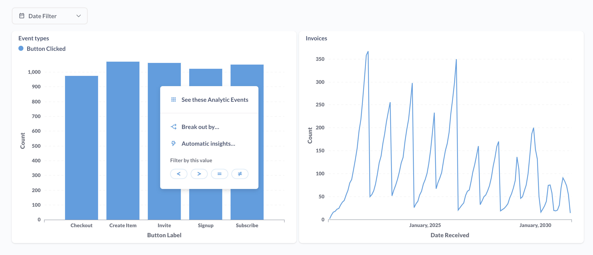
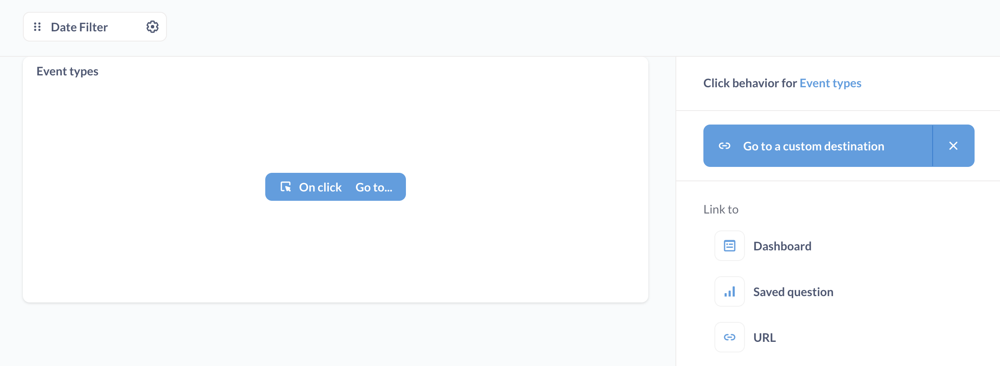

# Interaktivität des Dashboards

Sie können anpassen, was passiert, wenn Benutzer auf Fragen in Ihrem Dashboard klicken.

Wenn Sie Diagramme mit dem grafischen Abfrage-Builder von Metabase erstellen, verfügen Ihre Diagramme standardmäßig über [Drill-Through-Fähigkeiten](https://www.metabase.com/learn/metabase-basics/querying-and-dashboards/questions/drill-through), mit denen die Benutzer auf ein Diagramm klicken können, um weitere Informationen zu erhalten. Wenn Sie jedoch einen individuelleren Klickpfad wünschen, können Sie in Metabase festlegen, was passiert, wenn ein Benutzer auf ein Diagramm oder eine Tabelle in Ihrem Dashboard klickt.

Sie können eine Dashboard-Karte so einrichten, dass:

- Den Benutzer zu einem [benutzerdefinierten Ziel](#custom-destinations) zu schicken: ein Dashboard, eine Frage oder eine benutzerdefinierte URL.
- [Einen Dashboard-Filter aktualisieren](#use-a-chart-to-filter-a-dashboard).

Um diese Interaktivität zu konfigurieren, verwenden Sie die Option**Klickverhalten** auf einer Dashboardkarte.

## Klickverhalten anpassen

Klicken Sie in Ihrem Dashboard zunächst auf das Symbol**Bleistift**, um den Bearbeitungsmodus des Dashboards aufzurufen.

Wenn Sie den Mauszeiger über die Karte mit der Frage bewegen, die Sie anpassen möchten, zeigt Metabase oben rechts auf der Karte ein Menü mit den folgenden Optionen an (von links nach rechts):

- **Visualisierungsoptionen**: Dieses Symbol sieht aus wie die Palette eines Malers.
- **Klickverhalten**: Dies ist das Symbol, wenn der Mauszeiger auf eine Karte klickt.
- **Serie hinzufügen**: Wenn Ihre Frage eine Visualisierung hat, zu der Sie eine [zusätzliche Serie](./multiple-series.md) hinzufügen können (wie ein Linien- oder Balkendiagramm), sehen Sie dieses Symbol als **+** neben einer kleinen Darstellung dieses Diagrammtyps. Diese Option wird nicht auf allen Karten angezeigt.
- **Entfernen**: Dieses Symbol ist ein **X**. Wenn Sie dies auswählen, wird Ihre Frage aus dem Dashboard entfernt.

Wählen Sie die Option **Klickverhalten**.

[Klickverhalten-Symbol](./images/click-behavior-icon.png)

Die Metabase blendet die **Klickverhalten-Seitenleiste** aus:

Bei Fragen, die mit dem Query Builder erstellt wurden, können Sie aus drei Optionen wählen:

- Öffnen Sie das Drill-Through-Menü der Metabase.
- Wechseln Sie zu einem benutzerdefinierten Ziel.
- Einen Dashboard-Filter aktualisieren (wenn das Dashboard einen Filter hat).

Bei SQL-Fragen wird nur die Option **Zu einem benutzerdefinierten Ziel gehen** und **Einen Dashboard-Filter aktualisieren** angezeigt.

Wenn Ihr Dashboard über einen Filter verfügt, sehen Sie auch eine Option zum [Aktualisieren des Filters](#use-a-chart-to-filter-a-dashboard).

## Öffnen Sie das Drill-Through-Menü

Bei Fragen, die mit dem Query Builder erstellt wurden, wird standardmäßig das **Drill-Through-Menü** geöffnet, das den Benutzern die Möglichkeit bietet, [die Daten zu durchforsten](https://www.metabase.com/learn/metabase-basics/querying-and-dashboards/questions/drill-through):

## Benutzerdefinierte Ziele

Sie können für alle Fragen, einschließlich SQL-Fragen, benutzerdefinierte Ziele festlegen.

Mögliche Ziele sind:

- Dashboards
- Gespeicherte Fragen
- URLs

Interne Metabase-Ziele (Dashboards oder gespeicherte Fragen) werden in derselben Browser-Registerkarte oder im selben Fenster geladen. Externe URLs werden in einer neuen Registerkarte oder einem neuen Fenster geöffnet.

## Übergabe von Werten an das Ziel

Wenn Sie eine Verknüpfung zu einem Dashboard oder einer SQL-Frage mit Filtern herstellen, können Sie Werte aus dem aktuellen Dashboard an Filter im Ziel übergeben.

Wenn Sie zum Beispiel eine Verknüpfung zu einer Eigenschaftenleiste herstellen, die einen Filter für "Kategorie" hat, können Sie einen Wert für "Kategorie" von der Ausgangsfrage an die Ziel-Eigenschaftenleiste übergeben:

[Wert an Dashboard übergeben](./images/pass-value.png)

Sobald Sie die Spalte ausgewählt haben, die den zu übergebenden Wert enthält, wird in der Seitenleiste die Spalte angezeigt, die für die Übergabe des Wertes verwendet wird, sowie der Zielfilter am Zielort, an den Metabase den Wert übergibt:

[Kategorie an Filter übergeben](./images/pass-category-to-filter.png)

Wenn ein Benutzer im obigen Beispiel auf die Karte **Bestellungen nach Produktkategorie** klickt, übergibt Metabase die angeklickte "Produkt -> Kategorie" an das Ziel-Dashboard ("Interactive Dashboard"), das dann seine Karten nach dieser "Kategorie" filtert.---
Titel: Interaktivität des Armaturenbretts
redirect_from:
- /docs/latest/user-guide/interactive-dashboards 
---

# Interaktivität des Dashboards

Sie können anpassen, was passiert, wenn Benutzer auf Fragen in Ihrem Dashboard klicken.

Wenn Sie Diagramme mit dem grafischen Abfrage-Builder von Metabase erstellen, verfügen Ihre Diagramme standardmäßig über [Drill-Through-Fähigkeiten](https://www.metabase.com/learn/metabase-basics/querying-and-dashboards/questions/drill-through), mit denen die Benutzer auf ein Diagramm klicken können, um weitere Informationen zu erhalten. Wenn Sie jedoch einen individuelleren Klickpfad wünschen, können Sie in Metabase festlegen, was passiert, wenn ein Benutzer auf ein Diagramm oder eine Tabelle in Ihrem Dashboard klickt.

Sie können eine Dashboard-Karte so einrichten, dass:

- Den Benutzer zu einem [benutzerdefinierten Ziel](#custom-destinations) zu schicken: ein Dashboard, eine Frage oder eine benutzerdefinierte URL.
- [Einen Dashboard-Filter aktualisieren](#use-a-chart-to-filter-a-dashboard).

Um diese Interaktivität zu konfigurieren, verwenden Sie die Option**Klickverhalten** auf einer Dashboardkarte.

## Klickverhalten anpassen

Klicken Sie in Ihrem Dashboard zunächst auf das Symbol**Bleistift**, um den Bearbeitungsmodus des Dashboards aufzurufen.

Wenn Sie den Mauszeiger über die Karte mit der Frage bewegen, die Sie anpassen möchten, zeigt Metabase oben rechts auf der Karte ein Menü mit den folgenden Optionen an (von links nach rechts):

- **Visualisierungsoptionen**: Dieses Symbol sieht aus wie die Palette eines Malers.
- **Klickverhalten**: Dies ist das Symbol, wenn der Mauszeiger auf eine Karte klickt.
- **Serie hinzufügen**: Wenn Ihre Frage eine Visualisierung hat, zu der Sie eine [zusätzliche Serie](./multiple-series.md) hinzufügen können (wie ein Linien- oder Balkendiagramm), sehen Sie dieses Symbol als **+** neben einer kleinen Darstellung dieses Diagrammtyps. Diese Option wird nicht auf allen Karten angezeigt.
- **Entfernen**: Dieses Symbol ist ein **X**. Wenn Sie dies auswählen, wird Ihre Frage aus dem Dashboard entfernt.

Wählen Sie die Option **Klickverhalten**.

[Klickverhalten-Symbol](./images/click-behavior-icon.png)

Die Metabase blendet die **Klickverhalten-Seitenleiste** aus:

Bei Fragen, die mit dem Query Builder erstellt wurden, können Sie aus drei Optionen wählen:

-  Öffnen Sie das Drill-Through-Menü der Metabase.
-  Wechseln Sie zu einem benutzerdefinierten Ziel.
- Einen Dashboard-Filter  aktualisieren (wenn das Dashboard einen Filter hat).

Bei SQL-Fragen wird nur die Option **Zu einem benutzerdefinierten Ziel gehen** und **Einen Dashboard-Filter aktualisieren** angezeigt.

Wenn Ihr Dashboard über einen Filter verfügt, sehen Sie auch eine Option zum [Aktualisieren des Filters](#use-a-chart-to-filter-a-dashboard).

## Öffnen Sie das Drill-Through-Menü

Bei Fragen, die mit dem Query Builder erstellt wurden, wird standardmäßig das **Drill-Through-Menü** geöffnet, das den Benutzern die Möglichkeit bietet, [die Daten zu durchforsten](https://www.metabase.com/learn/metabase-basics/querying-and-dashboards/questions/drill-through):

## Benutzerdefinierte Ziele

Sie können für alle Fragen, einschließlich SQL-Fragen, benutzerdefinierte Ziele festlegen.

Mögliche Ziele sind:

-  Dashboards 
-  Gespeicherte Fragen
-  URLs 

Interne Metabase-Ziele (Dashboards oder gespeicherte Fragen) werden in derselben Browser-Registerkarte oder im selben Fenster geladen. Externe URLs werden in einer neuen Registerkarte oder einem neuen Fenster geöffnet.

## Übergabe von Werten an das Ziel

Wenn Sie eine Verknüpfung zu einem Dashboard oder einer SQL-Frage mit Filtern herstellen, können Sie Werte aus dem aktuellen Dashboard an Filter im Ziel übergeben.

Wenn Sie zum Beispiel eine Verknüpfung zu einer Eigenschaftenleiste herstellen, die einen Filter für "Kategorie" hat, können Sie einen Wert für "Kategorie" von der Ausgangsfrage an die Ziel-Eigenschaftenleiste übergeben:

[Wert an Dashboard übergeben](./images/pass-value.png)

Sobald Sie die Spalte ausgewählt haben, die den zu übergebenden Wert enthält, wird in der Seitenleiste die Spalte angezeigt, die für die Übergabe des Wertes verwendet wird, sowie der Zielfilter am Zielort, an den Metabase den Wert übergibt:

[Kategorie an Filter übergeben](./images/pass-category-to-filter.png)

Wenn ein Benutzer im obigen Beispiel auf die Karte **Bestellungen nach Produktkategorie** klickt, übergibt Metabase die angeklickte "Produkt -> Kategorie" an das Ziel-Dashboard ("Interactive Dashboard"), das dann seine Karten nach dieser "Kategorie" filtert.

