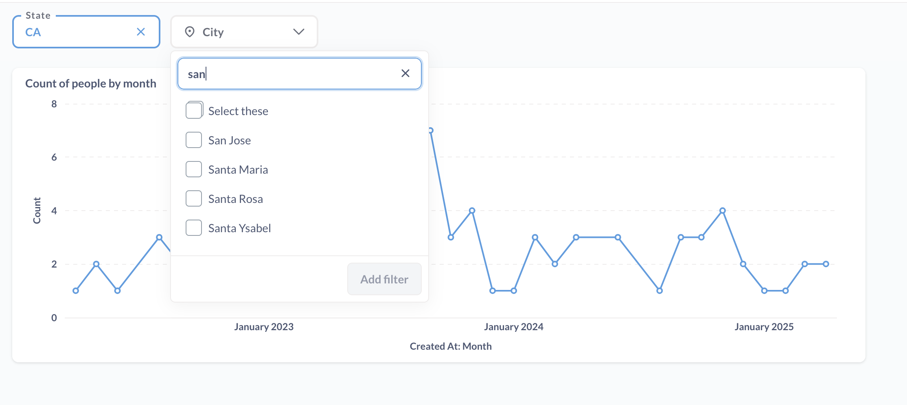
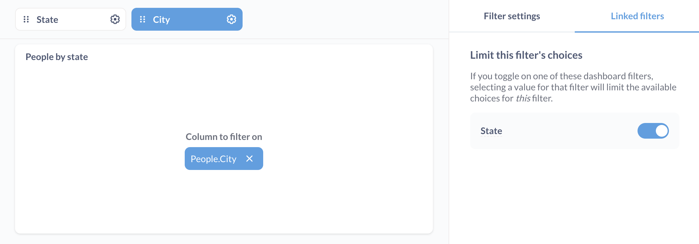

# Verknüpfte Filter

Sie können **Filter** auf einem Dashboardverknüpfen, so dass ein untergeordneter Filter seine Werte auf der Grundlage des/der von einem übergeordneten Filter angewendeten Wertes/Werte einschränkt.

Angenommen, Sie möchten, dass ein Filter für die Spalte "Bundesland" die für einen Filter für die Spalte "Stadt" verfügbaren Werte einschränkt, so dass jemand, der ein Bundesland auswählt, nur die Städte in diesem Bundesland auswählen kann. Zu diesem Zweck können Sie den Stadtfilter (untergeordnet) mit einem (übergeordneten) Bundeslandfilter verknüpfen.

## Tabellen für verknüpfte Filter einrichten

Sie können nur Dashboard-Filter verknüpfen, die mit Datenbankspalten (nicht mit benutzerdefinierten Spalten oder Zusammenfassungen) auf Dashboard-Karten verdrahtet sind, da Metabase Spalten-Metadaten benötigt, um verknüpfte Filter zu erstellen. Metabase muss wissen, welche Werte in den Spalten vorhanden sind und wie sich die Spalten im übergeordneten und untergeordneten Element zueinander verhalten.

Filter können nur verknüpft werden, wenn sie mit Spalten verbunden sind, die in den Metadaten der Tabelle in einer expliziten Beziehung stehen. Unter Beziehung verstehen wir, dass die Spalten entweder:

- In der gleichen Tabelle.
- In zwei verschiedenen Tabellen, die eine Fremdschlüsselbeziehung haben, die in der Datei [table metadata](../data-modeling/metadata-editing.md) angegeben ist.
- In zwei verschiedenen Tabellen, die eine Fremdschlüsselbeziehung zu einer oder mehreren Zwischentabellen haben, wie in den [table metadata](../data-modeling/metadata-editing.md) angegeben.

(/images/foreign-key-linked-filters.png)[Fremdschlüssel in Tabellenmetadaten einrichten]

Wenn Sie versuchen, verknüpfte Filter zwischen zwei Spalten einzurichten, die nicht miteinander verbunden sind, zeigt Metabase keinen Fehler an, aber Sie werden sehen, dass die Werte im untergeordneten Filter nicht durch den übergeordneten Filter eingeschränkt sind. Weitere Tipps zur Fehlerbehebung finden Sie unter [Troubleshooting link filters](../troubleshooting-guide/linked-filters.md).

## Verknüpfte Filter einrichten

Sie können einen untergeordneten Filter mit einem oder mehreren übergeordneten Filtern verknüpfen. Der untergeordnete Filter muss entweder ein ID-, Orts- oder Text- oder Kategoriefilter sein. Übergeordnete Filter können alle [Filtertypen] sein(./filters.md).

So verknüpfen Sie einen untergeordneten Filter auf einem Dashboard mit einem oder mehreren übergeordneten Filtern:

1. Bearbeiten Sie das Dashboard, indem Sie auf das Bleistiftsymbol oben rechts im Dashboard klicken.
2. Bearbeiten Sie den untergeordneten Filter, indem Sie auf das Zahnradsymbol im Filter klicken.
3. Wechseln Sie in der Seitenleiste der Filtereinstellungen zur Registerkarte **Verknüpfte Filter**.
4. Wählen Sie den/die übergeordneten Filter.

Der/die Filter, den/die Sie auf der Registerkarte**verknüpfte Filter** auswählen, ist/sind der/die übergeordnete(n) Filter, d.h. der/die Filter, der/die die Werte dieses (untergeordneten) Filters, den Sie gerade bearbeiten, einschränkt/einschränken.

## Einschränkungen von verknüpften Filtern

### Verknüpfte Filter ignorieren die von Modellen und Fragen definierten Beziehungen.

Verknüpfte Filter kennen nur die Beziehungen, die in den Metadaten der Tabelle definiert sind. Diese Einschränkung ermöglicht es, Filter mit derselben Spalte auf mehreren Dashboardkarten (über mehrere Registerkarten hinweg) zu verbinden, aber die Einschränkung bedeutet auch, dass:

- Verknüpfte Filter können keine Beziehungen sehen, die durch Verknüpfungen in Modellen oder Fragen definiert sind.
- Verknüpfte Filter können keine Filter- oder Verknüpfungslogik aus einer zugrunde liegenden Karte oder einem Modell verwenden.

Nehmen wir an, Sie haben eine Tabelle mit den Spalten Bundesland und Stadt, und Sie erstellen ein Modell, das Zeilen mit "Stadt = San Francisco" herausfiltert. Sie stellen eine Frage, die auf diesem Modell basiert, und fügen sie zu einem Dashboard hinzu. Sie fügen dem Dashboard die Filter Bundesland und Stadt hinzu und verknüpfen sie. Wenn Sie "Staat = CA" auswählen, zeigt der Stadtfilter möglicherweise immer noch "San Francisco" als Option an, obwohl es in der Frage und im zugrunde liegenden Modell keine Datensätze mit "San Francisco" gibt, da der Filter nur die zugrunde liegenden Tabellenmetadaten "kennt" (die Beispielwerte für die Spalte enthalten).

### Verknüpfte Filter funktionieren nicht mit benutzerdefinierten Spalten oder Zusammenfassungen

Metabase verwendet die Metadaten der Datenbankspalten, um die Werte für verknüpfte Filter aufzufüllen, was bedeutet, dass verknüpfte Filter mit den Datenbankspalten verbunden sein müssen. Im Besonderen:

- Sie können keine verknüpften Filter für benutzerdefinierte Spalten erstellen.

- Native/SQL-Fragen müssen eine [Feldfilter](../questions/native-editor/sql-parameters.md#the-field-filter-variable-type) Variable haben, um verknüpft werden zu können. Basic-SQL-Variablen sind nicht mit Datenbankspalten verbunden, so dass sie nicht für verknüpfte Filter verwendet werden können.
