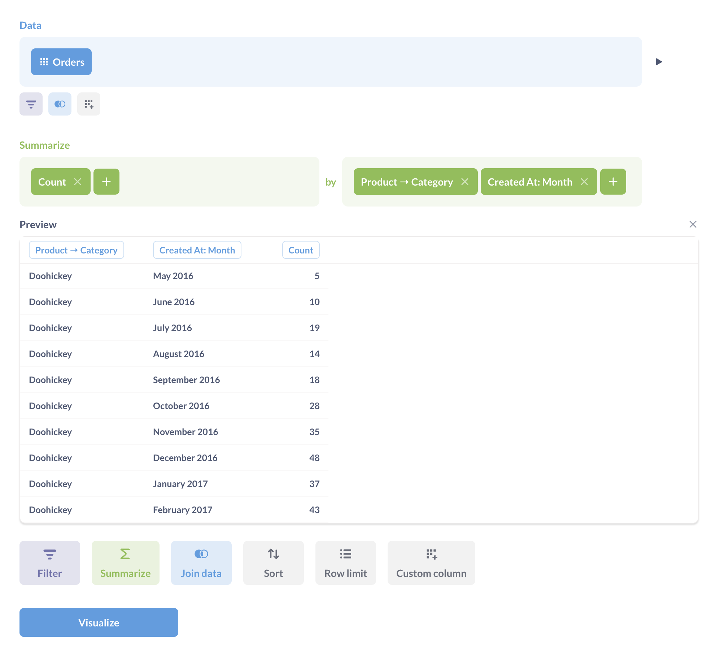

# Diagramme mit mehreren Reihen

Eine der besten Möglichkeiten, bei der Kommunikation mit Daten Kontext und Klarheit zu schaffen, besteht darin, Daten Seite an Seite mit anderen Daten darzustellen. Zum Beispiel:

- Die Einnahmen Ihres Unternehmens im Vergleich zu den Kosten im Laufe der Zeit
- Durchschnittlicher Bestellpreis in diesem Monat und Benutzeranmeldungen für diesen Monat
- Bestellungen pro Tag aus einigen verschiedenen Produktlinien

## Daten nebeneinander anzeigen

Es gibt im Wesentlichen zwei Möglichkeiten, mehrere Reihen in der Metabase zu visualisieren:

- [**Stellen Sie eine Frage, die mehrere Dimensionen umfasst**](#ask-a-question-that-involves-multiple-dimensions) mit dem Query Builder (oder in SQL, wenn Sie SQL verwenden). Zum Beispiel die Anzahl der Nutzer nach Region im Laufe der Zeit.
- [**Kombinieren Sie mehrere Fragen auf einer Dashboard-Karte**](#combining-multiple-questions-on-one-dashboard-card), die eine gemeinsame Dimension (wie Zeit) auf einem Dashboard haben. So können Sie z. B. die Einnahmen im Zeitverlauf und die Kosten im Zeitverlauf gemeinsam betrachten.

## Stellen Sie eine Frage, die mehrere Dimensionen umfasst.

Wenn Sie eine neue Frage erstellen, können Sie die Ergebnisse als Multiserien-Visualisierung anzeigen, indem Sie Ihre Daten zusammenfassen und nach zwei oder mehr Dimensionen gruppieren.

Zum Beispiel könnten wir die Verkäufe nach Monat und Produktkategorie anzeigen. In der **Beispieldatenbank**, die mit Metabase geliefert wird, würden Sie die Anzahl der Zeilen zählen und dann nach "Produkt -> Kategorie" und "Erstellt am" gruppieren:

Die Metabase zeigt automatisch ein Liniendiagramm mit mehreren Serien an, wobei jede Serie eine andere Kategorie darstellt.

(/images/multi-series_query_builder.png)[Multiserien im Query Builder)

Metabase kann bis zu 100 verschiedene Werte einer Dimension auf einmal visualisieren. Wenn Sie also ein Feld auswählen, das viele Werte enthält, müssen Sie die Werte möglicherweise filtern.

## Kombinieren mehrerer Fragen auf einer Dashboardkarte

Sie können mehrere Fragen auf einer einzigen Dashboardkarte überlagern. Sie können sogar Fragen überlagern, die verschiedene Datenbanken abfragen, solange sie dieselbe Datumsdimension haben.

1. **Erstellen Sie eine Instrumententafel und rufen Sie den Bearbeitungsmodus für die Instrumententafel auf**. Klicken Sie auf einer Eigenschaftenleiste auf das Symbol**Stift**, um den Bearbeitungsmodus aufzurufen.

2. **Fügen Sie eine Frage** mit einer Dimension wie Zeit oder Kategorie zu einem Dashboard hinzu. In der Praxis werden Sie in der Regel Fragen in Form von Linien- oder Balkendiagrammen überlagern wollen.

3. **Bearbeiten Sie die Visualisierung der Karte**. Bewegen Sie den Mauszeiger im Bearbeitungsmodus des Dashboards über die Karte der Frage und klicken Sie auf das Symbol**Bleistift**, um die Visualisierung der Karte zu bearbeiten.

[Visualisierung bearbeiten](./images/edit-visualization.png)

4. **Weitere Daten hinzufügen**. Klicken Sie in der Seitenleiste "Daten verwalten" auf der linken Seite auf**Weitere Daten hinzufügen**.

[Seitenleiste Daten verwalten](./images/add-data.png)

Die Metabase listet die Fragen in der linken Seitenleiste auf. Gültige Fragen, die Sie auf der Karte darstellen können, sind mit einem Pluszeichen **+** gekennzeichnet. Sie können auch die aktuelle Frage auf der Karte gegen eine andere Frage austauschen, wodurch die Liste der kompatiblen Fragen aktualisiert werden kann.

Falls erforderlich, werden die X- und Y-Achsen automatisch aktualisiert. Metabase erstellt eine Legende, in der die vorhandenen Kartentitel verwendet werden, um zu verdeutlichen, welche Frage zu welcher Reihe im Diagramm gehört. Wiederholen Sie diesen Vorgang so oft wie nötig.

Sie können die ursprüngliche Frage des Diagramms auch komplett austauschen, z. B. wenn Sie neu beginnen möchten oder um die Visualisierung der Frage auf die ursprünglichen Einstellungen zurückzusetzen.
