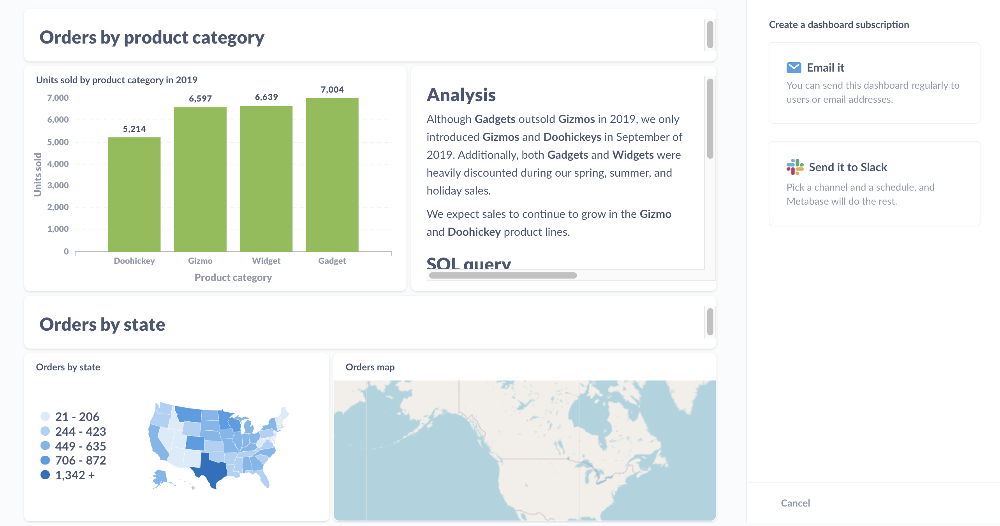

# Dashboard-Abonnements

Mit Dashboard-Abonnements können Sie die Ergebnisse von Fragen auf einem Dashboard per E-Mail oder Slack an Personen senden - auch an Personen, die kein Konto in Ihrer Metabase haben.

Wenn in Ihrer Metabase ein E-Mail- oder Slack-Konto eingerichtet ist, müssen Sie lediglich ein Dashboard erstellen, Abonnenten hinzufügen und der Metabase mitteilen, wie oft Sie ein Update versenden möchten. Sie können so viele Abonnements für ein Dashboard einrichten, wie Sie möchten. Wenn Sie Änderungen am Dashboard vornehmen, aktualisiert Metabase die Abonnements bei der nächsten Zustellung.

## Aktivieren von Dashboard-Abonnements

Um Dashboard-Abonnements zu aktivieren, müssen Ihre Administratoren E-Mail oder Slack für Ihre Metabase einrichten. Siehe [Einrichten von E-Mail](../configuring-metabase/email.md) oder [Einrichten von Slack](../configuring-metabase/slack.md).

## Einrichten eines Dashboard-Abonnements

Um ein Abonnement für ein Dashboard einzurichten, klicken Sie auf das Symbol **Freigabe** und wählen Sie **Abonnements**. Metabase blendet auf der rechten Seite eine Seitenleiste mit der Option ein, ein Abonnement per E-Mail oder Slack einzurichten:

Nehmen wir an, wir möchten ein Dashboard per E-Mail versenden. Wir klicken auf die Option**Emailen** in der Seitenleiste, und Metabase bietet uns einige Optionen:

(./images/email-options.png)##E-Mail-Optionen für das Dashboard-Abonnement

## Optionen für E-Mail-Abonnements

Für Emails können wir:

### Abonnenten hinzufügen

Fügen Sie E-Mail-Adressen hinzu, um Abonnenten zu registrieren. Bei Metabase [Pro](https://www.metabase.com/product/pro) und [Enterprise](https://www.metabase.com/product/enterprise) können Administratoren die E-Mail-Empfänger auf [zugelassene Domains für Benachrichtigungen](../configuring-metabase/email.md#approved-domains-for-notifications) beschränken und [konfigurieren, welche Empfänger Metabase vorschlägt](../configuring-metabase/email.md#suggest-recipients-on-dashboard-subscriptions-and-alerts).

### Häufigkeit und Timing festlegen

Legen Sie fest, wie oft die Metabase das Dashboard senden soll:

- Stündlich
- Täglich
- Wöchentlich
- Monatlich

Und zu welcher Tageszeit soll das Dashboard gesendet werden.

### E-Mail jetzt senden

Eine Schaltfläche, die jedes Mal, wenn Sie sie berühren, eine E-Mail an alle Abonnenten sendet.

### Nicht senden, wenn es keine Ergebnisse gibt

Wenn es keine Ergebnisse gibt, können Sie Metabase anweisen, die E-Mail nicht zu versenden.

### Legen Sie Filterwerte für den Versand fest



Hier können Sie Filter festlegen, die beim Senden des Abonnements durch Metabase angewendet werden sollen.

### Ergebnisse anhängen

Geben Sie an, ob Metabase die Ergebnisse als Datei an die E-Mail anhängen soll, zusätzlich zur Anzeige der Tabelle im E-Mail-Text.

Wenn Sie Ihrem Dashboard Filter hinzugefügt und Standardwerte für diese Filter festgelegt haben, wendet Metabase diese Standardwerte auf Ihre Abonnements an und filtert die Ergebnisse aller Fragen, die mit diesen Filtern verbunden sind, wenn die Abonnements gesendet werden. Weitere Informationen finden Sie unter [Dashboard-Filter](./filters.md).

#### Dateiformat
