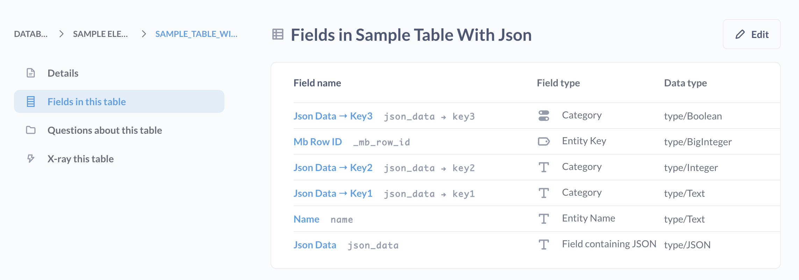
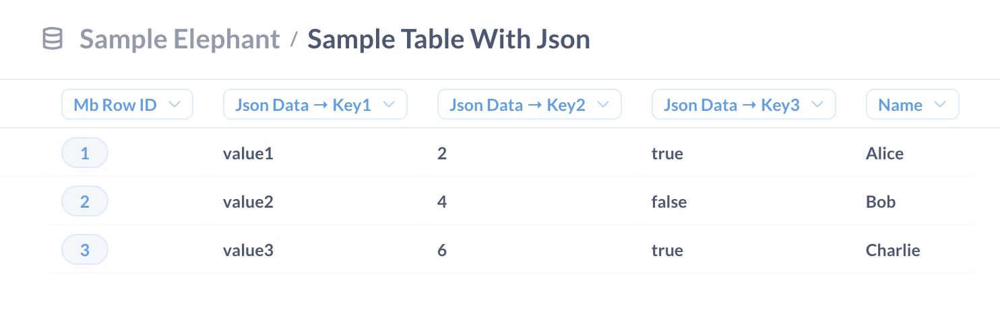

# Arbeiten mit JSON

## Filtern von JSON

Im [query builder](../questions/query-builder/editor.md) kann die Metabase JSON in Spalten nicht parsen, so dass man nur nach "Is empty" oder "Not empty" filtern kann.

## JSON-Entfaltung

Mit [einigen Datenbanken](#databases-that-support-json-unfolding) kann Metabase JSON-Spalten in ihre Komponentenfelder auffalten, nach denen Sie dann mit dem Query Builder filtern können.

Hier ist eine Tabelle mit einer Spalte, die JSON enthält.

Eine Tabelle mit einer JSON-Spalte(./images/table-with-json-column.png)

Metabase kann diese JSON-Spalte entfalten, so dass jeder Schlüssel im JSON-Objekt eine eigene Spalte in der Tabelle erhält. Hier sind die entfalteten Felder der Tabelle mit der oben abgebildeten JSON-Spalte:

Und hier sind die Werte, wie sie in der Tabelle zu sehen sind:

Diese Entfaltung ermöglicht es Ihnen, nach Werten zu filtern, die im ursprünglichen JSON-Objekt gefunden wurden.

Die Metabase stellt den Namen der entfalteten Spalten den Namen der ursprünglichen Spalte, die das JSON enthält, voran. Sie können die Spaltennamen in **Admin settings** > [Table metadata](metadata-editing.md) ändern, oder indem Sie ein [model](./models.md) erstellen und die Spaltenmetadaten bearbeiten.

## Umschalten der JSON-Entfaltung für eine Datenbank

Wenn Sie eine Beeinträchtigung der Leistung durch die JSON-Abwicklung feststellen, empfehlen wir, diese zu deaktivieren.

So deaktivieren Sie die JSON-Abwicklung für eine Datenbank:

1. Klicken Sie auf das **Zahnrad** in der oberen rechten Ecke.
2. Wählen Sie **Admin-Einstellungen**
3. Besuchen Sie die Registerkarte **Datenbanken**.
4. Wählen Sie die entsprechende Datenbank aus.
5. Klicken Sie auf **Erweiterte Optionen anzeigen**.
6. Toggle **Entfaltung von JSON-Spalten zulassen**.
7. Blättern Sie nach unten und klicken Sie auf die Schaltfläche **Änderungen speichern**.
8. Klicken Sie auf **Datenbankschema synchronisieren**.
9. Klicken Sie auf **Feldwerte neu scannen**.

## Umschalten der JSON-Aufklappung für eine bestimmte Spalte

Wenn die Leistung nachlässt oder Sie das JSON lieber in der ursprünglichen Spalte behalten möchten, können Sie die Entfaltung für einzelne Felder in deren Einstellungen deaktivieren.

1. Klicken Sie auf das **Zahnrad** in der oberen rechten Ecke.
2. Wählen Sie **Admin-Einstellungen**.
3. Besuchen Sie die Registerkarte **Metadaten der Tabelle**.
4. Wählen Sie die Datenbank aus, die das Feld enthält, das Sie aktualisieren möchten.
5. Wählen Sie die Tabelle aus, die das Feld enthält.
6. Wählen Sie das Feld aus, das das ursprüngliche JSON enthält.
7. Blättern Sie zur Option**JSON ausklappen** und wählen Sie**Ja** oder**Nein**. Wenn die Spalte ausgeklappt wurde, hat Metabase diese JSON-Spalte ausgeblendet. Wenn Sie die JSON-Spalte also wieder sichtbar machen möchten, müssen Sie die Sichtbarkeit der Spalte auf**Überall** ändern.
8. Scrollen Sie nach unten und klicken Sie auf das Feld **Dieses Feld erneut scannen**.

(./images/unfold-json-setting.png)

## Damit die JSON-Entfaltung funktioniert, muss der Datentyp der Spalte JSON sein.

Wenn Sie z. B. eine CSV-Datei mit JSON hochladen, müssen Sie möglicherweise die Daten/den Typ in der Datenbank aktualisieren. Beachten Sie, dass Sie den Datentyp über die Metabase nicht bearbeiten können; Sie können nur den Feldtyp ändern. Selbst wenn der Feldtyp in der Metabase also "Field containing JSON" lautet, bietet die Metabase keine Möglichkeit, die Spalte zu entfalten, wenn die Daten/der Typ nicht "JSON" sind. Sie müssen den Spaltentyp in der Datenbank selbst ändern.

## Datenbanken, die JSON-Entfaltung unterstützen

- [PostgreSQL](../databases/connections/postgresql.md)
- [MySQL](../Datenbanken/Verbindungen/mysql.md)
- [Druid (JDBC)](../databases/connections/druid.md)
