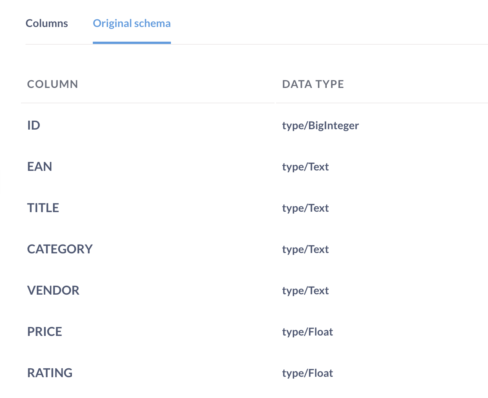

# Admin-Einstellungen für Tabellen-Metadaten

Mit Metabase können Sie Metadaten zu Ihren Tabellen und Spalten hinzufügen und bearbeiten, um die Geschäftslogik Ihrer Organisation bei Änderungen zu verwalten. Gehen Sie zur Registerkarte **Tabellen-Metadaten** in Ihren **Admin-Einstellungen**:

- [Anzeigenamen und Beschreibungen festlegen](#table-display-name).
- [Veraltete Daten ausblenden](#table-visibility).
- [Eine Text- oder Zahlenspalte in eine Datumsspalte umwandeln](#casting-to-a-specific-data-type).
- [Den Stil eines Filter-Widgets ändern](#changing-the-filter-widget).
- [Eine Spalte als Link anzeigen](#displaying-a-column-as-a-link).

> Die**Tabellenmetadaten**-Administrationseinstellungen wirken sich nur auf die Art und Weise aus, wie die Daten in der Metabase angezeigt und interpretiert werden. Keine der Einstellungen verändert die Daten in Ihrer Datenbank.

## Tabelleneinstellungen

Klicken Sie auf einen Tabellennamen in der linken Seitenleiste, um die Einstellungen der Tabelle in Metabase anzuzeigen.

Wenn Sie mehr als eine Datenbank mit Metabase verbunden haben, klicken Sie auf den Namen der Datenbank (z. B. "Beispieldatenbank") und wählen Sie eine andere Datenbank aus dem Dropdown-Menü. Sobald Sie eine Datenbank ausgewählt haben, werden die Tabellen in dieser Datenbank in der Seitenleiste angezeigt.

[Tabellen-Metadaten](./images/table-metadata.png)

- [Den Anzeigenamen ändern](#table-display-name).
- [Hinzufügen oder Bearbeiten der Beschreibung](#table-description).
- [Anzeigen oder Ausblenden der Tabelle in der Metabase](#table-visibility).
- [Das Originalschema anzeigen](#original-schema).
- [Spalten-(Feld)-Einstellungen bearbeiten](#column-field-settings).

### Name der Tabellenanzeige

Um den Anzeigenamen einer Tabelle in Metabase zu bearbeiten, klicken Sie in das Feld, das den aktuellen Tabellennamen enthält. Die Änderungen werden automatisch gespeichert, sobald Sie das Feld verlassen.

### Tabellenbeschreibung

Um eine Tabellenbeschreibung hinzuzufügen, klicken Sie in das Feld unter dem Tabellennamen. Die Beschreibungen werden in der [Datenreferenz] der Metabase(../exploration-and-organization/data-model-reference.md) angezeigt, um den Benutzern das Auffinden der richtigen Tabelle für ihren Anwendungsfall zu erleichtern.

### Sichtbarkeit von Tabellen

**Abfragbare** Tabellen sind in der gesamten Metabase sichtbar.

**Versteckte** Tabellen werden nicht im [query builder](../questions/query-builder/editor.md) oder [data reference](../exploration-and-organization/data-model-reference.md) angezeigt. Dies ist jedoch kein Sicherheitsmerkmal: versteckte Tabellen können immer noch in SQL-Fragen verwendet werden, wenn jemand `SELECT * FROM hidden_table` aus dem [SQL-Editor](../questions/native-editor/writing-sql.md) schreibt. Um zu verhindern, dass jemand Abfragen gegen bestimmte Tabellen schreibt, siehe [data permissions](../permissions/data.md).

Tipp: Um alle Tabellen in einer Datenbank auszublenden (z.B. wenn Sie zu einer neuen Datenbank migriert haben), klicken Sie auf das Symbol **verstecktes Auge** neben "# abfragbare Tabellen" in der linken Seitenleiste.

### Ursprüngliches Schema

Um sich an die Spaltennamen und Datentypen zu erinnern, wie sie in Ihrer Datenbank gespeichert sind, klicken Sie auf **Originalschema** (unter **Sichtbarkeit**).

## Einstellungen für Spalten (Felder)

Wählen Sie eine Datenbank aus und klicken Sie auf den Namen einer Tabelle in der Seitenleiste, um die grundlegenden Einstellungen für die Spaltenanzeige aufzurufen:

- [Ändern Sie den Anzeigenamen](#column-name)
- [Hinzufügen oder Bearbeiten der Beschreibung](#column-description)
