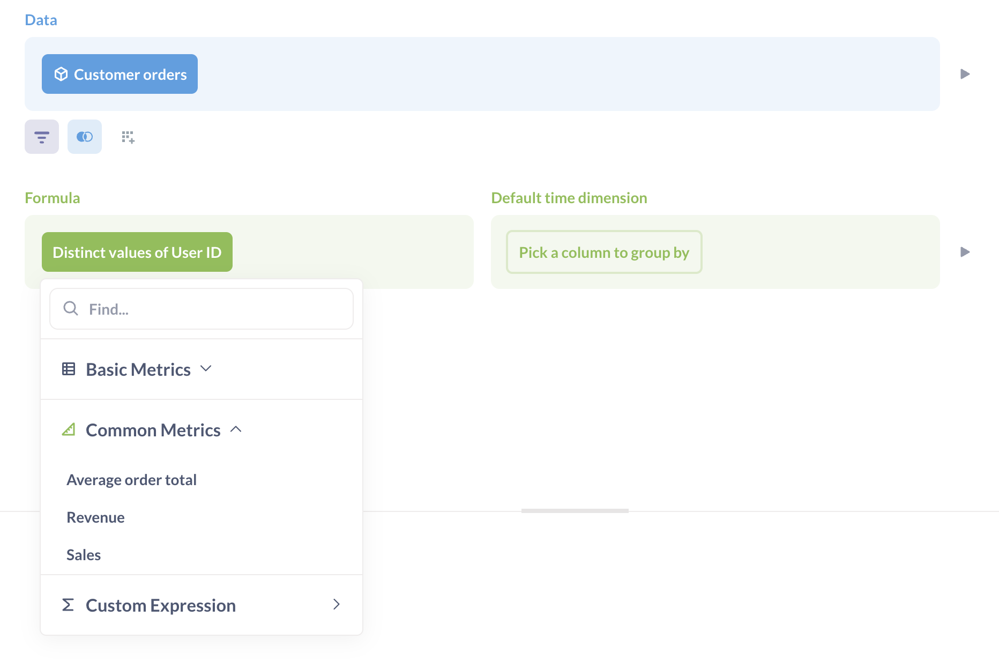
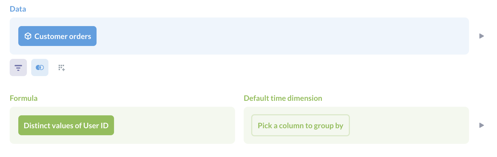

# Metriken

Erstellen Sie Metriken, um den offiziellen Weg zur Berechnung wichtiger Zahlen für Ihr Team zu definieren.

Metriken sind wie vordefinierte Berechnungen: Erstellen Sie Ihre Aggregationen einmal, speichern Sie sie als Metriken und verwenden Sie sie immer dann, wenn Sie Ihre Daten analysieren müssen.

Sie können zum Beispiel eine Metrik zur Berechnung des Umsatzes erstellen, damit sich die Mitarbeiter in ihren Fragen auf den Umsatz beziehen können. Auf diese Weise können Sie standardisieren, wie der Umsatz berechnet wird (so dass Sie nicht fünf verschiedene Berechnungen für den Umsatz haben).

## Verwendung von Metriken

Sie können:

- Metriken in [Sammlungen] speichern(../exploration-and-organization/collections.md).
- Hinzufügen von Metriken zu [Dashboards](../dashboards/introduction.md).
- Betrachten Sie Metriken im [Datenbankbrowser](../exploration-and-organization/exploration.md#browse-your-databases).
- Wählen Sie beim Erstellen von Fragen Metriken als Aggregationsspalten im Summarize-Block aus, ändern Sie sie oder kombinieren Sie sie.
- Die Pläne [Pro](https://www.metabase.com/product/pro) und [Enterprise](https://www.metabase.com/product/enterprise) bieten die Möglichkeit, [Metriken als verifiziert zu markieren](../exploration-and-organization/content-verification.md).

### Metriken im Abfragegenerator

Wenn Sie im Query Builder Fragen stellen, finden Sie die von Ihrem Team erstellten Metriken im Abschnitt "Zusammenfassung" unter **Gemeinsame Metriken**. Sie können mehrere Metriken auswählen, die dann unabhängig voneinander berechnet und automatisch entlang der gewählten Dimensionen verknüpft werden.

Sie können auch eine Metrik als Datenquelle auswählen, wenn Sie eine neue Frage erstellen. Wenn die Metrik eine Zeitdimension hat, wird die Metabase die Zeitdimension als Gruppierung einschließen. Sie können die Gruppierungen ändern, um die Metrik nach anderen Dimensionen aufzuschlüsseln.

(/images/entity-picker-metrics-tab.png)[Metrik-Registerkarte in der Entitätsauswahl)

Sie können benutzerdefinierte Ausdrücke verwenden, um mehrere Metriken zu kombinieren oder Berechnungen auf den Metriken durchzuführen.

## Erstellen einer Metrik

Um eine Metrik zu erstellen, rufen Sie die Befehlspalette mit cmd/ctrl + k auf. Das ist cmd + k für Macs oder ctrl + k für Windows PCs. Suchen Sie nach Neue Metrik.

Sie können auch eine neue Metrik erstellen, indem Sie in der seitlichen Navigationsleiste auf **Durchsuchen > Metriken** gehen und auf **+** klicken.

Wählen Sie Ihre Ausgangsdaten. Sie können von einem Modell, einer Metrik, einer Tabelle oder einer gespeicherten Frage ausgehen.

Der Metrik-Editor ist dem regulären Abfrage-Editor ähnlich, mit zwei wesentlichen Unterschieden:

- Der Aggregationsabschnitt heißt [**Formel**](#metric-formula)
- Der Abschnitt "Gruppieren nach" heißt [**Standard-Zeitdimension**](#metric-default-time-dimension). Sie können nur nach einer einzigen Zeitdimension gruppieren.

Zur Definition einer Metrik sind nur die Schritte Daten und Formel erforderlich. Sie können Daten vor dem Formelschritt verknüpfen und filtern und eine Standard-Zeitdimension für die Gruppierung nach festlegen.

## Metrische Formel

Die Formel ist der Kern der Metrik. Sie ist das, was Sie aggregieren, und sie ist erforderlich, wenn Sie eine Metrik definieren.

Sie können Metriken auf bestehenden Metriken aufbauen.

(./images/metrics-built-on-other-metrics.png)

## Standard-Zeitdimension der Metrik

Sie können optional eine Standard-Zeitdimension für die Metrik festlegen. Metabase verwendet diese Standardzeitdimension, wenn die Metrik geöffnet oder auf einer Karte in einer Sammlung oder einem Dashboard angezeigt wird. In der folgenden Abbildung, die zwei angeheftete Metriken am oberen Rand einer Sammlung zeigt, hat die linke Metrik keine Standard-Zeitdimension, sodass Metabase die Metrik als Zahlendiagramm anzeigt. Die rechte Metrik hat eine standardmäßige Zeitdimension und wird daher in der Metabase als Liniendiagramm angezeigt.
