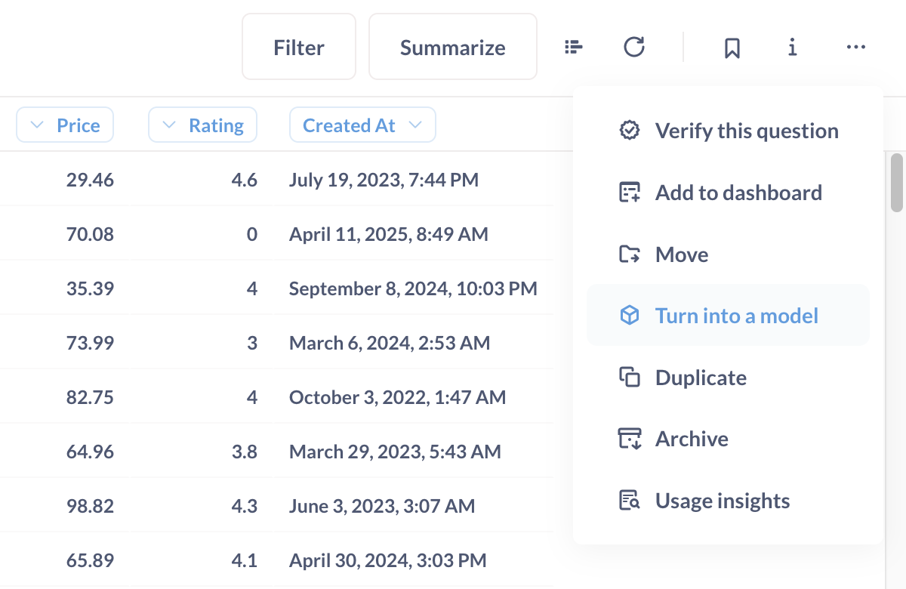

# Modelle

Modelle sind ein grundlegender Baustein in Metabase. Modelle kuratieren Daten aus einer anderen Tabelle oder aus Tabellen derselben Datenbank, um die Art von Fragen, die man an die Daten stellen wird, vorwegzunehmen. Man kann sie sich als abgeleitete Tabellen vorstellen oder als eine besondere Art von gespeicherten Fragen, die als Ausgangspunkt für neue Fragen verwendet werden können. Sie können ein Modell auf eine SQL- oder Query-Builder-Frage stützen, d. h. Sie können benutzerdefinierte, berechnete Spalten in Ihr Modell aufnehmen.

Modelle:

- Sie können Spaltenbeschreibungen aktualisieren und Metadaten anpassen, um hervorragende Ausgangspunkte für die Erkundung zu schaffen.
- Sie erscheinen in den Suchergebnissen weiter oben und werden hervorgehoben, wenn andere Nutzer neue Fragen stellen, um die Wiederverwendung zu fördern.
- Leben in Sammlungen, um sie von chaotischen Datenbankschemata zu trennen.
- Können [einzelne Datensätze in Suchergebnissen auftauchen](#surface-individual-records-in-search-by-matching-against-this-column).
- Kann [für schnelleres Laden persistiert werden](./model-persistence.md).

Einen tieferen Einblick, warum und wie man Modelle verwendet, finden Sie in unserem [Learn article on models][learn-models].

## Wie man Modelle verwendet

Sie können Modelle verwenden, um:

- Modelle erstellen, wobei mit Modell hier eine intuitive Beschreibung eines Konzepts in Ihrem Unternehmen gemeint ist, das Sie als eine Reihe von Spalten kodieren. Ein Beispiel für ein Modell könnte ein "Kunde" sein, eine Tabelle, die Kundeninformationen aus mehreren Tabellen zusammenfasst und berechnete Spalten hinzufügt, z. B. eine Spalte mit dem Lebenszeitwert (LTV). Dieses Modell stellt die [Kennzahlen und Dimensionen][Kennzahlen-Dimensionen] dar, die Sie für Ihr Verständnis Ihrer Kunden für relevant halten.
- Ermöglichen Sie es den Nutzern, die Ergebnisse von SQL-Abfragen mit dem Query Builder zu untersuchen (vorausgesetzt, Sie habendie Spaltentypen festgelegt)(#column-type).
- Erstellen Sie Übersichtstabellen, die Daten aus mehreren Tabellen zusammenfassen oder aggregieren.
- Bereinigen Sie Tabellen, aus denen unnötige Spalten und Zeilen herausgefiltert wurden.

Die Idee bei Modellen ist es, anderen Leuten eine gute "Startpunkttabelle" zu geben, die es ihnen erleichtert, Fragen zu dem Thema zu beantworten, das modelliert wird.

## Ein Modell erstellen

Suchen Sie zunächst nach bereits vorhandenen Modellen. Wenn Sie keines finden, das Ihren Anforderungen entspricht, können Sie ein Modell erstellen:

- [von Grund auf](#create-a-model-from-scratch), oder
- [aus einer gespeicherten Frage](#create-a-model-from-a-saved-question).

Modelle, die Sie erstellen, werden automatisch [an die aktuelle Sammlung]angeheftet(../exploration-and-organization/collections.md#pinned-items).

### Ein Modell von Grund auf erstellen

1. Klicken Sie oben rechts auf **Neu +** > **Modell**.
2. Wählen Sie entweder den Query Builder oder eine native Abfrage (wenn Sie SQL verwenden möchten). Die Verwendung des Query Builders hat den Vorteil, dass die Metabase einen Teil der Metadaten für Sie ausfüllen kann. Wenn Sie SQL verwenden, müssen Sie diese Metadaten manuell ausfüllen.
3. Wählen Sie Ihre Daten aus.
4. Erstellen und speichern Sie Ihre Abfrage.

### Erstellen Sie ein Modell aus einer gespeicherten Frage

1. [Stellen Sie eine Frage, indem Sie entweder den Query Builder oder den SQL-Editor verwenden, oder wählen Sie eine bereits gespeicherte Frage aus, die Sie in ein Modell umwandeln möchten.
2. Speichern Sie die Frage.
3. Klicken Sie auf die Schaltfläche **...** > **In ein Modell verwandeln**.

## Modell-Details
