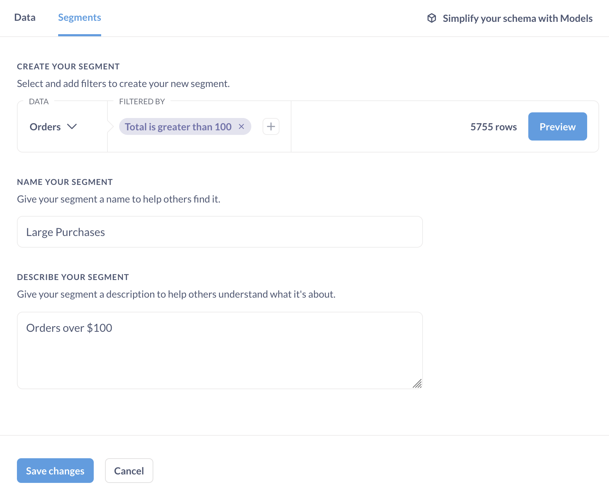
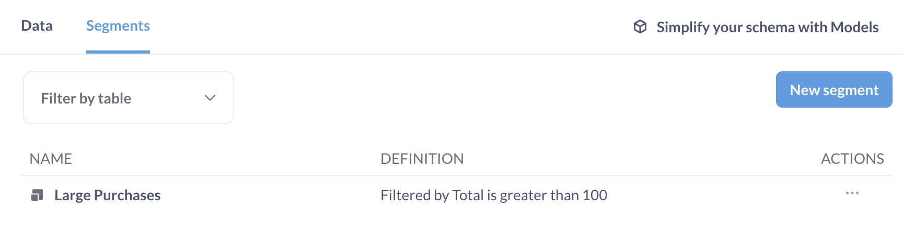
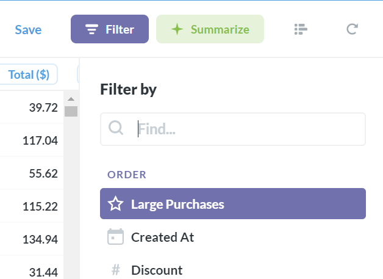

# Segmente

In der Metabase können Administratoren Segmente erstellen, auf die sie im Query Builder schnell und einfach verweisen können. Gehen Sie einfach zum**Administrationsbereich** und wählen Sie**Tabellenmetadaten** aus dem oberen Menü.

## Erstellen eines Segments

Ein Segment ist lediglich ein spezieller benannter Filter oder eine Gruppe von Filtern. Sie können diese erstellen, um sicherzustellen, dass es eine offizielle Definition einer Untergruppe von Kunden, Benutzern oder Produkten gibt, auf die sich alle in Ihrem Team einheitlich beziehen können. Sie könnten zum Beispiel ein Segment mit der Bezeichnung "Aktive Benutzer" erstellen, das alle Filter enthält, die für die korrekte Auswahl aktiver Benutzer erforderlich sind.

Wählen Sie zunächst die Registerkarte **Segmente**, gefolgt von der Schaltfläche **Neues Segment** auf der rechten Seite des Bildschirms. Wählen Sie die entsprechende Tabelle und Filter für Ihr neues Segment und fügen Sie einen Titel und eine Beschreibung hinzu. Wenn Sie fertig sind, wird dieses Segment über die Filterliste im Query Builder zugänglich sein, wenn Sie diese Tabelle anzeigen (das Segment wird nicht automatisch auf die Tabelle angewendet).

[Segment hinzufügen](images/AddSegment.png)

Nun sehen Sie sich den Segment Builder an, der eine eingeschränkte Version des Query Builders ist und nur die Möglichkeit bietet, Filter hinzuzufügen. Fügen Sie Ihre Filter wie im Query Builder hinzu und geben Sie Ihrem Segment einen Namen und eine Beschreibung (diese werden nach dem Speichern im Dropdown-Menü des Query Builders angezeigt). Wenn Sie Ihr Segment im Abfragegenerator testen möchten, bevor Sie es speichern, klicken Sie einfach auf die Schaltfläche Vorschau, die ein neues Fenster des Abfragegenerators mit Ihrem Segment öffnet.

Wenn Sie fertig sind, klicken Sie auf **Änderungen speichern**. Ihr neues Segment erscheint nun in der Liste der Segmente in Ihrer Tabelle.

Wenn Sie die Verwaltungskonsole verlassen und versuchen, eine neue Frage zu stellen, und dann auf die Schaltfläche zum Hinzufügen eines Filters klicken, sehen Sie Ihr Segment am Anfang der Liste.

## Segmente bearbeiten und löschen

Sie können Segmente auf dem Bildschirm Tabellenmetadaten im Admin Panel bearbeiten und löschen. Wählen Sie die Tabelle mit dem gesuchten Segment aus, und klicken Sie auf das Ellipsen-Symbol (...) rechts neben dem Segment.

[Segmentaktionen](images/SegmentActions.png)

Wenn Sie ein Segment bearbeiten, müssen Sie eine Notiz hinterlassen, warum Sie es ändern, damit alle verstehen können, warum sich etwas geändert hat. Wenn ein Benutzer eine gespeicherte Frage oder ein Dashboard erstellt hat, für das das von Ihnen bearbeitete Segment verwendet wurde, erhält er eine E-Mail, in der er über die Änderung informiert wird, zusammen mit der Erklärung, die Sie in dieses Feld schreiben.

[Nachricht bearbeiten](images/EditMessage.png)

Das Zurückziehen eines Segments führt dazu, dass es nicht mehr über den Abfragegenerator ausgewählt werden kann. Vorhandene gespeicherte Fragen, die von diesem Segment abhängen, werden dadurch jedochnicht beschädigt.

Schließlich können Sie auch den Änderungsverlauf für jedes Segment in der Aktionsliste einsehen.

