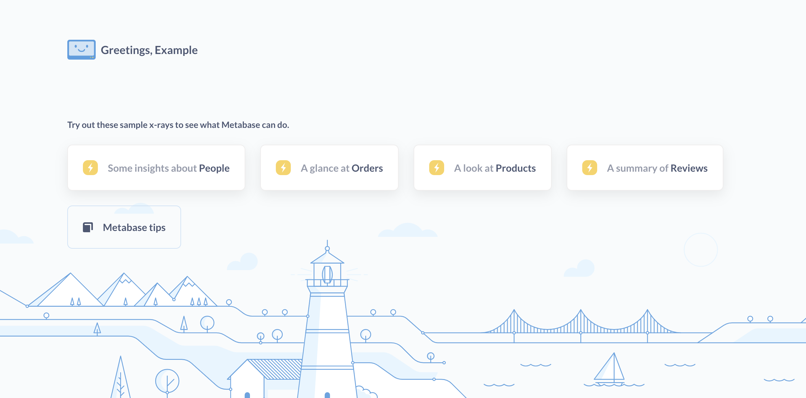

# Interaktive Einbettung UI-Komponenten


Um die Oberfläche Ihrer interaktiven Einbettung zu ändern, können Sie Parameter an das Ende Ihrer Einbettungs-URL anhängen. Wenn Sie die Farben oder Schriftarten in Ihrer Einbettung ändern möchten, lesen Sie bitte [Anpassen des Erscheinungsbildes](../configuring-metabase/appearance.md).


Sie können zum Beispiel die [obere Navigationsleiste](#top_nav) und das [seitliche Navigationsmenü](#side_nav) der Metabase wie folgt deaktivieren:


```
your_embedding_url?top_nav=false&side_nav=false
```





Hier ein Beispiel, bei dem der URL-Konstruktor verwendet wird, um der URL für den iframe Parameter hinzuzufügen:


```tsx
const mods = "logo=false&top_nav=true&search=true&new_button=true";


app.get("/sso/metabase", restrict, (req, res) => {
const ssoUrl = new URL("/auth/sso", METABASE_SITE_URL);
ssoUrl.searchParams.set("jwt", signUserToken(req.session.user));
ssoUrl.searchParams.set("return_to", `${req.query.return_to ?? "/"}?${mods}`);


res.redirect(ssoUrl);
});
```


Die Parameter umfassen:


- [Aktionsschaltflächen](#action_buttons)
- [Zusätzliche Informationen](#additional_info)
- [Brotkrümel](#breadcrumbs)
- [Entitätstypen](#entity_types)
- [Kopfzeile](#header)
- [Gebietsschema](#locale)
- [Logo](#logo)
- [Neue Schaltfläche](#new_button)
- [Suche](#search)
- [Seitennavigation](#side_nav)
- [Top nav](#top_nav)


> Um sicherzustellen, dass die Abfrageparameter bei der Verwendung von [Klickverhalten](../dashboards/interactive.md#customizing-click-behavior) erhalten bleiben, konfigurieren Sie die Admin-Einstellung [Site URL](../configuring-metabase/settings.md#site-url) so, dass sie der URL Ihres Metabase-Servers entspricht.


## `action_buttons`


Standardmäßig auf Frageseiten sichtbar, wenn die [Kopfzeile](#header) aktiviert ist.


Um die Aktionsschaltflächen wie **Filtern**, **Zusammenfassen**, die Schaltfläche für die Abfrageerstellung und so weiter auszublenden:


```
header=false&action_buttons=false
```


[Aktionsschaltflächen](./images/action-buttons.png)
