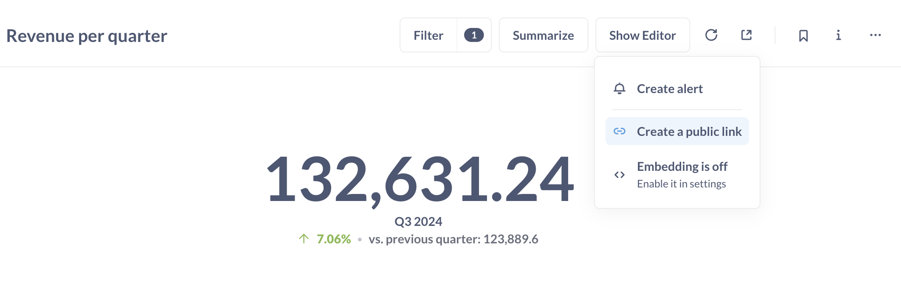
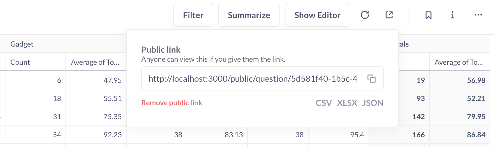

# Öffentliche Freigabe


> Nur Administratoren können öffentliche Links und Iframes erstellen.


Admins können öffentliche Links (URLs) für Fragen und Dashboards erstellen und freigeben. Besucher können diese als eigenständige Ziele (URLs) oder als eingebettete Iframes auf einer anderen Seite oder in einer App anzeigen. In beiden Fällen zeigt das öffentliche Element statische (nur zur Ansicht bestimmte) Ergebnisse Ihrer Frage oder Ihres Dashboards an, so dass die Besucher nicht in der Lage sind, die zugrunde liegenden Daten selbst zu analysieren.


## Einen öffentlichen Link für eine Frage erstellen





Um einen öffentlichen Link für eine Frage zu erstellen, können Administratoren auf das Symbol **Teilen** oben rechts in einer Frage klicken und **Öffentlichen Link erstellen** auswählen. Kopieren Sie den Link und testen Sie ihn, indem Sie ihn in einer privaten/inkognitiven Browsersitzung anzeigen.


## Öffentlicher Link zum Exportieren von Fragenergebnissen in CSV, XLSX, JSON


Diese Exportoption ist nur für Fragen, nicht für Dashboards verfügbar.


So erstellen Sie einen öffentlichen Link, über den Personen die Ergebnisse einer Frage herunterladen können:


1. Klicken Sie auf das Symbol **Teilen** für die Frage.
2. Wählen Sie **Einen öffentlichen Link erstellen**.
3. Klicken Sie auf das gewünschte Dateiformat (unterhalb der URL**Öffentlicher Link** ): CSV, XLSX oder JSON.





Öffnen Sie den öffentlichen Link in einer neuen Registerkarte, um den Download zu testen.


## Einen öffentlichen Link für ein Dashboard erstellen


Um ein Dashboard über einen öffentlichen Link freizugeben, können Administratoren auf die Schaltfläche**Freigeben** im Menü oben rechts klicken.


[Eine Instrumententafel freigeben](./images/dashboard-sharing.png)


Um ein Dashboard einzubetten, siehe [static embedding](./static-embedding.md).


## Exportieren roher, unformatierter Frageergebnisse


Um die rohen, unformatierten Zeilen zu exportieren, müssen Sie `?format_rows=false` an die von Metabase generierte URL anhängen. Wenn Sie zum Beispiel einen öffentlichen Link für einen CSV-Download erstellen, würde die URL wie folgt aussehen:


````html
https://www.example.com/public/question/cf347ce0-90bb-4669-b73b-56c73edd10cb.csv?format_rows=false
```


Standardmäßig exportiert die Metabase die Ergebnisse einer Frage, die alle von Ihnen hinzugefügten Formatierungen enthalten (z. B. wenn Sie eine Spalte mit Fließkommazahlen so formatiert haben, dass sie als Prozentsatz angezeigt wird (0,42 -> 42 %)).


Siehe Dokumentationen für den [Exportformat-Endpunkt](https://www.metabase.com/docs/latest/api#tag/public/GET/public/card/{uuid}/query/{export-format}).


## Drill-Through mit öffentlichen Links simulieren


Der automatische [Drill-Through] der Metabase(https://www.metabase.com/learn/metabase-basics/querying-and-dashboards/questions/drill-through) funktioniert nicht auf öffentlichen Dashboards, da öffentliche Links keinen Zugriff auf Ihre Rohdaten ermöglichen.
