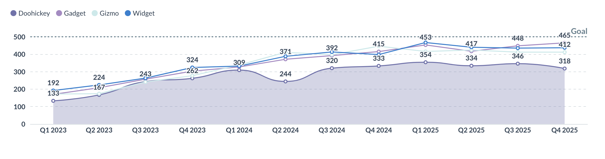
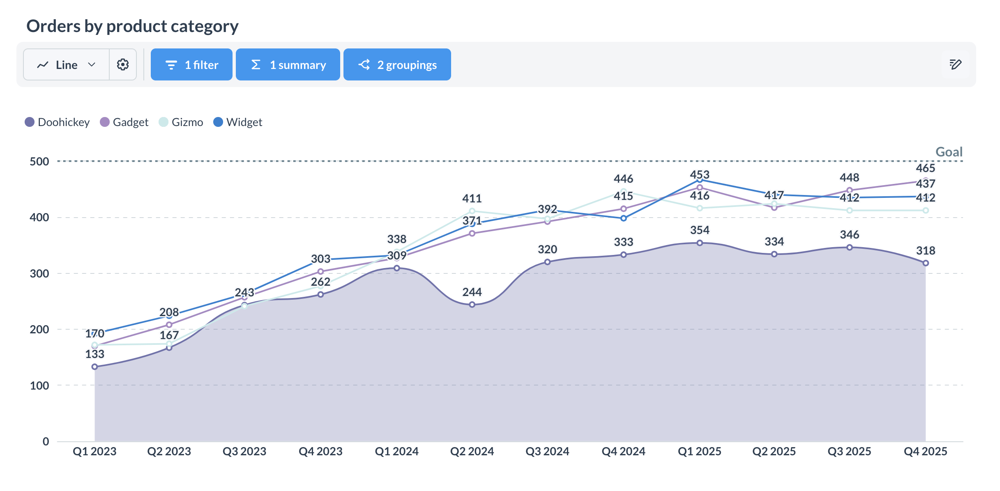

# Embedded analytics SDK - Fragen





Es gibt verschiedene Möglichkeiten, wie Sie Fragen einbetten können:


- [Statische Frage](#staticquestion). Bettet ein Diagramm ein. Ein Klick auf das Diagramm führt zu nichts.
- [Interaktive Frage](#interactivequestion). Wenn Sie auf das Diagramm klicken, erhalten Sie das Drill-Through-Menü.
- [Query builder](#embedding-the-query-builder-for-creating-new-questions). Bindet den grafischen Abfragegenerator ohne vordefinierte Abfrage ein.


## Einbetten einer Frage


Sie können eine Frage einbetten, indem Sie eine der Fragekomponenten verwenden:


### `StaticQuestion`


Eine leichtgewichtige Fragekomponente. Verwenden Sie diese Komponente, wenn Sie Ergebnisse anzeigen möchten, ohne dass die Benutzer mit den Daten interagieren können.





Die Komponente hat eine voreingestellte Höhe, die mit dem Parameter ` height` angepasst werden kann. Um die Höhe vom übergeordneten Container zu erben, können Sie`100%` an die Höhenangabe übergeben.


#### API-Referenz
- [Komponente](./api/StaticQuestion.html)
- [Requisiten](./api/StaticQuestionProps.html)


#### Beispiel


````Typescript

```


#### Requisiten





### `InteractiveQuestion`


Verwenden Sie diese Komponente, wenn Sie den Teilnehmern die Möglichkeit geben wollen, ihre Daten zu erkunden und das Layout der Fragen anzupassen.





#### API-Referenz
- [Komponente](./api/InteraktiveFrage.html)
- [Requisiten](./api/InteraktiveFrageProps.html)


#### Beispiel


````Typescript

```


#### Requisiten





## Übergabe von SQL-Parametern an SQL-Fragen mit `initialSqlParameters`


Mit dem Parameter`initialSqlParameters` können Sie Parameterwerte an Fragen übergeben, die mit SQL definiert wurden, und zwar im Format `{parameter_name: parameter_value}`. Erfahren Sie mehr über [SQL-Parameter](../../questions/native-editor/sql-parameters.md).


````Typescript

```


initialSqlParameters` kann nicht mit Fragen verwendet werden, die mit dem Query Builder erstellt wurden.


## Anpassen interaktiver Fragen


Standardmäßig bietet das Embedded Analytics SDK ein Standardlayout für interaktive Fragen, mit dem Sie Ihre Fragen anzeigen, Filter und Aggregationen anwenden und auf Funktionen innerhalb des Query Builders zugreifen können.---
Titel: "Eingebettete Analytik SDK - Fragen"
Beschreibung: Wie Sie mit dem Embedded Analytics SDK Diagramme in Ihre App einbetten.
---

# Embedded analytics SDK - Fragen



Es gibt verschiedene Möglichkeiten, wie Sie Fragen einbetten können:

- [Statische Frage](#staticquestion). Bettet ein Diagramm ein. Ein Klick auf das Diagramm führt zu nichts.
- [Interaktive Frage](#interactivequestion). Wenn Sie auf das Diagramm klicken, erhalten Sie das Drill-Through-Menü.
- [Query builder](#embedding-the-query-builder-for-creating-new-questions). Bindet den grafischen Abfragegenerator ohne vordefinierte Abfrage ein.

## Einbetten einer Frage

Sie können eine Frage einbetten, indem Sie eine der Fragekomponenten verwenden:

###  `StaticQuestion`

Eine leichtgewichtige Fragekomponente. Verwenden Sie diese Komponente, wenn Sie Ergebnisse anzeigen möchten, ohne dass die Benutzer mit den Daten interagieren können.


Die Komponente hat eine voreingestellte Höhe, die mit dem Parameter ` height` angepasst werden kann. Um die Höhe vom übergeordneten Container zu erben, können Sie`100%` an die Höhenangabe übergeben.

#### API-Referenz
- [Komponente](./api/StaticQuestion.html)
- [Requisiten](./api/StaticQuestionProps.html)

#### Beispiel

````Typescript

```

#### Requisiten



###  `InteractiveQuestion`

Verwenden Sie diese Komponente, wenn Sie den Teilnehmern die Möglichkeit geben wollen, ihre Daten zu erkunden und das Layout der Fragen anzupassen.


#### API-Referenz
- [Komponente](./api/InteraktiveFrage.html)
- [Requisiten](./api/InteraktiveFrageProps.html)

#### Beispiel

````Typescript

```

#### Requisiten



## Übergabe von SQL-Parametern an SQL-Fragen mit `initialSqlParameters`

Mit dem Parameter`initialSqlParameters` können Sie Parameterwerte an Fragen übergeben, die mit SQL definiert wurden, und zwar im Format `{parameter_name: parameter_value}`. Erfahren Sie mehr über [SQL-Parameter](../../questions/native-editor/sql-parameters.md).

````Typescript

```

initialSqlParameters` kann nicht mit Fragen verwendet werden, die mit dem Query Builder erstellt wurden.

## Anpassen interaktiver Fragen

Standardmäßig bietet das Embedded Analytics SDK ein Standardlayout für interaktive Fragen, mit dem Sie Ihre Fragen anzeigen, Filter und Aggregationen anwenden und auf Funktionen innerhalb des Query Builders zugreifen können.

