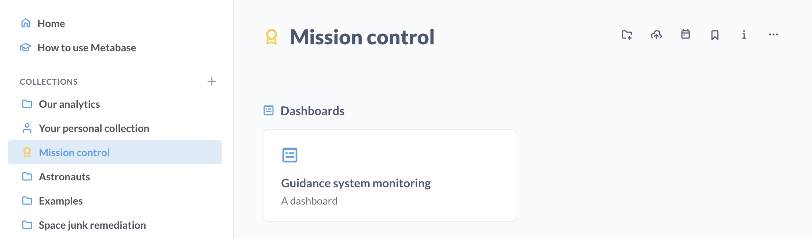

# Sammlungen

Sammlungen sind das wichtigste Mittel zur Organisation von [Fragen](../questions/introduction.md), [Dashboards](../dashboards/introduction.md) und [models][models]. Sie können sich die Sammlungen wie Ordner oder Verzeichnisse vorstellen. Sie können Sammlungen in anderen Sammlungen verschachteln und Sammlungen verschieben. Dabei ist zu beachten, dass ein einzelnes Element, z. B. eine Frage oder ein Dashboard, immer nur in einer Sammlung enthalten sein kann (ausgenommen übergeordnete Sammlungen).

## Erstellen Sie eine Sammlung

(./images/create-new-collection.png)

Um eine Sammlung zu erstellen, klicken Sie auf die Schaltfläche **+** in der linken Navigationsleiste am oberen Rand des Abschnitts **Sammlungen**.

Sie können auch von jeder Sammlungsseite aus eine neue Sammlung erstellen, indem Sie auf das Ordnersymbol mit dem Pluszeichen oben rechts auf der Sammlungsseite klicken.

## Sammlungstypen

### Reguläre Sammlungen

Sie sind wie Dateisystem-Ordner. Man kann Dinge darin ablegen.

### Offizielle Sammlungen



Metabase-Administratoren können Sammlungen als "offiziell" kennzeichnen, was folgende Auswirkungen hat:

- Diese Sammlungen sind mit einem gelben Abzeichen versehen, um darauf hinzuweisen, dass es sich bei den Elementen in der Sammlung um diejenigen handelt, die man sich ansehen sollte (oder was immer "offiziell" für Sie bedeutet).
- Fragen in offiziellen Sammlungen, die zu Dashboards hinzugefügt werden, die nicht zu offiziellen Sammlungen gehören, werden auf dem Dashboard neben ihrem Namen mit einem offiziellen Abzeichen versehen.
- Fragen und Dashboards in offiziellen Sammlungen werden auch eher an der Spitze der Suchergebnisse angezeigt.

Wenn Sie offizielle Abzeichen mit [verifizierten Artikeln](./content-verification.md) kombinieren, kann jeder in Ihrer Metabase herausfinden, welchen Fragen man vertrauen kann.

Um einer Sammlung ein offizielles Abzeichen hinzuzufügen, kann ein Administrator die Sammlung besuchen und auf das Punkt-Punkt-Menü(**...**) klicken und **Sammlung offiziell machen** wählen. Admins können ein offizielles Abzeichen über dasselbe Menü auch wieder entfernen. Admins können auch eine Sammlung als offiziell oder nicht offiziell markieren, wenn sie die Sammlung zum ersten Mal erstellen.

## Sammlungsberechtigungen

[Administratoren können Ihnen verschiedene Zugriffsarten](../permissions/collections.md) auf jede Sammlunggewähren:

-**Ansichtszugriff:** Sie können die Sammlung und ihren Inhalt sehen, aber Sie können nichts ändern oder der Sammlung etwas Neues hinzufügen.
-**Zugang kuratieren:** Sie können die Sammlung und ihren Inhalt bearbeiten, verschieben oder löschen. Sie können auch neue Dinge darin verschieben oder speichern und neue Sammlungen darin erstellen und können auch Elemente in der Sammlung an den oberen Rand des Bildschirms anheften. Allerdings können nur Administratoren die Berechtigungen für Sammlungen bearbeiten.
-Kein Zugriff:** Sie können die Sammlung oder ihren Inhalt nicht sehen. Wenn Sie Zugriff auf ein Dashboard haben, dieses aber Fragen enthält, die in einer Sammlung gespeichert sind, auf die Sie keinen Zugriff haben, wird für diese Fragen eine Berechtigungsmeldung anstelle des Diagramms oder der Tabelle angezeigt.

## Ihre persönliche Sammlung

Sie finden Ihre **Persönliche Sammlung** in der linken Navigationsleiste unter Sammlungen. Nur Sie (und Ihre Administratoren) können diese Sammlung einsehen und bearbeiten.

Sie können Ihre persönliche Sammlung als Kratzbaum für Experimente und Untersuchungen verwenden, die für den Rest Ihres Teams nicht besonders interessant sind, oder als Arbeitsbereich, in dem Sie an Dingen arbeiten und sie dann an einen gemeinsamen Ort verschieben können, sobald sie fertig sind.
