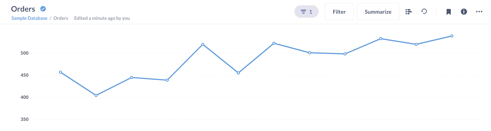

# Überprüfung des Inhalts



Admins können Artikel verifizieren, um anderen mitzuteilen, dass der Inhalt korrekt und auf dem neuesten Stand ist.

## Vorteile der Überprüfung eines Artikels

- Verifizierte Artikel erhalten ein schickes blaues Häkchen neben sich.
- Sie werden in den Suchvorschlägen und -ergebnissen weiter oben angezeigt.
- In den Browsern für Modelle und Metriken können Sie nach verifizierten Artikeln filtern.

(./images/verified-only.png)##Überprüfte Modelle umschalten

## Verifizierung von Artikeln

Um einen Artikel zu überprüfen, kann ein Administrator auf das Drei-Punkte-Menü(**...**) in der oberen rechten Ecke klicken, wenn er den Artikel anschaut und wählen: **Diesen Artikel überprüfen**.

(./images/verify-this-dashboard.png)**Dieses Dashboard überprüfen

## Entfernen des Verifizierungsstatus

Um die Verifizierung eines Artikels zu entfernen, können Administratoren:

1. Besuchen Sie den Artikel.
2. Klicken Sie auf das Drei-Punkte-Menü(**...**).
3. Wählen Sie **Überprüfung entfernen**.

## Änderungen an Abfragen erfordern eine erneute Verifizierung

Wenn jemand Änderungen an einer Frage, einer Metrik oder der _Abfrage_ eines Modells vornimmt, entfernt die Metabase den Verifizierungsstatus (das Häkchen verschwindet). Die Logik dahinter ist, dass jede Änderung der Ergebnisse eine erneute Überprüfung erfordert.

Die Überprüfung von Dashboards funktioniert ein wenig anders (da es keine zugrunde liegende Abfrage gibt). Die Dashboard-Verifizierung ist dauerhaft; Sie können ein verifiziertes Dashboard ändern und es behält seinen verifizierten Status.

## Überprüfbare Elemente

Admins können die folgenden Elemente überprüfen:

- [Fragen](../questions/start.md)
-Modelle](../Datenmodellierung/Modelle.md)
- [Metriken](../data-modeling/metrics.md)
- [Dashboards](../dashboards/introduction.md)

Der Überprüfungsstatus eines Dashboards hat keinen Einfluss auf seine Fragen. Fragen müssen unabhängig verifiziert werden.

## Weitere Lektüre

- [Offizielle Sammlungen](./collections.md#official-collections)

