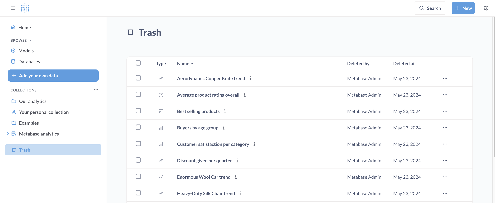

# Löschen und wiederherstellen

Manchmal sind Ihre Fragen, Dashboards, Modelle oder Sammlungen nicht mehr von Nutzen. Sie können veraltete Elemente in den **Papierkorb** verschieben.

In den Papierkorb verschieben(./images/move-to-trash.png)

Objekte im**Papierkorb** werden in der Suche nicht angezeigt (es sei denn, Sie verwenden [erweiterte Suchfilter](./exploration.md)), und Sie können sie nicht zum Erstellen neuer Fragen und Dashboards verwenden.

Das Verschieben von Elementen in den Papierkorb ist nicht dauerhaft; Sie können sie in ihrer ursprünglichen übergeordneten Sammlung wiederherstellen oder sie in eine andere Sammlung verschieben. Wenn Sie Elemente jedoch dauerhaft löschen möchten, [können Sie auch das tun](#permanently-deleting-items).

Das Löschen eines Elements wirkt sich auf alle [Dashboards](../dashboards/introduction.md), [Abonnements](../dashboards/subscriptions.md) oder [SQL-Fragen](../questions/native-editor/referencing-saved-questions-in-queries.md) aus, die von diesem Element abhängen, seien Sie also vorsichtig!

## Elemente im Papierkorb sehen

Sie finden den Papierkorb unten in der linken Navigationsleiste unter allen Sammlungen:

Sie können sich den Papierkorb als eine besondere Art von Sammlung vorstellen. Im**Papierkorb** können Sie gelöschte Elemente aus den Sammlungen sehen, für die Sie über [Kuratierrechte](../permissions/collections.md#collection-permission-levels) verfügen. Sie können gelöschte Elemente nach Typ (Fragen, Dashboards usw.), Löschzeitpunkt und Löschenden sortieren.

Sie können den Inhalt der gelöschten Dashboards, Fragen und Modelle im Papierkorb sehen, aber nicht ändern.

## Suche im Papierkorb

Um Elemente im Papierkorb zu finden, können Sie die [erweiterte Suche](./exploration.md) mit einem Umschalter "Elemente im Papierkorb suchen" verwenden.

## Löschen und Wiederherstellen von Elementen

So verschieben Sie ein Element (Frage, Dashboard, Modell oder Sammlung) in den Papierkorb:

1. Gehen Sie zu der Frage, die Sie löschen möchten;
2. Klicken Sie auf das Menü mit den drei Punkten;
3. Wählen Sie "In den Papierkorb verschieben".

Wenn eine Sammlung in den Papierkorb verschoben wird, verschiebt Metabase alle Elemente der Sammlung ebenfalls in den Papierkorb.

Sie können den Inhalt der Objekte im Papierkorb weiterhin sehen, aber Sie können sie nicht mehr ändern oder als Quelle für andere Fragen verwenden.

Wenn Sie mehrere Elemente aus derselben Sammlung löschen müssen, können Sie sie in einem Rutsch löschen:

1. Gehen Sie zu der Sammlung, die die zu löschenden Objekte enthält;
2. Klicken Sie auf die Kontrollkästchen neben den Elementen, um sie auszuwählen;
3. Wählen Sie "In den Papierkorb verschieben".

So stellen Sie ein Element wieder her:

1. Gehen Sie zu Papierkorb;
2. Suchen Sie das Element, das Sie löschen möchten. Sie können gelöschte Elemente sortieren, um das Auffinden des Elements zu erleichtern, oder [im Papierkorb nach Ihrer Frage suchen](#search-in-trash);
3. Klicken Sie auf das Kontrollkästchen neben dem Element, um es auszuwählen;
4. Wählen Sie "Wiederherstellen".

> Beim Wiederherstellen einer Sammlung werden auch alle Elemente dieser Sammlung wiederhergestellt.

Wenn die ursprüngliche übergeordnete Sammlung des Objekts ebenfalls gelöscht wurde, wird die Option **Wiederherstellen** nicht angezeigt. Sie können das Objekt dennoch aus dem Papierkorb in eine andere Sammlung verschieben.

### Sammlungen aufräumen

Um ältere, unbenutzte Objekte in den Papierkorb zu verschieben, lesen Sie [Sammlungen aufräumen](./collections.md#cleaning-up-collections).

## Wie sich das Löschen eines Objekts auf verwandte Objekte auswirkt
