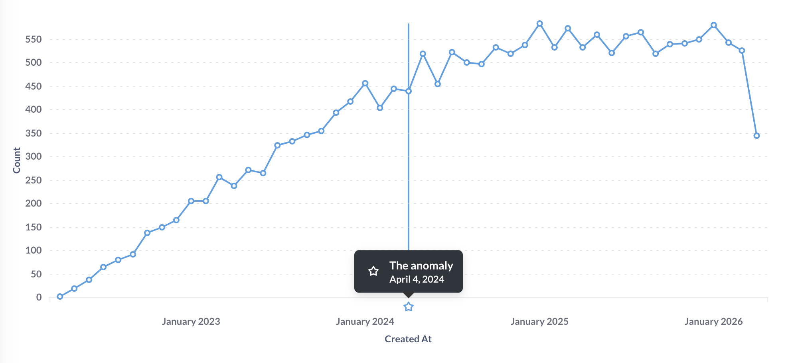
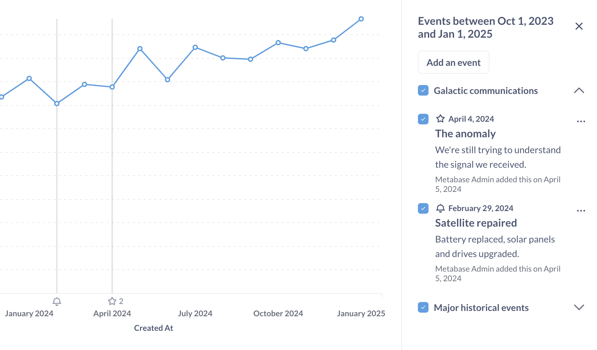

# Ereignisse und Zeitleisten

Bei vielen Diskussionen über Daten gibt es einen Moment, in dem jemand eine Frage stellt, die sich auf einen bestimmten Zeitpunkt bezieht: "Moment, was war noch mal die Spitze im März?" oder "Wann wurde das neue Widget eingeführt?"

Ereignisse und Zeitleisten sind eine Möglichkeit, dieses chronologische Wissen zu erfassen und im Kontext (d. h. beim Betrachten eines Diagramms) verfügbar zu machen, wenn Sie es brauchen. Ereignisse sind eine großartige Möglichkeit, institutionelles Wissen darüber zu speichern, was wann passiert ist, damit die Leute (einschließlich Sie selbst in drei Monaten) nicht (wieder) herausfinden müssen, warum das Liniendiagramm im März in die Höhe geschossen ist.

## Ereignisse

Ein Ereignis ist im Grunde ein Datum + ein Titel + eine Beschreibung + ein Symbol. Sie können der Metabase Ereignisse hinzufügen, um wichtige Meilensteine, Markteinführungen oder andere Ereignisse direkt neben Ihren Daten anzuzeigen.

Metabase zeigt Ereignisse nur in Zeitreihendiagrammen an, wenn eine einzelne Frage angezeigt wird. Metabase zeigt keine Ereignisse auf Diagrammen in Dashboard-Karten an.

## Timelines

Zeitleisten sind Gruppen von Ereignissen, die mit einer [Sammlung](collections.md) verbunden sind.

Sie können z. B. eine Zeitleiste mit wichtigen E-Mail- oder Verkaufsterminen oder eine Ausfallzeitleiste mit Ausfallzeiten einrichten. Sie können Ereignisse zwischen Zeitleisten verschieben und Zeitleisten von einer Sammlung in eine andere verschieben.

Sammlungen können Zeitleisten haben, und Zeitleisten können Ereignisse enthalten. In der Praxis bedeutet dies, dass Ereignisse, die Sie einer Zeitleiste hinzugefügt haben, in Zeitreihenfragen angezeigt werden, die in derselben Sammlung wie diese Zeitleiste gespeichert sind.

- Wenn Sie nicht explizit eine Zeitleiste erstellen, aber Ereignisse erstellen, erstellt Metabase automatisch eine Zeitleiste für Sie (die als Standardzeitleiste für die Sammlung fungiert).
- Sie können mehrere Zeitleisten für dieselbe Sammlung haben.
- Zeitleisten, die mit Sammlungen verbunden sind, gelten nicht für die Untersammlungen dieser Sammlung.

### Hinzufügen von Ereignissen beim Betrachten einer Sammlung

Wenn Sie eine [Sammlung](collections.md) ansehen, können Sie Ereignisse anzeigen, hinzufügen oder bearbeiten, indem Sie auf dasKalendersymbol oben rechts klicken.

In einer Sammlung können Sie Ereignisse anzeigen oder hinzufügen, indem Sie auf das Kalendersymbol klicken(./images/event-calendar.png)

Sobald Sie ein Ereignis erstellt haben, wird es in den Diagrammen der Sammlung angezeigt, sofern das Datum des Ereignisses in den Zeitbereich der Sammlung fällt:

- Das Datum des Ereignisses fällt in den Zeitbereich des Diagramms.
- Die Zeitleiste ist sichtbar (mehr dazu [unten](#adding-events-when-viewing-a-question)).

Auf der X-Achse ist ein Symbol zu sehen, das das Ereignis darstellt. Eine vertikale Linie zeigt an, wann sich die im Diagramm dargestellten Daten mit dem Ereignis überschneiden.

[Ein Ereignis in einem Diagramm](./images/example-event.png)

## Hinzufügen von Ereignissen beim Betrachten einer Frage

Wenn es sich bei Ihrer Frage um eine Zeitreihe handelt, können Sie unten rechts in der Frage auf den**Kalender** klicken, woraufhin Metabase die Seitenleiste der Zeitleiste öffnet. Metabase listet alle Zeitleisten und ihre Ereignisse auf, die in den Bereich Ihrer Zeitreihe fallen. Sie können:

- Die Sichtbarkeit der Zeitleiste umschalten (einschließlich Zeitleisten aus anderen Sammlungen)
- Ein neues Ereignis hinzufügen (auch wenn Sie die Frage noch nicht gespeichert haben).
- Bearbeiten, verschieben oder archivieren Sie ein Ereignis.
