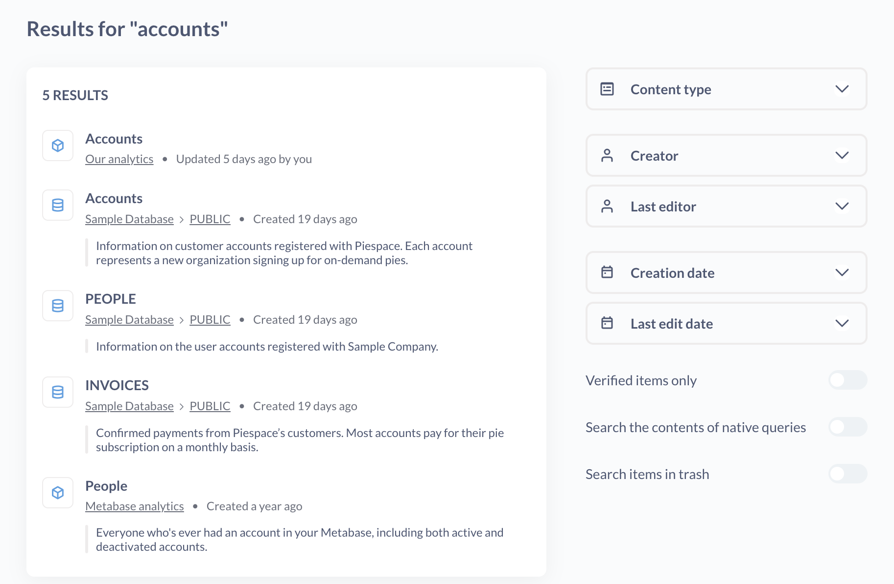
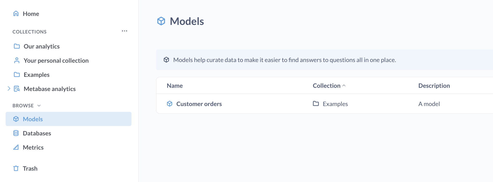

# Grundlegende Erkundung

## Sehen Sie, was Ihre Teammitglieder erstellt haben.

Solange Sie nicht der allererste Benutzer in der Metabase Ihres Teams sind, ist es am einfachsten, mit der Erkundung Ihrer Daten zu beginnen, indem Sie sich Dashboards, Diagramme und Listen ansehen, die Ihre Teamkollegen bereits erstellt haben. Am besten fängst du an, indem du dir die Dashboards ansiehst, die auf deiner Startseite oder in [Sammlungen][Sammlungen], auf die du Zugriff hast, angeheftet sind.

## Befehlspalette

Mit der Befehlspalette können Sie neue Dinge erstellen, Ihre Inhalte durchsuchen oder an eine beliebige Stelle in Ihrer Metabase springen.

Um die Befehlspalette aufzurufen, drücken Sie die Tastenkombination cmd/ctrl + k. Das heißt "cmd + k" für Macs oder "ctrl + k" für Windows-PCs.

Sie können die Befehlspalette verwenden, um:

- neue Dinge erstellen (wie neue Fragen und Dashboards)
- Dinge finden (gespeicherte Fragen, Dashboards, Modelle usw.)
- Suchen und Springen zu Admin- und Kontoeinstellungen.

Wann immer Sie also etwas in der Metabase tun oder finden wollen, drücken Sie einfach `cmd/ctrl + k` und geben Sie ein, was Sie tun wollen.

> Die Befehlspalette ist derzeit in [interactive-embedding](../embedding/interactive-embedding.md) Kontexten nicht verfügbar.

## Erweiterte Suche

Um Ihre Suchergebnisse zu filtern, drücken Sie `cmd/ctrl + k`, um die Befehlspalette aufzurufen, und geben Sie Ihren Suchbegriff ein. Das erste Ergebnis ist ein Link zu "Search and filter all X results".

Bei der Suche werden Titel, Beschreibungen und andere Metadaten der Objekte berücksichtigt - Sie können sogar den Inhalt Ihrer SQL-Abfragen durchsuchen. So können Sie zum Beispiel nach "SELECT escape_pod FROM mothership" suchen und die eine Frage finden, an der Sie vor sechs Monaten gearbeitet haben. In den Ergebnissen wird angezeigt, in welcher Sammlung die einzelnen Elemente gespeichert sind, um welche Art von Objekt es sich handelt und ob es angeheftet ist. Beachten Sie, dass nur Objekte angezeigt werden, die sich in Sammlungen befinden, für die Sie die Berechtigung zum Anzeigen haben.

Sie können nach folgenden Kriterien suchen:

-**Inhaltstyp**: Dashboard, Frage, Modell, Sammlung, Datenbank, Tabelle.
-**Ersteller**: wer das Ding erstellt hat.
-**Letzter Bearbeiter**: wer die letzte gespeicherte Änderung an dem Ding vorgenommen hat.
-**Erstellungsdatum**: wann das Ding in unser Universum kam.
- **Datumder letzten Bearbeitung**: wann jemand das Ding zuletzt aktualisiert hat.
-**Nur geprüfte Einträge**. Nur Elemente anzeigen, die [verifiziert wurden](./content-verification.md).
-**Den Inhalt nativer Abfragen durchsuchen**: Durchsuchen Sie den SQL/nativen Code in Fragen.
-**Durchsuchen von Objekten im Papierkorb**: Schließen Sie die Tiefen des Vergessens in Ihre Suche ein.

## Durchsuchen Sie Ihre Datenbanken

> Ob eine Gruppe Zugriff auf den Datenbankbrowser hat, hängt von der [Abfragen erstellen]-Erlaubnis der Gruppe ab(../permissions/data.md#create-queries-permissions).

In der linken Seitenleiste werden Ihre Datenbanken, [Modelle](../data-modeling/models.md) und [Metriken](../data-modeling/metrics.md) aufgelistet.

Die Pläne [Pro](https://www.metabase.com/product/pro) und [Enterprise](https://www.metabase.com/product/enterprise) bieten die Möglichkeit, nach [verifizierten Modellen und Metriken](./content-verification.md) zu filtern.

Der Datenbankbrowser listet alle mit Ihrer Metabase verbundenen Datenbanken auf. Bewegen Sie den Mauszeiger über eine Tabelle und klicken Sie auf das Symbol **Bolzen**, um die Tabellezu durchleuchten, oder klicken Sie auf das Symbol **Buch**, um weitere Informationen über die Tabelle anzuzeigen: ihre Felder und deren Beschreibungen (falls vorhanden), welche Fragen auf dieser Tabelle basieren und mehr.

Weitere Informationen finden Sie unter [Untersuchen von Daten mit dem Datenbrowser der Metabase](https://www.metabase.com/learn/metabase-basics/querying-and-dashboards/data-browser).

## Sammlungen untersuchen
