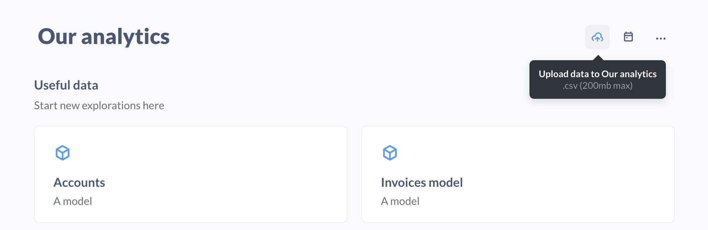
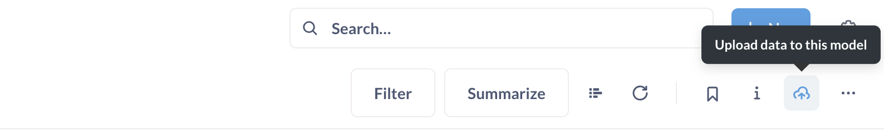

# Hochladen von Daten

Wenn ein Administrator [Uploads](../databases/uploads.md) eingerichtet hat, können Sie CSV-Daten hochladen, indem Sie auf das Symbol **Upload** oben rechts auf der Sammlungsseite klicken.

.

## Modelle mit Uploads erstellen, anhängen oder ersetzen

Wenn Sie eine CSV-Datei hochladen, fordert Metabase Sie möglicherweise auf, ein Ziel für diesen Upload auszuwählen (je nachdem, ob es noch andere Uploads gibt).

Wenn Ihre CSV-Datei dieselben Spalten enthält wie ein Modell aus einer zuvor hochgeladenen Datei, können Sie die Daten an dieses Modell anhängen. Andernfalls können Sie ein neues [Modell](../data-modeling/models.md) erstellen, wenn Sie dies möchten:

- Ein neues Modell erstellen
- [An ein bestehendes, durch einen Upload erstelltes Modell anhängen](#appending-to-a-model-created-by-an-upload)
- [Ersetzen der Daten eines bestehenden Modells, das durch einen Upload erstellt wurde](#replacing-the-data-of-an-uploaded-model)

Die Metabase erstellt ein [model](../data-modeling/models.md), das diese CSV-Daten sowie die dem Modell zugrunde liegende Tabelle enthält.

Uploads sind nur verfügbar, wenn Ihr Administrator Uploads für Ihre Metabase aktiviert hat und Sie einer Gruppe mit uneingeschränktem Zugriff auf das Schema angehören, das zum Speichern dieser Uploads verwendet wird. Siehe [Daten hochladen](../databases/uploads.md).

## Anhängen an ein durch einen Upload erstelltes Modell

Sie können zusätzliche CSV-Daten zu einem bestehenden Modell hochladen, das durch einen früheren CSV-Upload erstellt wurde.

Die hochgeladene CSV-Datei muss denselben Spaltennamen, dieselbe Reihenfolge und denselben Typ haben wie die Spalten im Modell. Die Metabase sucht nach einer Kopfzeile, um zu überprüfen, ob die Spaltennamen übereinstimmen. Wenn Sie also eine große CSV-Datei in mehrere CSV-Dateien aufteilen, achten Sie darauf, dass die Kopfzeilen für alle Dateien enthalten sind.

Beim Anhängen fügt Metabase die Zeilen einfach in die zugrundeliegende Tabelle ein, wodurch das Modell, das sich über dieser Tabelle befindet, aktualisiert wird. Wenn Sie von einem Upload zum nächsten doppelte Zeilen haben, behält Metabase diese doppelten Zeilen bei.

Das Upload-Symbol ist nur bei Modellen sichtbar, die durch Uploads erstellt wurden.

## Ersetzen der Daten eines hochgeladenen Modells

Anstatt ein Modell zu löschen und neu zu erstellen, können Sie die zugrunde liegenden Daten durch eine aktualisierte Kalkulationstabelle ersetzen.

Wie beim Anhängen an hochgeladene Modelle müssen auch beim Ersetzen der hochgeladenen CSV-Daten durch eine neue CSV-Datei die Spalten und Überschriften übereinstimmen.

Wenn Sie [die hochgeladene Tabelle löschen](../exploration-and-organization/uploads.md#deleting-models-and-tables-created-by-uploads), können Sie die Daten des Modells nicht ersetzen.

## Automatische Erzeugung von Primärschlüsseln

Wenn Sie eine CSV-Datei hochladen, erstellt Metabase eine eindeutige Primärschlüsselspalte mit der Bezeichnung "_mb_row_id" als erste (ganz linke) Spalte der hochgeladenen CSV-Tabelle. Diese Spalte "_mb_row_id" enthält automatisch generierte Ganzzahlen. Metabase ignoriert auch alle Spalten im Upload, die einen Namen haben, der in der Datenbank denselben Namen hat wie die automatisch generierte Primärschlüsselspalte (z. B. "_MB row-ID" in der CSV ist "_mb_row_id" oder "_MB_ROW_ID" in der Datenbank).
