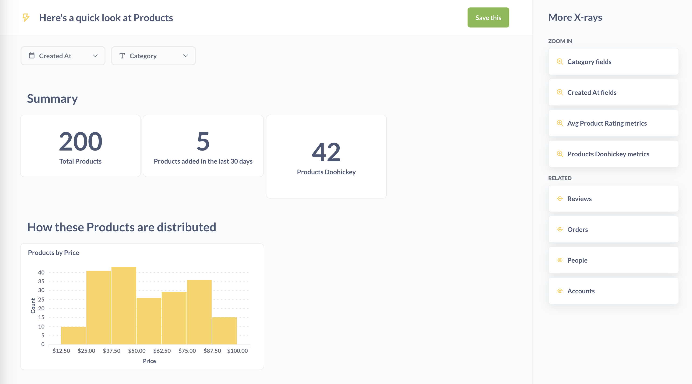
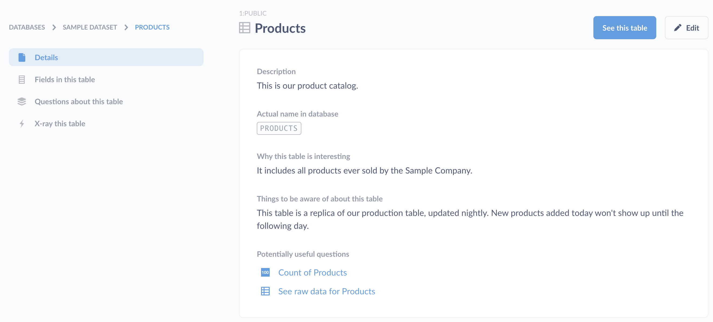

# X-rays

X-rays sind eine Möglichkeit, automatische Einblicke und Erkundungen in Ihre Daten zu erhalten.

## Automatische Einblicke erhalten, wenn Sie auf ein Diagramm klicken

Eine gute Möglichkeit, Ihre Daten in der Metabase allgemein zu erkunden, besteht darin, auf interessante Punkte in Diagrammen zu klicken und **Automatische Einblicke** auszuwählen.

Automatische Einblicke im Drill-Through-Menü(./images/automatic-insights.png)

Metabase bietet Ihnen einige Optionen:

-**Röntgen**
- **Mit dem Rest vergleichen**

In beiden Fällen untersucht Metabase die Felder in dieser Tabelle oder diesem Modell und erstellt automatisch Diagramme, die die Daten auf der Grundlage der gefundenen Datentypen zusammenfassen.

Hier ist ein Beispiel für ein Röntgenbild:

## Röntgen von Modellen und Tabellen

(./images/browse-data-x-ray.png)

Eine weitere gute Möglichkeit, Ihre Daten kennen zu lernen, ist das Röntgen Ihrer Modelle und Tabellen.

-Tabellen-Röntgenstrahlen**: Klicken Sie in der linken Navigationsleiste auf**Daten durchsuchen**, wählen Sie eine Datenbank aus, fahren Sie mit dem Mauszeiger über eine Tabellenkarte, und klicken Sie auf das Blitzsymbol Tabelle, um ein Röntgenbild der Tabelle anzuzeigen.
-**Modell-Röntgenbilder**: Klicken Sie auf die Ellipsen für ein Modell und wählen Sie**Röntgenstrahlen**.

## Röntgenstrahlen in der Datenreferenz

Sie können ein Röntgenbild auch anzeigen, indem Sie zu einer Tabelle navigieren und auf das Blitzsymbol klicken. Klicken Sie auf die Schaltfläche **Daten durchsuchen** in der oberen Navigation, wählen Sie eine Datenbank aus und bewegen Sie den Mauszeiger über eine Tabelle, um das Symbol zu sehen.

Auf der Seite "Daten durchsuchen" können Sie auch auf "Erfahren Sie mehr über unsere Daten" klicken, um den Abschnitt "Datenreferenz" anzuzeigen. Von hier aus können Sie durch Datenbanken, Tabellen, Spalten, Metriken oder Segmente navigieren, und Sie können auf den Link "Röntgenbild" in der linken Seitenleiste klicken, um ein Röntgenbild des Elements zu sehen, das Sie gerade betrachten.

## Erkunden neu hinzugefügter Datenquellen

Wenn Sie als Administrator zum ersten Mal eine Datenbank mit Metabase verbinden, bietet Ihnen Metabot einige automatische Erkundungen Ihrer neu verbundenen Daten an.

## Durchsuchen der vorgeschlagenen Röntgenaufnahmen

Je nach dem Röntgenbild, das Sie gerade betrachten, werden Ihnen Vorschläge angezeigt, die es Ihnen ermöglichen:

- **Verkleinern**: eine Röntgenaufnahme der Tabelle anzeigen, auf der die aktuelle Röntgenaufnahme basiert.
-**Vergrößern**: eine detailliertere Röntgenaufnahme eines Feldes oder einer Dimension der aktuellen Röntgenaufnahme anzeigen.
-**Verwandt**: Röntgen Sie einige verwandte Daten, z. B. eine auf der aktuellen Tabelle basierende Metrik oder eine andere Tabelle, die mit der aktuellen Tabelle zusammenhängt.

## Speichern von Röntgenbildern

Wenn Sie auf ein besonders interessantes Röntgenbild stoßen, können Sie dessen Karten und Filter als Dashboard speichern, indem Sie auf die grüne Schaltfläche**Speichern** klicken. Metabase erstellt ein neues Dashboard und speichert es in der Sammlung Automatisch generierte Dashboards (Sie können das Dashboard aber auch in jede andere Sammlung verschieben, auf die Sie Zugriff haben).

## Deaktivieren von Röntgenstrahlen

Wenn Röntgenstrahlen aus irgendeinem Grund nicht zu Ihrem Team oder Ihren Daten passen, können Administratoren sie vollständig deaktivieren, indem sie auf das Zahnradsymbol oben rechts klicken und zu **Admin-Einstellungen** > **Einstellungen** > **Allgemein** gehen und die Option **Röntgenfunktionen aktivieren** umschalten.
