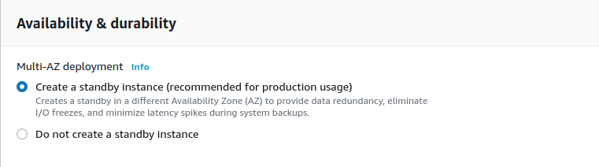

# Erstellen einer RDS-Datenbank auf AWS

Wenn Sie Metabase nicht mehr nur zu Testzwecken verwenden möchten, sondern etwas, das für den großen Auftritt bereit ist, sollten Sie PostgreSQL für Ihre Anwendungsdatenbank verwenden. Hier sehen Sie eine Übersicht über die Metabase, die mit einer dedizierten Anwendungsdatenbank eingesetzt wird.

## Erstellen Sie eine Datenbank

Geben Sie in AWS RDS in das Suchfeld ein oder wählen Sie RDS aus der Dropdown-Schaltfläche oben links auf der Seite. Klicken Sie innerhalb von RDS auf die Schaltfläche **Datenbank erstellen**.

Wählen Sie PostgreSQL als Motortyp aus. Wir wählen die neueste Version, die zum Zeitpunkt der Erstellung dieses Dokuments in AWS verfügbar ist (12.4-R1).

Templates: Sie können "Production" auswählen oder eine andere Option wählen, die Ihren Anforderungen besser entspricht.

Einstellungen: Geben Sie einen eindeutigen **DB-Instanzbezeichner** für Ihre Datenbank ein. Sie benötigen den Benutzernamen und das Master-Passwort, um die Umgebungsvariablen in Metabase zu konfigurieren.

Größe der Instanz: Die Größe der RDS-Instanz hängt von der Anzahl der Metabase-Instanzen ab, die mit dieser Datenbank verbunden werden, von der Anzahl der gleichzeitigen Benutzer, die die Metabase verwenden, und von der Anzahl der Fragen, Dashboards und Konfigurationen, die gespeichert werden. Für den Anfang ist eine "t3.small" eine gute Wahl.

Verfügbarkeit und Dauerhaftigkeit: Bei Produktionseinsätzensollten Sie** einen Multi-AZ-Cluster (Availability Zone) verwenden, da dies sicherstellt, dass die Datenbank nicht ausfällt, wenn es in einer einzelnen Availability Zone zu einem Problem kommt.

Konnektivität:

- Vergewissern Sie sich, dass Sie die Datenbank in derselben VPC bereitstellen, in der Sie die Metabase-Instanz(en) bereitgestellt haben, da sie sich sonst nicht gegenseitig sehen können.
- Erstellen Sie eine **VPC-Sicherheitsgruppe**, da Sie den Zugriff von der/den Metabase-Instanz(en) auf die Datenbank an dem Port, der auf Verbindungen wartet, gewähren müssen.

Zusätzliche Konfiguration:

- Geben Sie "metabase" als **Initialer Datenbankname** ein. Metabase wird diese Datenbank für alle Konfigurationen verwenden.
- Sie können auch das Backup-Fenster konfigurieren, falls Sie die Backups zu einem bestimmten Zeitpunkt wiederherstellen müssen.

Wenn Sie all diese Konfigurationen abgeschlossen haben, klicken Sie auf die Schaltfläche**Datenbank erstellen** im unteren rechten Teil der Seite und warten Sie, bis die Datenbank erstellt wurde (was einige Minuten dauern kann).

## Sicherheit einrichten

Sobald der Datenbankstatus "Verfügbar" lautet, müssen Sie auf den DB-Bezeichner klicken:

[RDS DB-Bezeichner](images/RDSDBIdentifier.png)

Auf der Seite, die angezeigt wird, nachdem Sie auf den Datenbankbezeichner geklickt haben, sehen Sie in der Mitte der Seite den Abschnitt**Verbindung & Sicherheit**. In diesem Abschnitt finden Sie den**Endpunkt**, den die Metabase benötigt, um eine Verbindung mit der gerade erstellten Anwendungsdatenbank herzustellen.

Im Abschnitt**Sicherheitsgruppenregeln** sehen Sie die erstellte Sicherheitsgruppe, aber die Gruppe hat eine Regel, die nur einer IP-Adresse den Zugriff auf die Datenbank erlaubt.

Um die Regel für die Datenbank zu konfigurieren, wählen Sie die Regel **CIDR/IP - Inbound** aus und klicken dann auf die Registerkarte **Inbound rules** im unteren Teil der Seite.
