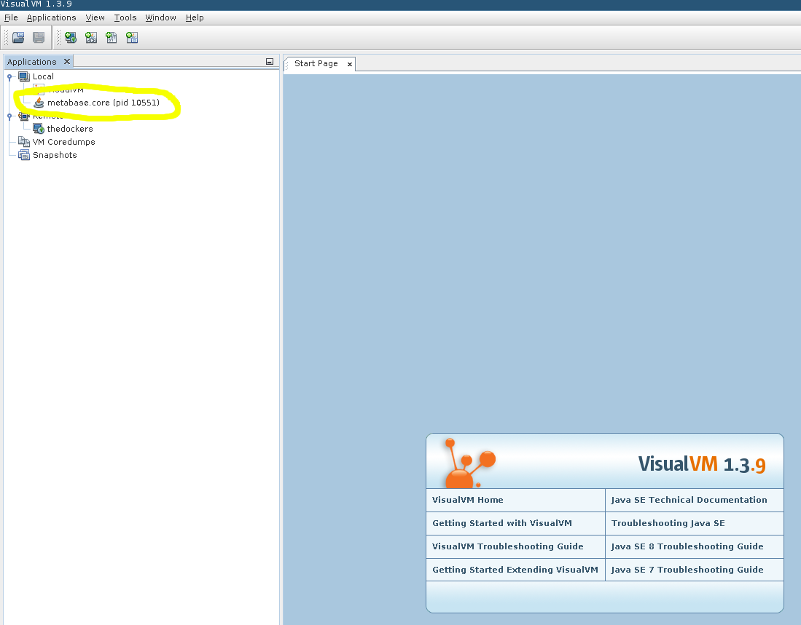

# Überwachung Ihrer Metabasis


Die Diagnose von Leistungsproblemen kann eine Herausforderung sein. Glücklicherweise wird die JVM mit Tools ausgeliefert, die bei der Diagnose vieler gängiger Probleme helfen können. Die Aktivierung von JMX und die Verwendung eines Tools wie VisualVM können bei der Diagnose von Problemen im Zusammenhang mit Speichermangel, einer blockierten Metabase oder langsamen Antwortzeiten helfen.


In dieser Anleitung wird davon ausgegangen, dass Sie das VisualVM-Tool lokal installiert haben. VisualVM ist im Lieferumfang von OpenJDK und dem Oracle JDK enthalten. Sie finden VisualJVM im Verzeichnis "bin" der JDK-Installation. Einige Linux-Distributionen trennen VisualVM vom JDK, in diesem Fall ist es ein separates ` visualvm`-Paket.


## Verbinden mit einer lokalen Metabase


Wenn Sie VisualVM auf Ihrem Metabase-Server installiert haben und VisualVM dort ausführen können, ist dies der einfachste Weg, da Sie keine Remote-Kommunikation mit Ihrer Metabase-Instanz einrichten müssen. In diesem Szenario starten Sie die Metabase wie gewohnt und starten VisualVM separat.





## Verbindung zu einer entfernten Metabase


Die Überwachung einer entfernten Metabase-Instanz (oder einer lokalen Instanz, die in einem Docker-Container läuft) ist wahrscheinlich häufiger anzutreffen, erfordert aber eine umfangreichere Einrichtung. Zunächst müssen wir einige Systemeigenschaften angeben, die der JVM mitteilen, dass wir eine Fernüberwachung zulassen wollen. Angenommen, wir führen Metabase mit `java --add-opens java.base/java.nio=ALL-UNNAMED -jar metabase.jar` aus, müssen wir den Aufruf in den folgenden Befehl ändern, der die Eigenschaften enthält:


``sh
java --add-to-start=jmx,jmx-remote \
-Dcom.sun.management.jmxremote \
-Dcom.sun.management.jmxremote.port=1099 \
-Dcom.sun.management.jmxremote.rmi.port=1099 \
-Dcom.sun.management.jmxremote.authenticate=false \
-Dcom.sun.management.jmxremote.ssl=false \
-Dcom.sun.management.jmxremote.local.only=false \
-Djava.rmi.server.hostname=<Metabase Hostname> \
-jar metabase.jar
```


Port "1099" ist ein typischer RMI/JMX-Port, kann aber jeder zugängliche Port sein.


Der obige Befehl öffnet Ihre Anwendung für die Überwachung durch jedermann und sollte nur verwendet werden, wenn Sie sich für kurze Zeit in einem vertrauenswürdigen Netzwerk befinden. Eine Absicherung dieser Verbindung ist möglich, siehe [the Oracle
docs](https://docs.oracle.com/javase/8/docs/technotes/guides/management/agent.html).


Wenn Sie Metabase in einem "Docker"- Container ausführen, müssen Sie die oben beschriebenen Systemeigenschaften angeben und außerdem sicherstellen, dass der Port geöffnet ist. Docker ermöglicht die Angabe von Umgebungsvariablen über eine separate Datei, die an den Aufruf von "docker run" übergeben werden kann. Sie können eine Datei mit dem Namen "metabase-vars.env" erstellen, in der "JAVA_OPTS" angegeben ist:


```
JAVA_OPTS=-Dcom.sun.management.jmxremote.port=1099 -Dcom.sun.management.jmxremote.rmi.port=1099 -Dcom.sun.management.jmxremote.authenticate=false -Dcom.sun.management.jmxremote.ssl=false -Dcom.sun.management.jmxremote.local.only=false -Djava.rmi.server.hostname=<Datenbank Hostname>
```


Diese Datei erwartet, dass jede Umgebungsvariable in einer eigenen Zeile ohne Zeilenumbruch steht:


```sh
docker run --env-file=metabase-vars.env -d -p 3000:3000 -p 1099:1099 -h <Metabase Hostname> --name metabase metabase/metabase
```


Der Zusatz `-p 1099:1099` öffnet den JMX-Port für die Überwachung und die `--env-file=metabase-vars.env` übergibt die zusätzlichen JMX-bezogenen Umgebungsvariablen. Nachdem die Instanz gestartet wurde, muss VisualVM wissen, wie man sich mit der laufenden Instanz verbindet. Fügen Sie zunächst eine neue Remote-Instanz hinzu:
