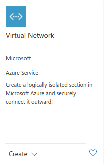

# Ausführen von Metabase auf Microsoft Azure

In dieser Anleitung werden die Grundlagen für den Betrieb Ihrer Metabase-Instanz in Microsoft Azure mit Docker behandelt.

## Schritt 1: Erstellen Sie die Ressourcengruppe (Ressourcengruppierung)

Klicken Sie in der Azure-Verwaltungskonsole auf das Symbol**Ressourcengruppen** oben auf der Seite (oder suchen Sie einfach nach Ressourcengruppen). Wenn Sie bereits eine Ressourcengruppe haben, können Sie direkt zu [Schritt 2](#step-2-create-the-vnet-virtual-network) gehen.

Klicken Sie auf der Ressourcengruppenseite auf die Schaltfläche **+ Hinzufügen** in der oberen Leiste, um eine neue Ressourcengruppe zu erstellen. Wählen Sie auf der Seite**Ressourcengruppe erstellen** Ihr gültiges Azure-Abonnement aus, geben Sie den Namen Ihrer Ressourcengruppe ein und wählen Sie eine Region aus.

[Eine Ressourcengruppe erstellen](images/AZResource_group_Add.png)

Klicken Sie auf**Weiter**, bis Sie die Schaltfläche**Erstellen** sehen, und klicken Sie dann auf diese Schaltfläche.

Bei der Auswahl der Region für Ihre Metabase sollten Sie den Standort Ihrer Benutzer und Ihres Data Warehouse sowie die Infrastrukturkosten und Datenschutzgesetze berücksichtigen, die den grenzüberschreitenden Datentransfer einschränken könnten.

## Schritt 2: Erstellen Sie das VNET (virtuelles Netzwerk)

Klicken Sie in der Mitte der Seite auf die Schaltfläche**Ressourcen erstellen**. Suchen Sie nach**VNET**:

Wählen Sie das VNET-Produkt von Microsoft, und klicken Sie auf **Erstellen**:

Geben Sie einen Namen für das virtuelle Netzwerk ein und wählen Sie die gleiche Region, die Sie für die Ressourcengruppe verwendet haben. Klicken Sie auf**Weiter: IP-Adressen** am unteren Rand.

Hier erstellen wir ein sicheres Netzwerk, das aus einem öffentlichen Subnetz (einem Netzwerk, das dem Internet ausgesetzt ist) und einem privaten Netzwerk besteht, das Ihre Anwendungsdatenbank enthalten wird.

Für die IPv4-Adresse sollten Sie den Standardwert 10.0.0.0/16 verwenden (andernfalls fügen Sie diesen Netzwerkbereich in das Feld ein). Als nächstes fügen Sie zwei Subnetze hinzu:

- ein Subnetz namens public mit dem Subnetzadressbereich 10.0.1.0/24 und
- ein Subnetz namens private mit dem Subnetzbereich 10.0.2.0/24.

[Azure-Netzwerkkonfiguration](images/AZNetworks.png)

Klicken Sie auf**Weiter**, bis Sie zur Seite**Prüfen und erstellen** gelangen, und klicken Sie dann auf die Schaltfläche**Erstellen** am unteren Rand, um Ihr Netzwerk zu erstellen.

## Schritt 3: Erstellen Sie die Anwendungsdatenbank (PostgreSQL)

Erstellen Sie auf der Startseite der Azure-Verwaltungskonsole eine neue Ressource. Suchen Sie dieses Mal nach**Azure Database for PostgreSQL**. Sie finden diese Datenbank auch im Marketplace-Menü unter**Datenbanken**.

Auf der nächsten Seite müssen Sie auswählen, wie Sie den Dienst nutzen wollen. Wählen Sie zunächst **Einzelserver**, was ein guter Ausgangspunkt ist, aber bedenken Sie, dass dadurch nur eine Instanz von PostgreSQL erstellt wird, die Ihr einziger Ausfallpunkt sein wird.

Wählen Sie auf dem nächsten Bildschirm Folgendes aus oder geben Sie es ein:

-**Ressourcengruppe**: die Gruppe, die alle Ihre Komponenten umfasst.
-**Servername**: ein eindeutiger Name für Ihre Datenbank.
-**Datenquelle**: kann als "Keine" belassen werden.
-**Standort**: derselbe, den Sie für Ihre Ressourcengruppe und Ihr VNET verwendet haben.
- Version**: Verwenden Sie die neueste Version, die Sie können.
-Compute + Storage**: Sie können Ihre Datenbank neu dimensionieren, aber Sie müssen die "General Purpose"-Ebene wählen, da dies die einzige Ebene ist, die einen Private Link bietet.

Wählen Sie dann einen Administrator-Benutzernamen und ein Passwort Ihrer Wahl.

Klicken Sie auf **Weiter**, bis Sie zur letzten Seite gelangen, und klicken Sie dann auf **Erstellen**. Es wird einige Zeit dauern, bis Azure die Datenbank erstellt hat. Sobald die Erstellung abgeschlossen ist, klicken Sie auf die Schaltfläche **Go to resource**.
