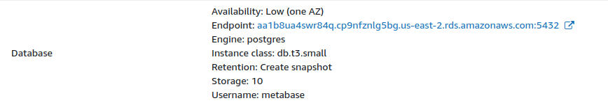

# Ausführen von Metabase auf AWS Elastic Beanstalk

> Aufgrund von Problemen mit der Plattform wird die Verwendung von Elastic Beanstalk für die Ausführung von Metabase in der Produktion nicht mehr empfohlen.

Wenn Sie Metabase auf Elastic Beanstalk ausführen, empfehlen wir Ihnen, auf ein anderes Setup zu wechseln.

## Alternativen zu Elastic Beanstalk

### Metabase Cloud

Wir empfehlen [Metabase Cloud](https://www.metabase.com/pricing/) (natürlich).

### Selbst gehostete Setups

Sie können Metabase entweder mit PostgreSQL oder MySQL als Anwendungsdatenbank einrichten und Metabase auf einem Server betreiben, den Sie überwachen können, entweder auf Ihrer Hardware oder bei einem Cloud-Anbieter.

Stellen Sie zumindest sicher, dass Sie Ihre Anwendungsdatenbank regelmäßig (und immer vor einem Upgrade) sichern. Beachten Sie die Anforderungen Ihres Unternehmens in Bezug auf Sicherheit, Überwachung und Verfügbarkeit.

### Professionelle Dienstleistungen

Wenn Sie Hilfe bei der Einrichtung von Metabase (oder beim Aufbau Ihres Datenstacks im Allgemeinen) benötigen, sehen Sie sich die [professionellen Dienstleistungen an, die wir anbieten](https://www.metabase.com/product/professional-services).

## Entkoppeln Sie Ihre RDS-Datenbank von der Elastic Beanstalk-Bereitstellung

Wenn Sie den Relationalen Datenbankservice von AWS zum Speichern Ihrer Metabase-Anwendungsdaten verwenden, können Sie dies auch weiterhin tun (allerdings sollten Sie Ihre Metabase-Installation von Elastic Beanstalk abkoppeln). Sie können [Umgebungsvariablen](../configuring-metabase/environment-variables.md) verwenden, um von dem Ort, an den Sie Ihre Metabase-Installation verschieben, eine Verbindung zu Ihrem RDS-Host herzustellen.

### Benachrichtigen Sie die Benutzer, dass Ihre Metabase eine Zeit lang nicht verfügbar sein wird.

Diese Prozedur wird eine Ausfallzeit verursachen, daher sollten Sie Ihren Benutzern mitteilen, dass die Metabase nicht verfügbar sein wird, während Sie die Umgebung mit der neuen Datenbank wiederherstellen.

### Erstellen Sie einen Snapshot Ihrer Anwendungsdatenbank.

> Sie benötigen den Master-Benutzernamen und das Passwort für die Datenbank, die Sie bei der Erstellung der Elastic Beanstalk-Instanz verwendet haben.

Identifizieren Sie den RDS-Endpunkt, den Ihr Elastic Beanstalk verwendet, indem Sie die Konfiguration der Umgebung aufrufen und den Endpunktwert im Abschnitt Database suchen.

- Wenn Retention auf "Create snapshot" steht, können Sie loslegen. Sie können die gesamte Elastic Beanstalk-Umgebung löschen, da AWS vor dem Löschen der Umgebung einen Snapshot (Sicherung) der Datenbank erstellt.
- Wenn Retention einen anderen Wert hat, besuchen Sie Ihre RDS-Instanz und erstellen Sie einen Snapshot der von der Elastic Beanstalk-Anwendung verwendeten Datenbank.

### Beenden Sie Ihre Elastic Beanstalk-Umgebung mit Snapshot

Gehen Sie zur Anwendung Elastic Beanstalk Metabase, wählen Sie die laufende Umgebung aus und beenden Sie sie. Bestätigen Sie, dass die Datenbank **mit Snapshot** beendet wird.

[Umgebung beenden](images/EBTerminateEnvironment.png)

Das Beenden der Umgebung kann etwa 20 Minuten dauern. Wenn die Löschung fehlschlägt, müssen Sie über CloudFormation ermitteln, welche Ressourcen nicht gelöscht werden konnten, und sie selbst löschen.
