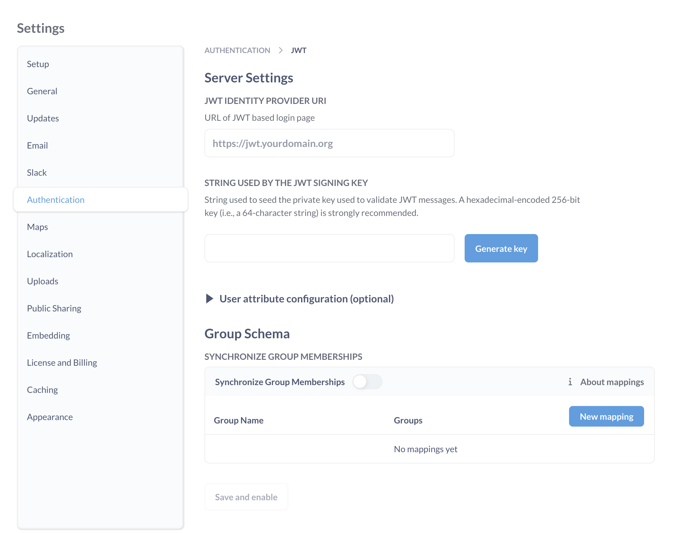
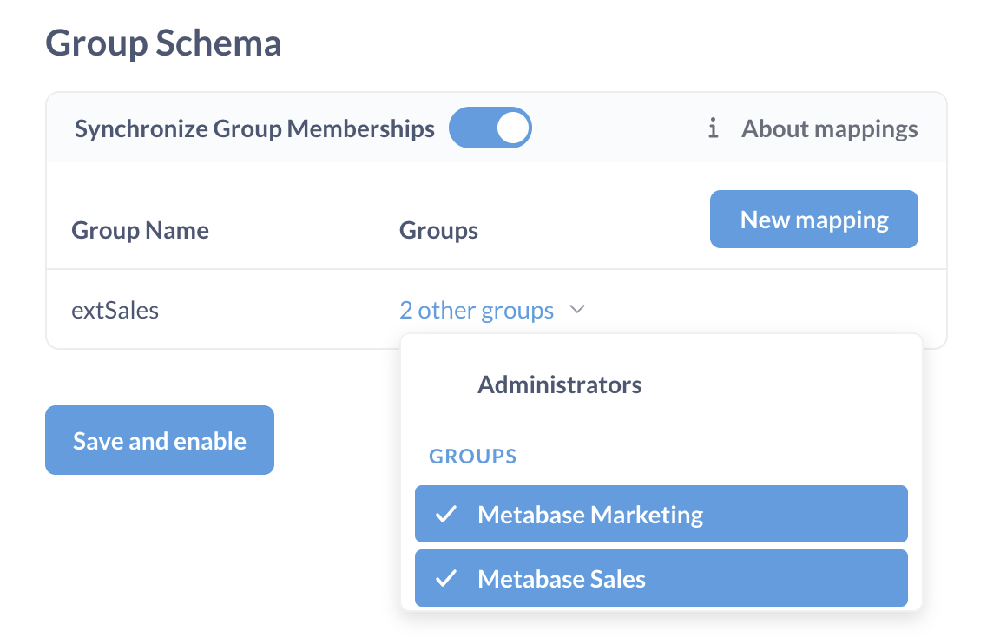

# JWT-basierte Authentifizierung



Sie können die Metabase mit Ihrem Identitätsanbieter verbinden, indem Sie JSON Web Tokens (JWT) verwenden, um Personen zu authentifizieren.

## Typischer Ablauf für eine JWT-basierte SSO-Interaktion mit Metabase

Angenommen, Ihr Standort ist localhost und wird über Port 3000 bedient:

1. Die Person versucht, eine Frage anzuzeigen, z.B. "http://localhost:3000/question/1-superb-question".
2. Wenn die Person nicht eingeloggt ist, leitet Metabase sie auf `http://localhost:3000/auth/sso` um.
3. Unter Beibehaltung des ursprünglichen URI "/question/1-superb-question" leitet Metabase die Person zum SSO-Anbieter (der Authentifizierungs-App) weiter.
4. Die Person meldet sich über das Grundformular an.
5. Im Falle einer erfolgreichen Anmeldung sollte Ihre Authentifizierungsanwendung eine GET-Anforderung an Ihren Metabase-Endpunkt mit dem Token und der "return to"-URI ausgeben: `http://localhost:3000/auth/sso?jwt=TOKEN_GOES_HERE&return_to=/question/1-superb-question`.
6. Die Metabase verifiziert das JSON-Web-Token, meldet die Person an und leitet sie dann an ihr ursprüngliches Ziel `/question/1-superb-question` weiter.

## Aktivieren der JWT-Authentifizierung

Navigieren Sie zum Abschnitt**Admin**>**Einstellungen** des Admin-Bereichs und klicken Sie dann auf die Registerkarte**Authentifizierung**. Klicken Sie auf die Schaltfläche**Konfigurieren** im Abschnitt JWT auf dieser Seite, und Sie sehen dieses Formular:

Hier ist eine Aufschlüsselung der einzelnen Einstellungen:

**JWT-Identitätsanbieter-URI:** Hier werden die Anmeldeanfragen von Metabase umgeleitet. Das heißt, hier melden sich Ihre Benutzer über Ihren Identitätsanbieter an.

**Vom JWT-Signierschlüssel verwendete Zeichenkette:** Die Zeichenkette, die zum Seeden des privaten Schlüssels verwendet wird, der zur Validierung von JWT-Nachrichten dient. Sowohl die Metabase als auch die Authentifizierungs-App sollten denselben JWT-Signierungsschlüssel haben.

## Konfiguration der Benutzerattribute (optional)

Dies sind zusätzliche Einstellungen, die Sie ausfüllen können, um Benutzerattribute an die Metabase zu übergeben.

-E-Mail-Attribut:** Der Schlüssel zum Abrufen der E-Mail-Adresse jedes JWT-Benutzers.
-Attribut "Vorname":** Der Schlüssel zum Abrufen des Vornamens jedes JWT-Nutzers.
-**Nachname-Attribut:** Wenn Sie erraten haben, dass dies der Schlüssel für den Abruf des Nachnamens jedes JWT-Benutzers ist, dann haben Sie gut aufgepasst.

Sie können weitere Benutzerattribute an die Metabase senden, indem Sie die Attribute als Schlüssel/Wert-Paare zu Ihrem JWT hinzufügen. Diese Attribute werden bei jeder Anmeldung synchronisiert.

## Konfigurieren Sie die Gruppenzuordnungen

Sie können Ihre JWT verwenden, um Metabase-Benutzer benutzerdefinierten Gruppen zuzuordnen.

1. Fügen Sie Gruppen zu Ihrem JWT hinzu: `groups: ["group_name"]`.
1. Gehen Sie in der Metabase zum Admin-Panel und wechseln Sie zur Registerkarte **Einstellung > Authentifizierung**.
1. Klicken Sie unter JWT auf die Schaltfläche **Configure**.
1. Aktivieren Sie unter **Gruppenschema** das Kontrollkästchen **Gruppenmitgliedschaften synchronisieren**.
1. Klicken Sie auf **Neue Zuordnung** und fügen Sie den Namen einer JWT-Gruppe hinzu.
1. Klicken Sie in der angezeigten Zeile auf das Dropdown-Menü, um die Metabase-Gruppe(n) auszuwählen, die zugeordnet werden soll(en).

1. Wiederholen Sie diesen Vorgang für alle Gruppen, die Sie zuordnen möchten.

Alternativ können Sie die Zuordnungen zwischen JWT- und Metabase-Gruppen über die [Umgebungsvariable `MB_JWT_GROUP_MAPPINGS`](../configuring-metabase/environment-variables.md#mb_jwt_group_mappings) definieren. Sie akzeptiert ein JSON-Objekt, wobei die Schlüssel JWT-Gruppen und die Werte Listen von Metabase-Gruppen-IDs sind. Zum Beispiel:
