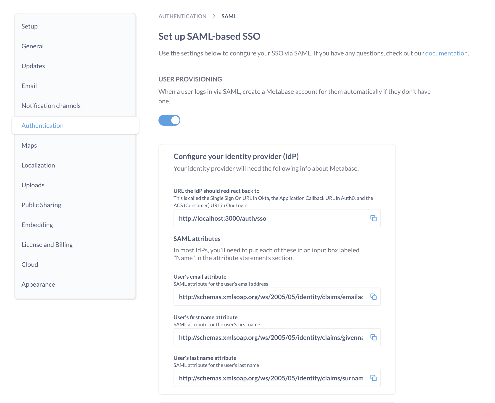

# SAML-basierte Authentifizierung



Die Integration Ihres SSO in die Metabase ermöglicht es Ihnen,:

- Bereitstellung eines Metabase-Kontos, wenn sich jemand bei Metabase anmeldet.
- Übergeben Sie automatisch Benutzerattribute von Ihrer SSO an die Metabase, um [data sandboxes](../permissions/data-sandboxes.md) zu betreiben.
- Ermöglichen Sie Personen den Zugriff auf die Metabase ohne erneute Authentifizierung.

## Bestätigen Sie das Kennwort für Ihr Metabase-Administratorkonto

Vergewissern Sie sich vor der Einrichtung von SAML, dass Sie das Kennwort für Ihr Metabase-Administratorkonto kennen. Sollten während des Einrichtungsprozesses Probleme auftreten, können Sie sich über die Option "Admin backup login" auf dem Anmeldebildschirm anmelden.

## Einrichten von SAML mit Ihrem IdP in Metabase

Nachdem Sie [das Passwort für Ihr Metabase-Admin-Konto bestätigt haben](#confirm-the-password-for-your-metabase-admin-account), gehen Sie zum Abschnitt **Settings** des Admin Panels und klicken Sie auf die Registerkarte **Authentication**. Klicken Sie im SAML-Abschnitt der Authentifizierungsseite auf die Schaltfläche**Einrichten**, und Sie sehen dieses Formular:

Das Formular enthält drei Abschnitte:

1. [Metabasis-Informationen, die Sie bei Ihrem Identitätsanbieter (IdP) eingeben müssen](#generic-saml-configuration).
2. [IdP-Informationen, die Sie der Metabase mitteilen müssen](#enabling-saml-authentication-in-metabase).
3. [Signieren von SSO-Anfragen (optional)](#settings-for-signing-sso-requests-optional).

## SAML-Anleitungen

Zunächst müssen Sie sicherstellen, dass die Konfiguration mit Ihrem IdP korrekt ist. Jeder IdP behandelt die SAML-Einrichtung anders.

Wir haben einige Anleitungen für die gängigsten Anbieter verfasst:

- [Auth0](saml-auth0.md)
- [Microsoft Entra ID](saml-azure.md)
- [Google](saml-google.md)
- [Keycloak](saml-keycloak.md)
- [Okta](saml-okta.md)

Wenn Ihr IdP hier nicht aufgeführt ist:

- Schlagen Sie in den Referenzdokumenten Ihres IdP zur Konfiguration von SAML nach. Sie werden nach einer Anleitung wie dieser [OneLogin SAML guide](https://onelogin.service-now.com/support?id=kb_article&sys_id=83f71bc3db1e9f0024c780c74b961970) suchen.
- Verwenden Sie die Informationen aus dem SAML-Formular der Metabase, um das SAML-Formular Ihres IdP auszufüllen.
- Weitere Informationen finden Sie im nächsten Abschnitt über [Generic SAML configuration](#generic-saml-configuration).

## Benutzer-Provisionierung

Standardmäßig erstellt Metabase Konten für Personen, die noch kein Metabase-Konto haben, sich aber über SAML SSO anmelden können.

Wenn Sie [User provisioning with SCIM](./user-provisioning.md) eingerichtet haben, sollten Sie diese Einstellung deaktivieren, damit Metabase nicht automatisch ein neues Konto für jeden erstellt, der sich erfolgreich authentifiziert, da Sie möglicherweise SCIM verwenden möchten, um zu bestimmen, wer ein Konto in Metabase erstellen kann und wer nicht.

## Allgemeine SAML-Konfiguration

Der obere Teil des SAML-Formulars in der Metabase enthält die Informationen, die Sie zum Ausfüllen des SAML-Formulars Ihres IdP benötigen, sowie Schaltflächen, die das Kopieren der Informationen erleichtern.

Die Namen der Felder im SAML-Formular der Metabase stimmen nicht immer mit den von Ihrem IdP verwendeten Namen überein. Nachfolgend finden Sie eine Beschreibung der einzelnen Felder, die Ihnen helfen soll, Informationen von einem Ort zum anderen zu übertragen.

### URL, zu der der IdP zurückleiten soll

Die Redirect-URL ist die Webadresse, zu der die Benutzer nach der Anmeldung bei Ihrem IdP weitergeleitet werden. Um Personen zu Ihrer Metabase umzuleiten, sollte die Umleitungs-URL Ihre Metabase [Site-URL](../configuring-metabase/settings.md#site-url) sein, mit "/auth/sso" am Ende.
