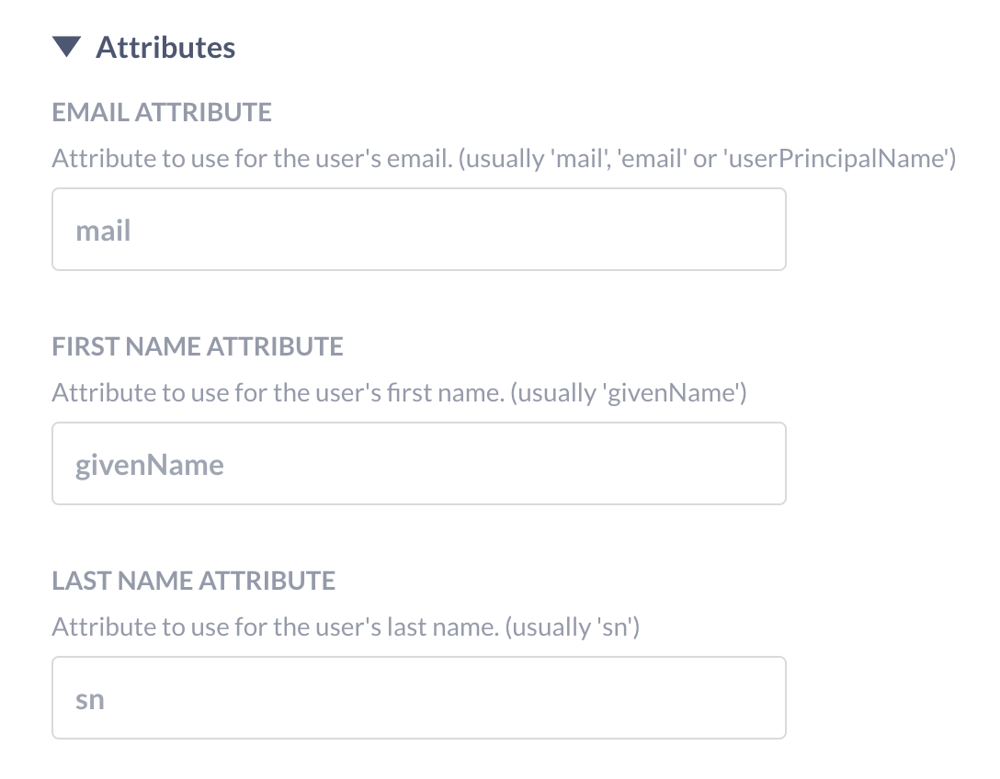

# LDAP


Metabase unterstützt die Authentifizierung mit Lightweight Directory Access Protocol (LDAP).


SSO-Optionen finden Sie unter **Admin-Einstellungen** > **Einstellungen** > **Authentifizierung**.


## Erforderliche LDAP-Attribute


Sie müssen Ihr LDAP-Verzeichnis mit diesen Attributen einrichten:


- E-Mail (standardmäßig mit dem Attribut "mail" )
- Vorname (Standardwert ist das Attribut "givenName" )
- Nachname (standardmäßig das Attribut "sn" ).


Wenn Ihr LDAP-System andere Attribute verwendet, können Sie diese im Abschnitt "Attribute" des Formulars bearbeiten.





In Ihrem LDAP-Verzeichnis muss das E-Mail-Feld für jeden Eintrag, der ein Metabase-Benutzer werden soll, ausgefüllt sein. Andernfalls kann Metabase das Konto nicht erstellen und die Person kann sich auch nicht anmelden. Fehlt eines der beiden Namensfelder, verwendet Metabase den Standardwert "Unknown", und die Person kann ihren Namen in ihren [Kontoeinstellungen](./account-settings.md) ändern.


## Aktivieren der LDAP-Authentifizierung


Gehen Sie in den **Verwaltungseinstellungen** > **Einstellungen** > **Authentifizierung** zum Abschnitt LDAP und klicken Sie auf **Einrichten**. Klicken Sie auf das Kästchen am oberen Rand des Formulars, um LDAP zu aktivieren, und füllen Sie dann das Formular mit den entsprechenden Angaben aus.


## Benutzerbereitstellung


Wenn sich eine Person über LDAP anmeldet, kann Metabase automatisch ein Metabase-Konto für sie erstellen (wenn sie noch kein Metabase-Konto hat).


## Server-Einstellungen


- LDAP-Host. Ihr Servername. Z.B. ldap.ihredomain.org
- LDAP-Anschluss. Der Server-Port, normalerweise 389 oder 636, wenn SSL verwendet wird.
- LDAP-Sicherheitseinstellungen. Die Optionen sind Keine, SSL oder StarTLS.
- LDAP-Administrator-Benutzername. Der Distinguished Name, unter dem die Verbindung hergestellt werden soll (falls vorhanden). Dieser Benutzer wird für die Suche nach Informationen über andere Benutzer verwendet.
- LDAP-Administrator-Passwort.


Speichern Sie dann Ihre Änderungen. Die Metabase zieht automatisch die [erforderlichen Attribute](#required-ldap-attributes) aus Ihrem LDAP-Verzeichnis.


## Benutzerschema


Im Abschnitt**Benutzerschema** auf derselben Seite können Sie Einstellungen vornehmen, die sich darauf beziehen, wo und wie Metabase eine Verbindung zu Ihrem LDAP-Server herstellt, um Benutzer zu authentifizieren.


### Benutzer-Suchbasis


Das Feld**Benutzersuchbasis** sollte mit dem _Distinguished Name_ (DN) des Eintrags in Ihrem LDAP-Server ausgefüllt werden, der den Ausgangspunkt für die Suche nach Benutzern bildet.


Nehmen wir zum Beispiel an, Sie konfigurieren LDAP für Ihr Unternehmen WidgetCo, wobei Ihr Basis-DN `dc=widgetco,dc=com` lautet. Wenn die Einträge für die Mitarbeiter alle innerhalb einer Organisationseinheit in Ihrem LDAP-Server mit dem Namen`People` gespeichert sind, müssen Sie das Basisfeld für die Benutzersuche mit dem DN `ou=People,dc=widgetco,dc=com` versehen. Dadurch wird Metabase angewiesen, an dieser Stelle des LDAP-Servers nach passenden Einträgen zu suchen.


### Benutzerfilter


Sie werden den folgenden ausgegrauten Standardwert im Feld **Benutzerfilter** sehen:


```
(&(objectClass=inetOrgPerson)(|(uid={login})(mail={login})))
```


Wenn sich eine Person bei der Metabase anmeldet, bestätigt dieser Befehl, dass der angegebene Login entweder mit einem UID- _oder_ E-Mail-Feld in Ihrem LDAP-Server übereinstimmt, _und_ dass der übereinstimmende Eintrag eine ObjectClass von ` inetOrgPerson` hat.


Dieser Standardbefehl funktioniert für die meisten LDAP-Server, da "inetOrgPerson" eine weit verbreitete Objektklasse ist. Wenn Ihr Unternehmen jedoch beispielsweise eine andere Objektklasse zur Kategorisierung von Mitarbeitern verwendet, können Sie in diesem Feld einen anderen Befehl festlegen, wie Metabase einen LDAP-Eintrag bei der Anmeldung einer Person findet und authentifiziert.
