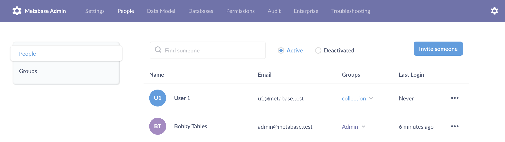

# Personen und Gruppen

Personen können [Konten](#creating-an-account) in der Metabase haben, und diese Konten können Mitglieder von [Gruppen](#groups) sein. Diese Gruppen werden verwendet, um [Berechtigungen] zu definieren(../permissions/introduction.md). Personen können in mehreren Gruppen sein.

> Diese Seite behandelt Konten, mit denen sich Personen bei _Ihrer_ Metabase(s) anmelden. Diese Konten unterscheiden sich von den [Metabase _store_ accounts](https://store.metabase.com), die für die Verwaltung der kostenpflichtigen Metabase-Tarife verwendet werden.

## Verwaltung von Personen und Gruppen

Um mit der Verwaltung von Personen und Gruppen zu beginnen:

Drücken Sie Cmd/Ctrl + K, um die Befehlspalette aufzurufen, und suchen Sie nach "Personen". Klicken Sie auf das Ergebnis der Einstellungen **Personen**.

Oder

Klicken Sie auf das Symbol **Zahnrad** > **Verwaltungseinstellungen** > **Personen**. Sie sehen dann eine Liste aller Personen in Ihrer Organisation.

## Ein Konto erstellen

Admins können Personen zu ihrer Metabase hinzufügen. Um eine neue Person manuell hinzuzufügen, klicken Sie auf das Zahnradsymbol und wählen Sie**Admin-Einstellungen**. Klicken Sie unter der Registerkarte**Personen** in der oberen rechten Ecke auf**Jemanden einladen**. Sie werden aufgefordert, die E-Mail-Adresse und optional den Vor- und Nachnamen einzugeben - nur die E-Mail-Adresse ist erforderlich.

Klicken Sie auf**Erstellen**, um ein Konto zu aktivieren. Ein Konto wird aktiv, sobald Sie auf**Erstellen** klicken, auch wenn sich die Person nie bei dem Konto anmeldet. Das Konto bleibt aktiv, bis Siees [deaktivieren](#deactivating-an-account). Bei einem Pro- oder Enterprise-Metabase-Tarif werden alle aktiven Konten auf die Gesamtzahl der Benutzerkonten angerechnet. Wenn eine Person mehr als ein Konto hat, wird jedes Konto für die Gesamtzahl gezählt (siehe [wie die Abrechnung funktioniert](../cloud/how-billing-works.md)).

Wenn SieMetabase bereits [für die Verwendung von E-Mail konfiguriert haben](../configuring-metabase/email.md), sendet Metabase der Person eine E-Mail mit der Aufforderung, sich bei Metabase anzumelden. Wenn Sie noch keine E-Mail für Ihre Metabase eingerichtet haben, erhalten Sie von Metabase ein temporäres Passwort, das Sie manuell an die Person senden müssen.

Um Konten mit SSO zu erstellen, sehen Sie sich [Authentifizierungsoptionen](./start.md#authentication) an.

## Bearbeiten eines Kontos

Sie können den Namen und die E-Mail-Adresse einer Person bearbeiten, indem Sie auf das Symbol mit den drei Punkten klicken und **Benutzer bearbeiten** wählen.

> Vorsicht: Wenn Sie die E-Mail-Adresse eines Kontos ändern, ändert sich auch die Adresse, mit der sich die Person bei der Metabase anmeldet_.

## Hinzufügen eines Benutzerattributs



Um ein Benutzerattribut manuell hinzuzufügen:

1. Gehen Sie zu **Admin-Einstellungen** > **Personen**.
2. Suchen Sie das Konto der Person und klicken Sie auf das Menü **drei Punkte** (...).
3. Klicken Sie auf **Benutzer bearbeiten**.
4. Klicken Sie auf **+ Ein Attribut hinzufügen**.
5. Fügen Sie den Namen des Benutzerattributs unter "Schlüssel" hinzu. Zum Beispiel: "Abteilung".
6. Fügen Sie den Wert hinzu, der auf die jeweilige Person zutrifft. Zum Beispiel: "Ingenieurwesen".
7. Optional: Wenn es keine Gruppe für Sandbox-Personen gibt, [erstellen Sie eine Gruppe](#creating-a-group), um Personen zu organisieren, die Rechte für Sandbox-Tabellen erhalten, z. B. "Sandbox-Personen".
8. Fügen Sie die Person zu der Gruppe hinzu.

Sie können auch Benutzerattribute von Ihrem Identitätsanbieter [über SSO] synchronisieren(./start.md#authentication).
