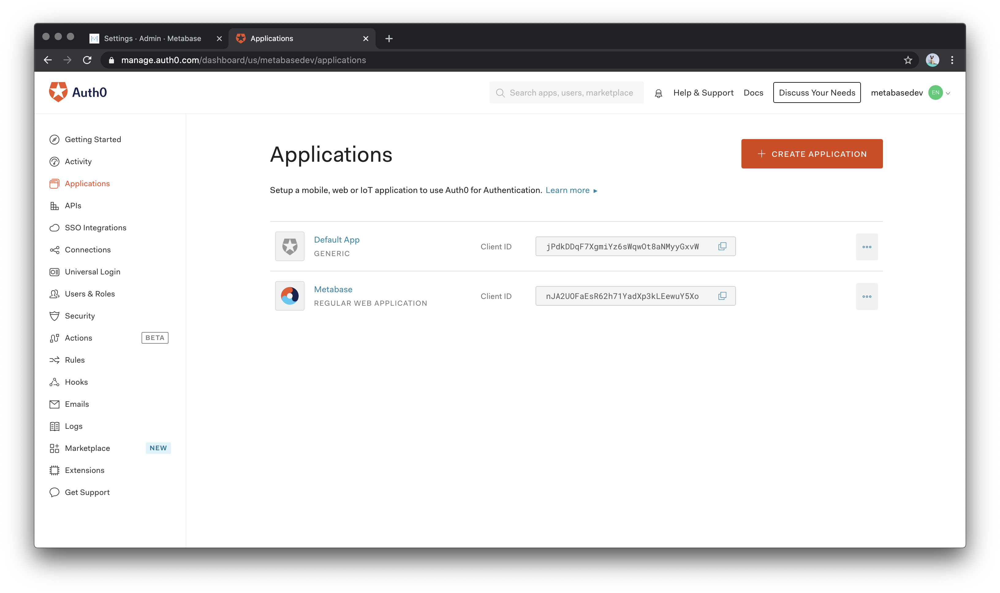
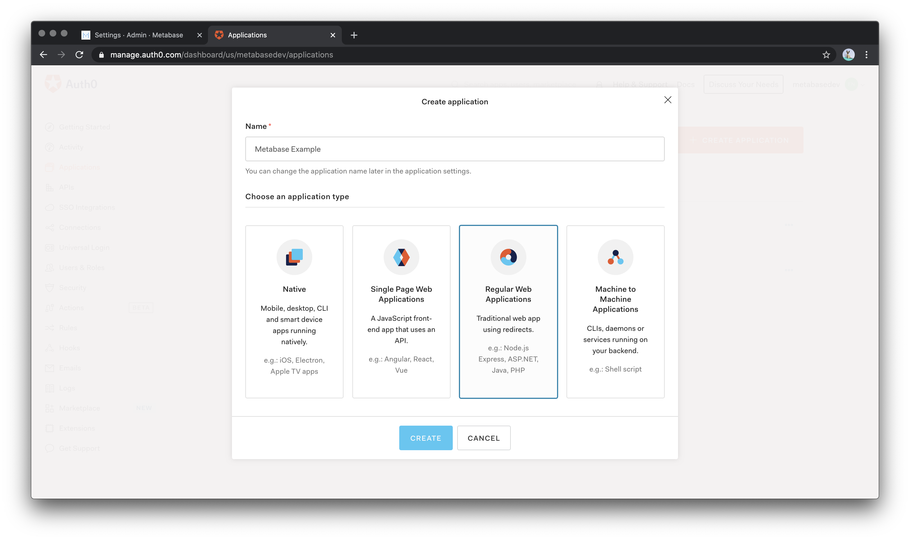
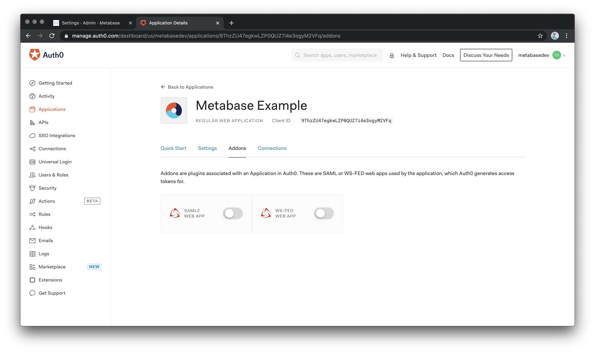
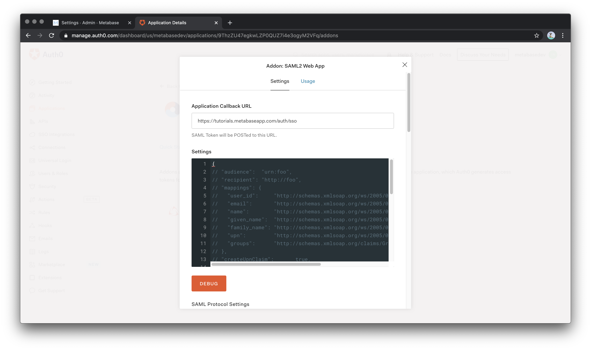

# SAML mit Auth0





1. [SAML in Auth0 konfigurieren](#working-in-the-auth0-console) (der Identitätsanbieter).
2. [SAML in der Metabase konfigurieren](./authenticating-with-saml.md#enabling-saml-authentication-in-metabase) (der Service Provider).


Weitere Informationen finden Sie in unserer Anleitung zur [Authentifizierung mit SAML](./authenticating-with-saml.md).


## Arbeiten in der Auth0 Konsole


### Erstellen Sie eine Anwendung


Nachdem Sie sich in Ihr Auth0-Konto eingeloggt haben, navigieren Sie zu **Anwendungen** und wählen **Anwendung erstellen**.





Geben Sie als Anwendungsname "Metabase" mit dem Typ "Regular Web Applications" ein.





Gehen Sie nun auf den Reiter Einstellungen innerhalb der Auth0 Metabase App und tragen Sie die folgenden Werte ein:


- Application Login URI: die URL Ihrer Metabase-Instanz.
- Erlaubte Callback-URLs: die URL, die unter **Konfigurieren Sie Ihren Identitätsanbieter (IdP)** in den SAML-Einstellungen innerhalb der Metabase (sie endet mit `/auth/sso`).


Scrollen Sie zum Ende der Seite und klicken Sie auf **Änderungen speichern**.


### Aktivieren Sie SAML in Auth0


Als nächstes müssen wir das SAML2 Web App Addon aktivieren. Blättern Sie zurück zum Anfang der Einstellungsseite und wählen Sie**Addons** aus dem Navigationsmenü.


Wählen Sie im Abschnitt**Addons** die**SAML 2 Web App**, um das Einstellungs-Popup zu laden.





### Mapping der Felder von Benutzern in Auth0 zur Metabase


Oben im Abschnitt **Einstellungen** auf dieser Seite müssen Sie den Wert, den Sie in **Erlaubte Callback-URLs** angegeben haben, erneut in das Feld **Application Callback URL** eingeben. Kopieren Sie die folgende JSON-Datei und fügen Sie sie in das Einstellungsfeld ein, damit Auth0 die richtigen Zuordnungen an die Metabase senden kann, wenn sich ein Benutzer anmeldet:


```
{
"Mappings": {
"email": "http://schemas.xmlsoap.org/ws/2005/05/identity/claims/emailaddress",
"Vorname": "http://schemas.xmlsoap.org/ws/2005/05/identity/claims/givenname",
"familien_name": "http://schemas.xmlsoap.org/ws/2005/05/identity/claims/surname",
"groups": "http://schemas.xmlsoap.org/claims/Group"
}
}
```


Wenn Sie zusätzliche Benutzereigenschaften festlegen müssen, können Sie jederzeit zu diesem Schritt zurückkehren, um dem Mappings-Objekt weitere Felder hinzuzufügen.





## Metabase konfigurieren


Als nächstes, im Auth0 Addon: SAML2 Web App auf die Registerkarte**Verwendung** und konfigurieren Sie dann in der Metabase (linke Spalte) die Werte, die diese Registerkarte liefert (rechte Spalte).
