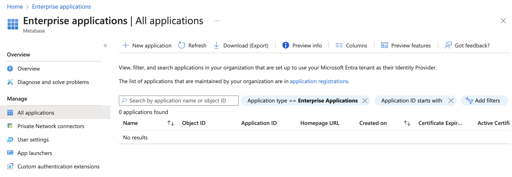
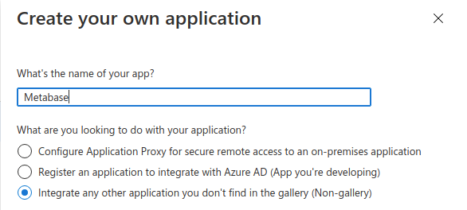
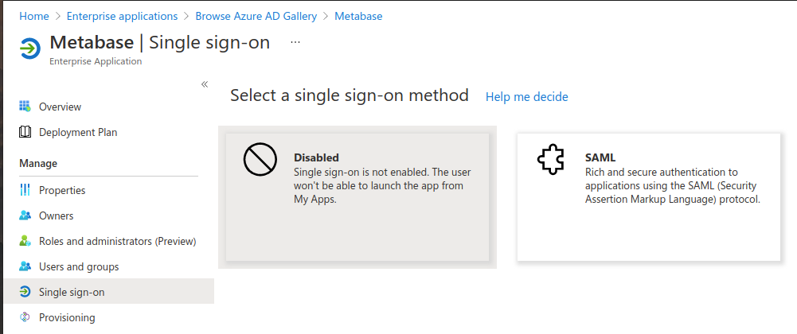
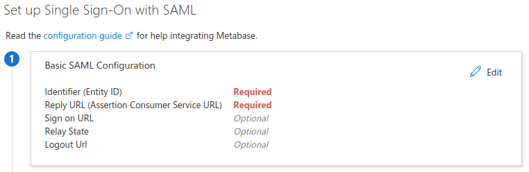

# SAML mit Microsoft Entra ID



## Aktivieren von SAML in der Metabase

Folgen Sie zunächst unserer Anleitung zur [Aktivierung der SAML-Authentifizierung](authenticating-with-saml.md).

## Hinzufügen einer Unternehmensanwendung in Microsoft Entra ID

Gehen Sie zum Microsoft Entra Admin Center und klicken Sie auf**Unternehmensanwendungen** unter Anwendungen in der Seitenleiste. Klicken Sie dann auf **+ Neue Anwendung** in der Leiste oben auf der Seite.

Klicken Sie auf der neuen Seite auf **+ Erstellen Sie Ihre eigene Anwendung** und eine Leiste öffnet sich im rechten Teil der Seite. Geben Sie "Metabase" als Namen der Anwendung ein, wählen Sie die Option "Integrieren Sie eine andere Anwendung, die Sie nicht in der Galerie finden (Nicht-Galerie)" und klicken Sie auf die Schaltfläche**Erstellen** unten in der Leiste.

Wählen Sie auf der Anwendungsseite unter **Verwalten** die Option **Single Sign-on** und klicken Sie dann auf die Schaltfläche "SAML".

Wenn die Seite "Single Sign-On mit SAML einrichten" erscheint, sehen Sie eine Option für "Grundlegende SAML-Konfiguration". Klicken Sie auf die Schaltfläche **Bearbeiten**, um die erforderlichen Informationen einzugeben.

Füllen Sie die folgenden Felder wie folgt aus und klicken Sie auf "Speichern":

- **Bezeichner (Entitäts-ID)**: `Metabase`
-Antwort-URL (Assertion Consumer Service URL)**: Gehen Sie zu Ihrer Metabase-Instanz unter Einstellungen -> Admin-> Authentifizierung -> SAML und geben Sie den Wert ein, den Ihre Metabase-Instanz im Feld "Configure your identity provider (IdP)" meldet.

Klicken Sie auf "Speichern" und beachten Sie dann die folgenden 2 Punkte in Schritt 4:

- " Login URL": dies ist der Wert, den Sie im nächsten Schritt in "SAML identity provider URL" in der Metabase eingeben müssen
- Microsoft Entra Identifier": Diesen Wert müssen Sie im nächsten Schritt in "SAML identity provider issuer" in der Metabase eingeben.

Laden Sie die Datei "Federation Metadata XML" herunter, die das Zertifikat enthält, das Sie im nächsten Schritt benötigen.

Um die Microsoft Entra-Seite der Konfiguration abzuschließen, klicken Sie auf der Registerkarte "Verwalten" auf die Schaltfläche**Benutzer und Gruppen** und fügen Sie die Benutzer oder Gruppen hinzu, die Zugang zur Metabase haben sollen.

## Konfigurieren Sie die Unternehmensanwendung mit den SSO-Informationen der Metabase

Melden Sie sich als Administrator bei Metabase an und gehen Sie zu **Admin** -> **Einstellungen** -> **Authentifizierung** -> **SAML**.

Geben Sie unter "Informieren Sie Metabase über Ihren Identitätsanbieter" Folgendes ein:

- **SAML Identity Provider URL**: die "Login URL", die Sie in Schritt 4 der Microsoft Entra ID SAML SSO Konfiguration erhalten haben
-**SAML Identity Provider Certificate**: Öffnen Sie die "Federation Metadata XML" mit einem Texteditor, kopieren Sie die sehr lange Zeichenfolge und fügen Sie sie unter dem Tag "<X509Certificate>" in die "App Federation Metadata Url" ein. Achten Sie darauf, dass Sie die gesamte Zeichenfolge kopieren und einfügen; wenn Sie ein Zeichen auslassen, wird die Integration nicht funktionieren
- **SAML-Anwendungsname**: "Metabase"
- **SAML Identity Provider Issuer**: die "Microsoft Entra Identifier" URL, die Sie aus der Microsoft Entra ID SAML SSO Konfiguration erhalten haben.
