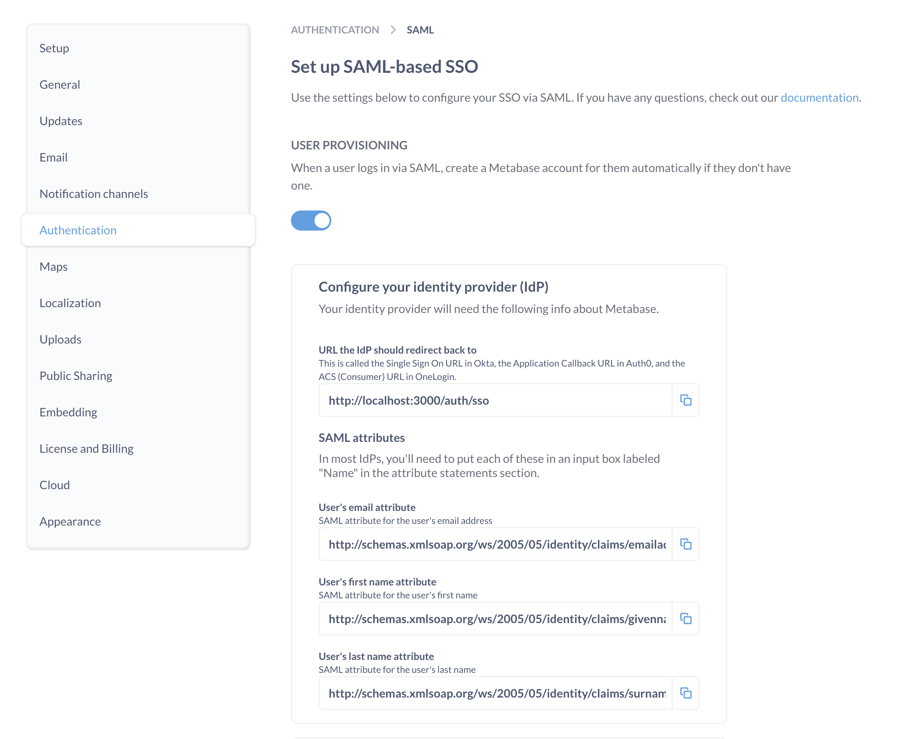

# SAML mit Okta



1. [Aktivieren Sie SAML-basiertes SSO in der Metabase](#turn-on-saml-based-sso-in-metabase)
2. [SAML in Okta einrichten](#set-up-saml-in-okta).
3. [SAML in der Metabase einrichten](#set-up-saml-in-metabase).

Sie können auch optional [Gruppenzuordnungen konfigurieren](#configure-group-mappings), um Okta-Benutzer automatisch Metabase-Gruppen zuzuordnen.

Allgemeine Informationen zu SAML finden Sie unter [Authentifizierung mit SAML](./authenticating-with-saml.md).

## Aktivieren von SAML-basiertem SSO in der Metabase

Gehen Sie im Bereich**Admin**>**Einstellungen** des Admin-Bereichs auf die Registerkarte**Authentifizierung** und klicken Sie unter**SAML** auf**Einrichten**.

Sie sehen dann ein SAML-Konfigurationsformular wie dieses:

Sie müssen die Informationen in diesem Formular verwenden, um SAML in Okta einzurichten.

## Einrichten von SAML in Okta

Bevor Sie die SAML-Authentifizierung in der Metabase konfigurieren, müssen Sie eine neue SAML-App-Integration in Okta erstellen.

### Erstellen einer App-Integration in Okta

Erstellen Sie in der Okta **Admin**-Konsole [eine neue SAML-App-Integration][okta-saml-docs] zur Verwendung mit Metabase.

### Konfigurieren der Okta SAML-Einstellungen

Für die Konfiguration der Okta-App-Integration mit der Metabase müssen Sie die Informationen verwenden, die Sie in der Metabase im Abschnitt **Admin Panel** > **Authentifizierung** > **SAML** finden.

#### Allgemeine Einstellungen

| Okta SAML | Metabase SAML |
| ------------------------------- | ------------------------------------------------------------------------------------------------------------------------------------------- |
| **Single Sign-On URL** | **URL, auf die der IdP umleiten soll**. Dies ist Ihre Metabase [Site URL][site-url] -- sie sollte mit `https://` beginnen und mit `/auth/sso` enden. |
| **Audience URI (SP Entity ID)** | **SAML Application Name** ("Metabase" standardmäßig) |

#### Attribut-Anweisungen

Erstellen Sie im Abschnitt **Attribut-Anweisungen (optional)** der SAML-Einstellung der Okta-Anwendung die folgenden Attribut-Anweisungen:

- E-Mail-Adresse
- Vorname (Vornamen)
- Nachname (Nachname)

Auch wenn Okta sagt, dass diese Angaben optional sind, benötigt Metabase sie. Okta übergibt diese Attribute während der Authentifizierung an die Metabase, um Personen automatisch bei der Metabase anzumelden.

| Name | Wert |
| -------------------------------------------------------------------- | -------------- |
| `http://schemas.xmlsoap.org/ws/2005/05/identity/claims/emailaddress` | user.email |
| `http://schemas.xmlsoap.org/ws/2005/05/identity/claims/givenname` | user.firstName |
| `http://schemas.xmlsoap.org/ws/2005/05/identity/claims/surname` | user.lastName |

Die Namen der Attributanweisungen in Okta sollten mit den Attributnamen in der Metabase übereinstimmen (Groß- und Kleinschreibung ist zu beachten). Wenn Sie in Ihrer Okta-App-Konfiguration andere Attributnamen als die Standardattribute verwenden möchten, müssen Sie auch die Namen für die Attributfelder in der Metabase in **Admin Panel** > **Authentifizierung** > **SAML** ändern.
