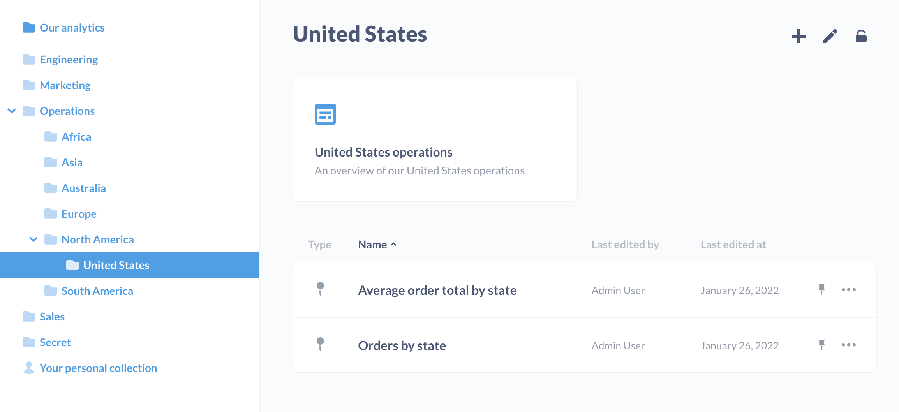

# Berechtigungen für Sammlungen

Sie können [Sammlungen](../exploration-and-organization/collections.md) verwenden, um Fragen, Dashboards, Modelle, Zeitleisten und andere Sammlungen zu organisieren. Sie können Berechtigungen für diese Sammlungen festlegen, um zu bestimmen, welche Personengruppen die Elemente der Sammlungen anzeigen und kuratieren können.

Metabase beginnt mit einer Standardsammlung auf oberster Ebene, die**Unsere Analytik** heißt und in der jede andere Sammlung gespeichert wird.

## Berechtigungsstufen für Sammlungen

Es gibt drei Berechtigungsstufen für Sammlungen:

- [Kuratieren-Zugang](#curate-access)
- [Zugriff anzeigen](#view-access)
- [Kein Zugriff](#no-access)

| Action | Curate Access | View Access | No Access |
| ---------------------------------- | ------------- | ----------- | --------- |
| Artikel ansehen | ✅ | ✅ | ❌ |
| Titel und Beschreibungen der Artikel bearbeiten | ✅ | ❌ | ❌ |
| Artikel verschieben | ✅ | ❌ | ❌ | ❌
| Elemente löschen | ✅ | ❌ | ❌ | ❌
| Anheften von Elementen | ✅ | ❌ | ❌ |
| Ereignisse und Zeitleisten anzeigen | ✅ | ✅ | ❌ |
| Edit events and timelines | ✅ | ❌ | ❌ |

### Curate access

Die Gruppe kann in dieser Sammlung gespeicherte Objekte anzeigen, bearbeiten, verschieben, löschen und anheften sowie neue Objekte speichern oder in die Sammlung verschieben. Die Gruppe kann auch neue Untersammlungen innerhalb dieser Sammlung erstellen. Die Gruppe kann auch [Ereignisse und Zeitleisten] erstellen und bearbeiten(../exploration-and-organization/events-and-timelines.md).

### Zugriff auf die Ansicht

Die Gruppe kann alle Fragen, Dashboards und Modelle der Sammlung sowie [Ereignisse und Zeitleisten](../exploration-and-organization/events-and-timelines.md) einsehen.

### Kein Zugriff

Die Gruppe sieht diese Sammlung nicht aufgelistet und hat keinen Zugriff auf die darin gespeicherten Elemente.

## Sammlung vs. Datenberechtigungen

Sammlungsberechtigungen gelten nur für die Anzeige und Bearbeitung vorhandener Fragen, Modelle und Dashboards. Das Ändern der Abfrage einer bestehenden Frage oder das Erstellen einer neuen Frage erfordert, dass die Gruppe über [Datenberechtigungen](./data.md) für die zugrunde liegenden Daten verfügt.

Es gibt eine wichtige Ausnahme: Wenn die Datenberechtigung einer Gruppe für eine Datenbank oder Tabelle auf [Blockieren](./data.md#blocked-view-data-permission) gesetzt ist, kann die Gruppe keine Fragen anzeigen, die auf diesen Daten basieren, selbst wenn sie Kuratorenrechte für die Sammlung hat, in der diese Fragen gespeichert sind.

## Dashboards mit Fragen aus mehreren Sammlungen

Wenn ein Dashboard Fragen enthält, die in anderen Sammlungen gespeichert sind, muss die Gruppe Zugriff auf alle Sammlungen haben, um diese Fragen anzuzeigen oder zu bearbeiten. Ist dies nicht der Fall, entschuldigt sich Metabase und teilt Ihnen mit, dass Sie keine Berechtigung haben, die in den anderen Sammlungen gespeicherten Karten zu sehen.

(./images/dashboard-no-permissions.png)[Dashboard mit Fragen aus mehreren Sammlungen, wobei die Person nicht zu einer Gruppe mit Zugriff auf eine der Sammlungen gehört)

Im Allgemeinen ist es einfacher, Berechtigungen zu verwalten, wenn alle Fragen eines Dashboards in derselben Sammlung enthalten sind.

## Berechtigungen für Sammlungen festlegen

Sie können Berechtigungen für Sammlungen festlegen, indem Sie auf das Schlosssymbol oben rechts auf dem Bildschirm klicken, während Sie die Sammlung anzeigen, und dann auf **Berechtigungen bearbeiten** klicken. Nur Administratoren können Sammlungsberechtigungen bearbeiten. Jede [Benutzergruppe](./introduction.md) kann entweder Ansicht, Kuratieren oder keinen Zugriff auf eine Sammlung haben:
