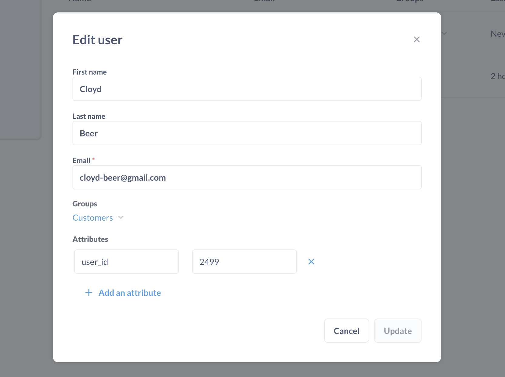
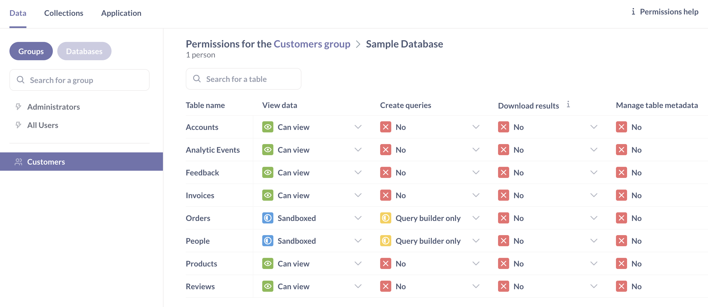

# Beispiele für Daten-Sandkästen



Mit [Daten-Sandboxen](./data-sandboxes.md) können Sie:

-Zeilen** mit Hilfe einer [einfachen Sandbox] einschränken(./data-sandboxes.md#basic-data-sandboxes-filter-by-a-column-in-the-table).
-Spalten** (und Zeilen) mit einer [benutzerdefinierten Sandbox] einschränken(./data-sandboxes.md#custom-data-sandboxes-use-a-saved-question-to-create-a-custom-view-of-a-table).

## Setup für alle folgenden Beispiele

Die folgenden Beispiele verwenden die in der Metabase enthaltene Beispieldatenbank. Hier ist die grundlegende Einrichtung:

1. **Blockieren Sie die Berechtigungen für die Gruppe Alle Benutzer**: Drücken Sie cmd/ctrl + k, um die Befehlspalette aufzurufen, und suchen Sie nach "Berechtigungen". In der Registerkarte**Berechtigungen** >**Daten**. Klicken Sie auf die Gruppe**Alle Benutzer**. Setzen Sie für die Beispieldatenbank die Berechtigung [Daten anzeigen](./data.md#view-data-permissions) für alle Benutzer auf "Blockiert".

2. **Erstellen Sie eine Gruppe mit dem Namen Kunden**. Drücken Sie cmd/ctrl + k und suchen Sie nach den Einstellungen für Personen. [Erstellen Sie eine Gruppe namens "Kunden".

3. **Erstellen Sie ein Benutzerkonto für Cloyd Beer**. Wir [erstellen ein Benutzerkonto](../people-and-groups/managing.md#creating-an-account) für eine beliebige Person aus der Tabelle "Personen" in unserer Beispieldatenbank. Nehmen wir `Cloyd Beer` aus der Tabelle`Personen` der Beispieldatenbank.

4. **Hinzufügen eines Benutzerattributs zum Konto**: Wir fügen ein Benutzerattribut zu Cloyds Konto hinzu. Da wir in der Lage sein wollen, die Daten nach der Benutzer-ID zu filtern, nehmen wir Cloyds ID aus der Tabelle "Personen" der Beispieldatenbank und fügen die ID als [Benutzerattribut] hinzu(../people-and-groups/managing.md#adding-a-user-attribute): `user_id: 2499` (`2499` ist die ID von Herrn Beer in der Beispieldatenbank).

5. **Fügen Sie Herrn Beer zur Gruppe "Kunden" hinzu**: Siehe [Personen zu Gruppen hinzufügen](../people-and-groups/managing.md#adding-people-to-groups).

6. **Erstellen Sie eine Sammlung, die nur von Admins eingesehen werden kann.**. Nennen Sie sie "Admin-Sammlung". In dieser Sammlung werden wir die SQL-Fragen speichern, die wir in den Beispielen 2 und 3 für die Sandbox-Tabellen verwenden. Siehe [Collection permissions](./collections.md).

## Grundlegende Sandbox-Einrichtung - Filtern von Zeilen anhand von Benutzerattributen

In diesem Beispiel werden wir unsere Tabelle "Orders" in eine Sandbox stellen, so dass jeder in der Gruppe "Customers" nur die Zeilen in der Tabelle "Orders" sehen kann, bei denen die Spalte "User ID" mit dem Attribut "user_id" der Person übereinstimmt.

1. **Gehen Sie zu den Admin-Einstellungen > Berechtigungen > Daten**. Klicken Sie auf die Gruppe "Kunden".

2. **Ansichtsdaten auf "Granular" einstellen**. Setzen Sie für die Beispieldatenbank die [View data](./data.md#view-data-permissions) der Gruppe Customer auf "Granular". Die Einstellung "Granular" ermöglicht es uns, Berechtigungen für einzelne Tabellen der Gruppe "Customer" einzurichten.

3. **Sandbox für die Tabellen "Orders" und "People"**. Hier setzen wir die Berechtigungen zum Anzeigen von Daten in den Tabellen "Orders" und "People" auf "Sandboxed". Und da wir möchten, dass die Personen ihre Daten selbst verwalten (indem sie Fragen stellen, Dashboards erstellen usw.), setzen wir auch ihre [Abfragen erstellen](../permissions/data.md#create-queries-permissions) Berechtigung auf "Nur Abfrageersteller".

4. **Für jede Tabelle fragt uns die Metabase: "Wie möchten Sie diese Tabelle nach Benutzern in dieser Gruppe filtern?". Wir behalten in jedem Fall die Standardauswahl bei: "Nach einer Spalte in dieser Tabelle filtern". Für die Tabelle "Orders" filtern wir nach der Spalte "User ID", die wir gleich dem Attribut "user_id" für Personen der Gruppe "Customers" setzen.

[Sandbox-Einstellungen](images/select-user-attribute.png)
