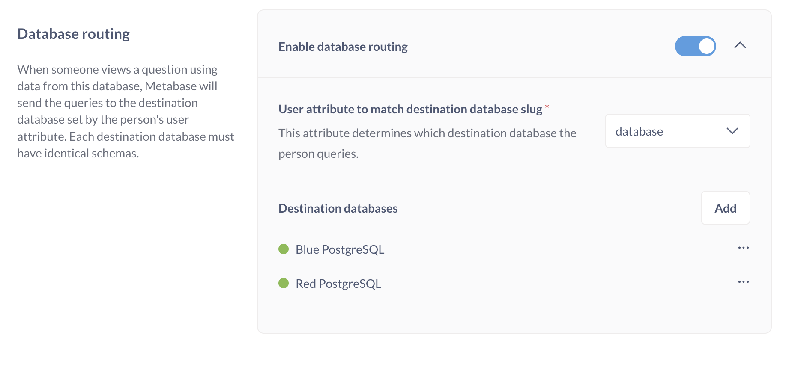

# Datenbank-Routing



Mit dem Datenbank-Routing kann ein Administrator eine Frage einmal mit einer Datenbank erstellen, und die Frage wird mit einer anderen Datenbank mit demselben Schema abgefragt, je nachdem, wer die Frage betrachtet.

Datenbank-Routing ist nützlich für:

- Verwaltung von Einbettungskonfigurationen, bei denen jeder Kunde seine eigene Datenbank mit identischen Schemata hat.
- Umschalten zwischen Dev- und Prod-Data-Warehouses.
- Ändern des Ziel-Data-Warehouses für bestimmte Teams.
- Verwaltung separater Verbindungen zum gleichen Data Warehouse, wobei jede Verbindung über separate Berechtigungen verfügt. Diese Verbindungsverwaltung ist vergleichbar mit [connection impersonation](./impersonation.md) für Datenbanken, die verhindern, dass dieselbe Verbindung die Rolle wechselt.

## Datenbanken, die Datenbank-Routing unterstützen

- [Druid](../Datenbanken/Verbindungen/druid.md)
- [MongoDB](../Datenbanken/Verbindungen/mongodb.md)
- [MariaDB](../Datenbanken/Verbindungen/mariadb.md)
- [MySQL](../Datenbanken/Verbindungen/mysql.md)
- [PostgreSQL](../Datenbanken/Verbindungen/postgresql.md)
- [SQL Server](../Datenbanken/Verbindungen/sql-server.md)
- [SQLite](../Datenbanken/Verbindungen/sqlite.md)

## So funktioniert das Datenbank-Routing

Sie verbinden die Metabase ganz normal mit einer Datenbank. Wenn Sie das Datenbank-Routing für diese Datenbank aktivieren, wird sie zu einer **Router-Datenbank** - der Hauptdatenbank, die Abfragen an **Zieldatenbanken** weiterleiten wird. Sie fügen diese Zieldatenbanken zu dieser Router-Datenbank hinzu, wobei jede Zieldatenbank mit einem Wert für das Benutzerattribut verbunden ist, das Sie der Router-Datenbank zuweisen. Sie müssen Ihre Kundendatenbanken nicht als separate Verbindungen haben.

Wenn die Router-Datenbank mit ihren Zieldatenbanken eingerichtet ist, kann ein Administrator Fragen erstellen, die die Router-Datenbank abfragen. Wenn sich andere Personen anmelden und diese Fragen ansehen, leitet die Metabase die Abfragen an die durch das Benutzerattribut der Person angegebene Zieldatenbank weiter.

## Einrichten des Datenbank-Routings

1. [Verbinden Sie sich mit einer Datenbank(../databases/connecting.md), die _das gleiche Schema wie alle Datenbanken Ihres Kunden hat_. Diese Datenbank sollte eine Mock-/Dev-Datenbank sein, idealerweise mit einigen gefälschten Daten. Der Name, der für diese Router-Datenbank verwendet wird, ist der Name, den alle Benutzer sehen werden, unabhängig davon, zu welcher Zieldatenbank sie weitergeleitet werden, also stellen Sie sicher, dass der Name für alle sinnvoll ist. (Sie können den Anzeigenamen jederzeit ändern).
2. Sobald Sie mit dieser ersten Datenbank (der "Router-Datenbank") verbunden sind, gehen Sie zum Abschnitt Datenbank-Routing und schalten Sie **Datenbank-Routing aktivieren** ein.
3. Geben Sie das Benutzerattribut ein, das Sie verwenden möchten, um zu bestimmen, zu welcher Datenbank ein Benutzer weitergeleitet werden soll.
4. Klicken Sie im Abschnitt**Zieldatenbanken** auf**Hinzufügen**, und geben Sie die Verbindungsdetails ein. Für jede Zieldatenbank müssen Sie einen**Slug** angeben - dieser Slug ist der Wert, den Metabase für den Abgleich mit dem Benutzerattribut, das Sie der Router-Datenbank zugewiesen haben, verwenden wird. Wenn ein Benutzer zur Laufzeit eine in der Router-Datenbank erstellte Frage anschaut, überprüft Metabase das Benutzerattribut der Person. Wenn der Wert mit diesem Slug übereinstimmt, wird die Frage stattdessen diese Zieldatenbank abfragen.
