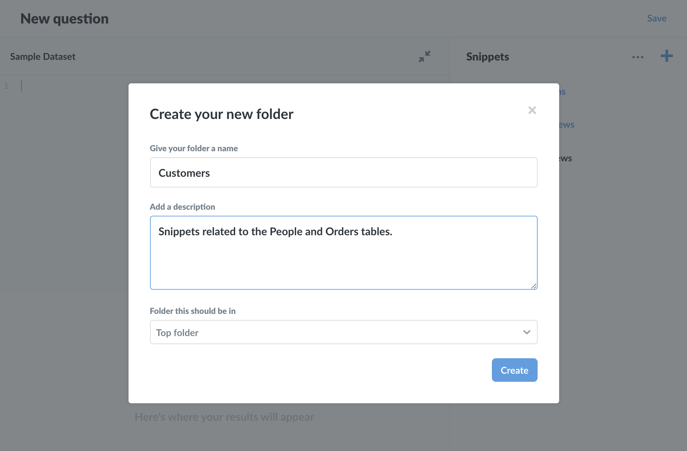
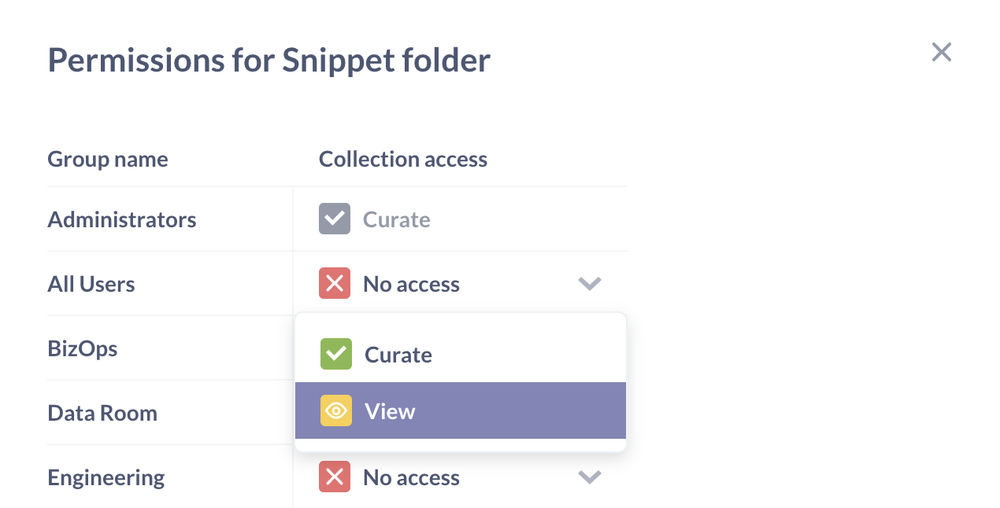

# Berechtigungen für Snippet-Ordner



Dieser Artikel befasst sich mit **Snippet-Ordnern**, die es Ihnen ermöglichen, [Snippets](../questions/native-editor/snippets.md) zu organisieren und Berechtigungen darauf zu setzen.

Ordnerberechtigungen sollten nicht als Sicherheitsfunktion betrachtet werden, sondern als eine Funktion, die die Organisation und Standardisierung von Snippets unterstützt. Obwohl Ordner von Sammlungen getrennt sind, haben sie beide eine organisatorische Funktion: Sammlungen sammeln und erlauben Dashboards und Fragen; Ordner sammeln und erlauben Snippets. Weitere Informationen finden Sie in der [Diskussion über Berechtigungen unten](#permissions).

## Ordner

Ordner funktionieren ähnlich wie ein Dateisystem. Sie können Snippets zu Ordnern hinzufügen und Ordner in anderen Ordnern ablegen. Sie können so viele Ordner verschachteln, wie Ihre Metabase-Instanz verarbeiten kann oder wie es die Gesetze der Physik zulassen (je nachdem, was zuerst eintritt).

Der**Oberste Ordner** ist der Standardordner für die Snippet-Seitenleiste. Er ist der Stammordner, der alle Ordner und Snippets enthält.

### Erstellen eines neuen Snippet-Ordners

Sie können einen Snippet-Ordner über das Menü **Snippets** im [SQL-Editor](../questions/native-editor/writing-sql.md) erstellen.

[Neuen Snippet-Ordner erstellen](./images/snippet-folder.png)

1. Klicken Sie auf das Menüsymbol **Snippets** (das Snippet-Symbol sieht aus wie ein Text- oder Codeblock mit drei ungleichmäßigen horizontalen Linien).
2. Klicken Sie auf das Symbol **+** und wählen Sie **Neuer Ordner**.
3. Geben Sie Ihrem Ordner einen Namen, undfügen Sie optional **eine Beschreibung hinzu** und/oder platzieren Sie den Ordner in einem bestehenden Ordner (die Option **Ordner, in dem er sich befinden sollte** ).

### Erstellen eines neuen Snippets

Bei [einigen Plänen](https://www.metabase.com/pricing/) wird beim Erstellen eines Snippets eine zusätzliche Option angezeigt, mit der Sie das Snippet zu einem bestehenden Ordner hinzufügen können (die Option **Ordner, in dem es sich befinden sollte** ).

(./images/enterprise-add-snippet.png)[Ein Snippet hinzufügen Unternehmen modal]

Der Standardspeicherort ist der **Top-Ordner**, der der Stammordner für alle Snippets und Ordner ist. Sie können jederzeit ein Snippet zu einem Ordner hinzufügen (oder ein Snippet in einen anderen Ordner verschieben, vorausgesetzt, Sie haben die Berechtigung zum Bearbeiten für beide Ordner).

Beachten Sie, dass Snippet-Namen eindeutig sein müssen; Ordner haben keinen Einfluss auf diese Anforderung.

## Berechtigungen

Administratoren (und nur Administratoren) können die Sichtbarkeit und Bearbeitbarkeit von Snippets festlegen, indem sie Snippets in **Ordnern** ablegen und dann Gruppen eine von drei Berechtigungsstufen für diese Ordner erteilen. Wenn Sie mit [collection permissions](./collections.md#setting-permissions-for-collections) vertraut sind, ist die Funktionalität ähnlich. Mehr darüber, wie Sammlungs- und Ordnerberechtigungen zusammenarbeiten, finden Sie unter [ how-folder-permissions-work](#how-folder-permissions-work) weiter unten.

### Ändern von Berechtigungen für einen Ordner

Administratoren können die Berechtigungen für einen Ordner festlegen, indem sie auf die Ellipse(**...**) neben einem Ordner klicken und **Berechtigungen ändern** wählen.

Sie können außerdem den aktuell ausgewählten Ordner ändern, indem Sie mit der Maus zum oberen Rand der Snippets-Seitenleiste fahren, auf die Ellipse(**...**) links neben dem **+** klicken und**Berechtigungen ändern** auswählen. Wenn Sie sich im**Obersten Ordner** befinden, können Administratoren durch Klicken auf **...** oben in der Seitenleiste die Berechtigungen für alle Snippets, Ordner und Unterordner festlegen.

Wenn Sie die Berechtigungen für einen Ordner mit Unterordnern ändern, haben Sie die Möglichkeit, diese Berechtigungen auf die Unterordner dieses Ordners auszuweiten, indem Sie die Einstellung**Auch Unterordner ändern** aktivieren.

### Optionen für Ordnerberechtigungen

Es gibt drei Optionen zum Ändern der Berechtigungen für Snippet-Ordner:

- **Zugriff bearbeiten (grünes Häkchensymbol)**. Die Standardeinstellung. Wenn ein Ordner erstellt wird, können alle Benutzer (die über SQL-Editor-Berechtigungen für mindestens eine Datenbank verfügen) die Snippets des Ordners anzeigen, bearbeiten und archivieren oder dearchivieren.
- **Anzeigezugriff (gelbes Augensymbol)**. Benutzer in Gruppen mit Anzeigezugriff können Snippets im Ordner anzeigen, aber nicht bearbeiten oder archivieren/entarchivieren. Sie können natürlich Snippet-Code kopieren und neue Snippets erstellen, ohne dass dies Auswirkungen auf die vorhandenen Snippets hat.
- **Zugriff widerrufen (rotes X-Symbol)**. Benutzer in Gruppen, die weder Bearbeitungs- noch Ansichtsrechte für einen Snippet-Ordner haben, sehen die Snippets dieses Ordners nicht in der Seitenleiste und es werden auch keine Snippets in diesem Ordner in den Vorschlägen für diese Benutzer angezeigt. Beachten Sie, dass Personen, die Zugriff auf eine Frage mit einem Snippet haben, für das sie keine Berechtigung haben, trotzdem Ergebnisse aus dieser Frage erhalten können. Siehe die Diskussion weiter unten über [wie Ordnerberechtigungen funktionieren](#how-folder-permissions-work).

### Archivierung hat keinen Einfluss auf Berechtigungen

Das Archivieren oder Dearchivieren von Snippets hat keinen Einfluss auf die Berechtigungen eines Snippets. Wenn z. B. nur eine Gruppe, z. B. die Gruppe "Buchhaltung", über Bearbeitungsrechte für einen Ordner verfügt, können nur Personen der Gruppe "Buchhaltung" (und Administratoren) Snippets in diesem Ordner archivieren und dearchivieren, da das Archivieren und Dearchivieren als Bearbeitung des Snippets gilt.
