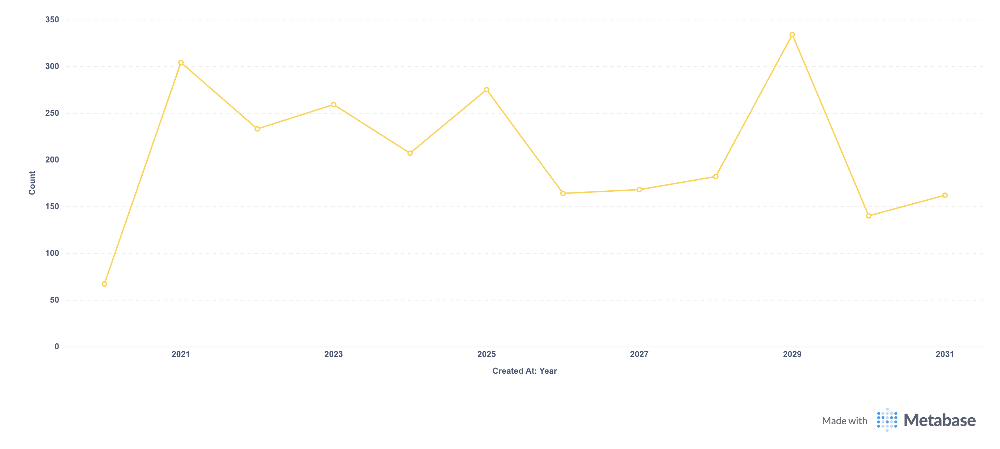

# Ergebnisse exportieren

**Rohtabelle** (Tabelle "Bestellungen" einschließlich der Tabelle "verbundene Produkte"):

(./images/raw-table.png)

Der Grund, warum Metabase nicht versucht, die Ergebnisse als native Excel PivotTable zu exportieren, ist, dass Excel nicht alle Aggregationsfunktionen von Metabase unterstützt. Der Versuch, Metabase Pivot-Tabellen als Excel PivotTables ohne diese Funktionen zu rekonstruieren, kann zu Problemen mit der Korrektheit führen, was den Zweck der Datenbetrachtung zunichte macht.

## Exportgrenzen

Sie können bis zu 1 Million Zeilen exportieren (herunterladen).

Sie können diese Grenze mit einer Umgebungsvariablen ändern: [`MB_DOWNLOAD_ROW_LIMIT`](../configuring-metabase/environment-variables.md).

### Zellen-Zeichen-Limit in Excel-Exporten

Beim Exportieren von Ergebnissen in ein Excel-Dokument (.xlsx) begrenzt Metabase die Anzahl der Zeichen pro Zelle auf 32.767, was der [von Excel erzwungenen Zeichengrenze] entspricht(https://support.microsoft.com/en-us/office/excel-specifications-and-limit-1672b34d-7043-467e-8e27-269d656771c3). Wenn eine einzelne Zelle zu viele Zeichen enthält, schneidet Metabase den Inhalt ab, damit er in diese Grenze passt.

## Daten über einen öffentlichen Link exportieren

Sie können einen [öffentlichen Link](../embedding/public-links.md#public-link-to-export-question-results-in-csv-xlsx-json) erstellen, über den Personen Daten in einem bestimmten Format sowie [rohe, unformatierte Frageergebnisse](../embedding/public-links.md#exporting-raw-unformatted-question-results) herunterladen können.

## Exportieren von Fragedaten über Alerts

Sie können Daten auch exportieren, indem Sie einen [alert](./alerts.md) einrichten.

## Exportieren der Ergebnisse eines Dashboards

Sie können die Ergebnisse eines Dashboards und seiner Karten auf verschiedene Weise exportieren:

- [Dashboard als PDF exportieren](#export-dashboard-as-pdf)
- [Dashboard-Karte exportieren](#exporting-results-of-a-dashboard-card)
- [Exportieren über Dashboard-Abonnements](#exporting-results-of-a-dashboard-via-dashboard-subscriptions)

### Dashboard als PDF exportieren

Sie können ein Dashboard als PDF exportieren. Klicken Sie auf die Schaltfläche **Freigabe**, und wählen Sie dann **Als PDF exportieren**.

Dashboard als PDF exportieren(./images/export-dashboard-as-pdf.png)

Die PDF-Datei enthält nur Screenshots der Diagramme, wie sie auf dem Dashboard zu sehen sind.

### Exportieren der Ergebnisse einer Dashboard-Karte

Um die Ergebnisse einer bestimmten Karte zu exportieren, bewegen Sie den Mauszeiger über die Dashboard-Karte, klicken Sie auf das Drei-Punkte-Menü(**...**) und wählen Sie **Ergebnisse herunterladen**.

[Ergebnisse einer Dashboard-Karte exportieren](./images/download-card-results.png)

Von hier aus können Sie wählen:

- . csv
- . xlsx
- . json
- . png (falls ein Diagramm)

Um die rohen, unformatierten Ergebnisse zu exportieren, halten Sie dieOptionstaste( Mac) bzw. dieAlt-Taste( Windows) gedrückt und klicken Sie dann auf das Dateiformat "Download".

Wenn Sie diese Option nicht sehen, haben Sie möglicherweise keine [Berechtigung zum Herunterladen von Ergebnissen](../permissions/data.md#download-results-permissions).

### Exportieren von Ergebnissen eines Dashboards über Dashboard-Abonnements

Sie können [Dashboard-Abonnements](../dashboards/subscriptions.md) verwenden, um regelmäßig Daten aus allen Fragen eines Dashboards zu exportieren und diese Ergebnisse als Anhang beizufügen.

## Metabase Branding aus den Exporten entfernen

Standardmäßig sind die Datenexporte (PDFs, PNGs, Benachrichtigungs- und Abonnement-E-Mails usw.) mit dem Metabase-Branding versehen, z. B. mit dem Logo "Made with Metabase":

Um das Metabase-Logo und das Branding bei Exporten zu entfernen, müssen Sie einen [Pro- oder Enterprise-Plan](https://www.metabase.com/pricing/) abonnieren.

## Weitere Lektüre

- [Warnungen](../alerts.md)
- [Dashboard-Abonnements](../dashboards/subscriptions.md)
- [Tabellen](../visualizations/table.md)
