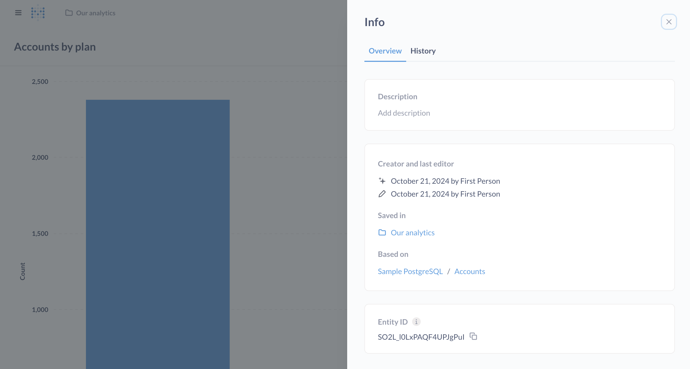

# Fragen

Fragen, die in einem Dashboard enthalten sind, sind nur in diesem Dashboard sichtbar. Diese Fragen können nicht in anderen Dashboards verwendet werden. Wenn Sie eine Frage in einem Dashboard speichern, müssen Sie die Karte auf einer der Registerkarten des Dashboards anordnen und dann das Dashboard speichern.

### Fragen in Sammlungen speichern

Fragen, die in einer Sammlung gespeichert sind, können zu mehreren Dashboards hinzugefügt werden. Das Verschieben einer Frage aus einer Sammlung in eine andere Sammlung hat keine Auswirkungen auf die Dashboards, denen die Frage hinzugefügt wurde. Um eine Frage in einer Sammlung zu speichern, müssen Sie sich in einer Gruppe mit [curate access](../permissions/collections.md#curate-access) für diese Sammlung befinden.

## Verschieben von Fragen aus Sammlungen in Dashboards (und umgekehrt)

Ob Sie eine Frage aus einer Sammlung in ein Dashboard verschieben können, hängt davon ab, wie viele andere Dashboards diese Frage verwenden.

Sie können die Frage aus einer Sammlung in ein Dashboard verschieben, wenn entweder:

- Keine anderen Dashboards verwenden diese Frage.
- Die anderen Dashboards, die diese Frage verwenden, befinden sich in Sammlungen, auf die Sie [curate access](../permissions/collections.md#curate-access) haben. In diesem Fall teilt Ihnen die Metabase mit, welche anderen Dashboards diese Frage verwenden, und Sie müssen entscheiden, ob Sie die Frage aus diesen Dashboards entfernen möchten.

## Informationen zu Ihrer Frage

Sobald Sie eine Frage gespeichert haben, können Sie auf das Symbol **info** oben rechts klicken, um einige Metadaten zu Ihrer Frage anzuzeigen:

### Registerkarte Übersicht

- Beschreibung, die Sie hinzufügen können - Beschreibungen unterstützen sogar Markdown!
- Wer hat die Frage erstellt und wer hat sie zuletzt bearbeitet?
- Die Sammlung oder das Dashboard, in dem die Frage gespeichert ist
- Die Daten, auf denen die Frage basiert.
- Die Entitäts-ID der Frage (die Sie mit [Serialisierung](../installation-and-operation/serialization.md) verwenden können, um IDs über mehrere Datenbanken hinweg konsistent zu halten).

Registerkarte### Historie

Siehe [history](../exploration-and-organization/history.md).

## Herunterladen der Ergebnisse Ihrer Frage

Siehe [Ergebnisse exportieren](./exporting-results.md).

## Überprüfen einer Frage

Siehe [Inhaltsüberprüfung](../exploration-and-organization/content-verification.md).

## Lesezeichen für eine Frage

Klicken Sie auf das Symbol **Lesezeichen**, um eine Frage in der Seitenleiste der Metabase zu speichern. Siehe [Lesezeichen](../exploration-and-organization/exploration.md#bookmarks).

## Eine Frage in ein Modell verwandeln

Sie können eine in einer Sammlung gespeicherte Frage in ein Modell umwandeln, um anderen mitzuteilen, dass die Ergebnisse einen guten Ausgangspunkt für neue Fragen darstellen. (Sie können eine Frage, die in einem _Dashboard_ gespeichert ist, nicht in ein Modell umwandeln; Sie müssen die Frage zunächst in eine Sammlung verschieben). Siehe [models](../data-modeling/models.md).

## Zwischenspeichern von Frageergebnissen



Siehe [Caching pro Frage](../configuring-metabase/caching.md#question-caching-policy).

## Einrichten von Warnmeldungen

Sie können Fragen einrichten, die in regelmäßigen Abständen ausgeführt werden und Sie benachrichtigen, wenn die Ergebnisse interessant sind. Sehen Sie sich [alerts](./alerts.md) an.

## Anzeige von Ereignissen in Ihrem Diagramm

Wenn es sich bei Ihren Ergebnissen um eine Zeitreihe handelt, können Sie Ereignisse auf der x-Achse anzeigen. Siehe [events and timelines](../exploration-and-organization/events-and-timelines.md).

## Löschen einer Frage

Siehe [Löschen und Wiederherstellen](../exploration-and-organization/delete-and-restore.md).
