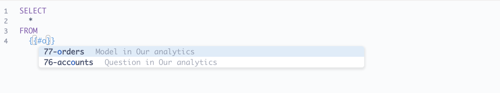

# Verweis auf Modelle und gespeicherte Fragen


Bei SQL-Datenbanken können wir ein [model][model] oder eine bestehende Frage als Grundlage für eine neue Abfrage oder als gemeinsamen Tabellenausdruck [CTE][cte] verwenden.


Nehmen wir zum Beispiel an, wir haben viele Daten, die auf mehrere Tabellen verteilt sind, aber die Leute sind vor allem an einer Teilmenge dieser Daten interessiert. Wir können einmal eine komplizierte Abfrage durchführen, um diese Ergebnisse zurückzugeben, und diese Frage als Modell speichern, auf das die Leute in ihren Abfragen genauso verweisen können wie auf jede andere Tabelle.


## Suche nach Modellen und Fragen während der Eingabe


Erstellen und speichern Sie zunächst eine Frage oder ein Modell, das die Ergebnismenge liefert, die Sie anderen zur Abfrage zur Verfügung stellen möchten.


Um diese Frage oder dieses Modell in einer SQL-Abfrage zu referenzieren, verwenden Sie die Typeahead-Suche in einer Variable mit dem Präfix "#".


Geben Sie `{{#Ihr Suchbegriff }} ` und Metabase zeigt eine Liste von Modellen und Fragen an, die für Ihren Suchbegriff relevant sind.





Sie können die ID der Frage oder des Modells auch finden, indem Sie in der Metabase zu dem Modell oder der Frage navigieren, auf die Sie in Ihrer Abfrage verweisen möchten. Die ID befindet sich in der URL in der Adressleiste Ihres Browsers. Die ID ist die Zahl nach `/Modell/` oder`Frage/`. Z.B. für "https://metabase.example.com/model/12345-example-name" wäre die ID des Modells "12345".


Nur die "#" und die "ID" sind erforderlich. Metabase zeigt nur den Modell- oder Fragennamen an, um die Abfrage lesbarer zu machen.


## Modell, Tabelle oder gespeicherte Frage als Common Table Expression (CTE)


Die gleiche Syntax kann in [Common Table Expressions (CTEs)](https://www.metabase.com/learn/sql/working-with-sql/sql-cte) verwendet werden (mit SQL-Datenbanken, die CTEs unterstützen):


```sql
WITH gizmo_orders AS {{#5-gizmo-orders-in-2019}}
SELECT count(*)
FROM gizmo_orders
```


Wenn diese Abfrage ausgeführt wird, wird das "{{#5-gizmo-orders-in-2019}}" -Tag durch die SQL-Abfrage der referenzierten Frage, umgeben von Klammern, ersetzt. Unter der Haube sieht es also so aus:


````sql
WITH
gizmo_orders AS (
SELECT
*
FROM
aufträge AS o
INNER JOIN produkte AS p ON o.produkt_id = p.id
WHERE
p.category = 'Gizmo'
AND o.created_at BETWEEN '2019-01-01' AND '2019-12-31'
)
SELECT
count(*)
FROM
gizmo_orders
```


## Einschränkungen und Kompromisse


- Sie können nur auf ein Modell oder eine gespeicherte Frage in einer Abfrage verweisen, wenn Sie mit einer SQL-Datenbank wie PostgreSQL, MySQL, Snowflake oder SQL Server arbeiten.
- Das Modell oder die gespeicherte Frage, die Sie auswählen, muss auf derselben Datenbank basieren wie die, die Sie gerade im nativen Abfrage-Editor ausgewählt haben.
- Sie können sich nicht auf Variablen in Unterabfragen beziehen. Sie haben nur Zugriff auf die _Ergebnisse_ des Modells oder der gespeicherten Frage, nicht auf die Abfrage des Modells oder der gespeicherten Frage. Wenn Sie zum Beispiel eine gespeicherte Frage haben, die einen [Feldfilter](https://www.metabase.com/learn/metabase-basics/querying-and-dashboards/sql-in-metabase/field-filters) verwendet, können Sie nicht auf diese Variable verweisen. Wenn Sie ändern möchten, wie die gespeicherte Frage die Ergebnisse gefiltert hat, müssen Sie diese Frage aktualisieren (oder duplizieren) und den Filter anwenden.
