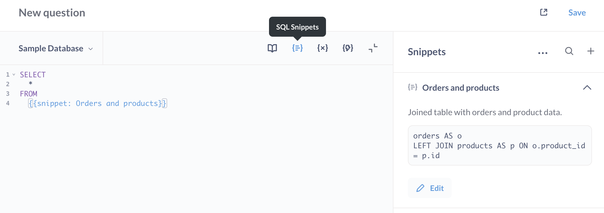

# Schnipsel





**Snippets** sind wiederverwendbare Teile von SQL oder nativen Abfragen. Jeder, der Zugriff auf den [SQL-Editor](./writing-sql.md) hat, kann Snippets erstellen und bearbeiten, die dann für alle SQL-Autoren verfügbar sind.


Wenn Sie beispielsweise häufig Abfragen durchführen, die mehrere Tabellen umfassen, können Sie den SQL-Code, der diese Tabellen verbindet, als Snippet speichern, so dass Sie (und andere in Ihrem Unternehmen) diesen Code in mehreren Fragen wiederverwenden können.


## So erstellen Sie ein Snippet


Hier ist eine einfache Abfrage mit einer Verknüpfung unter Verwendung der **Beispieldatenbank**, die in der Metabase enthalten ist.


```sql
SELECT
*
FROM
aufträge AS o
LEFT JOIN produkte AS p ON o.produkt_id = p.id
```


Lassen Sie uns alles nach FROM als Schnipsel speichern, um es in anderen Abfragen wiederzuverwenden.


Im **SQL-Editor**:


1. **Markieren Sie einen SQL-Abschnitt**, den Sie speichern möchten. In diesem Fall wählen wir den folgenden SQL-Code aus:


```sql
aufträge AS o
LEFT JOIN produkte AS p ON o.produkt_id = p.id
```


2. **Klicken Sie mit der rechten Maustaste auf den markierten Abschnitt.**
3. **Wählen Sie Als Snippet speichern**, um ein Snippet zu erstellen. Es öffnet sich ein Modal mit der markierten SQL-Anweisung.
4. **Bearbeiten, benennen und beschreiben Sie Ihr Snippet**. Snippet-Namen müssen eindeutig sein. Klicken Sie auf die Schaltfläche "Speichern", um das Snippet zu erstellen.


In diesem Fall haben wir das Snippet "Bestellungen und Produkte" genannt. Das Snippet kann nun von jedem verwendet werden. So sieht das Snippet im SQL-Editor aus:


```sql

SELECT
*
FROM
{{snippet: Bestellungen und Produkte}}

```


Wenn Sie im SQL-Editor schreiben, können Sie nun `{{snippet:}}` eingeben, und Metabase zeigt die Optionen für die automatische Vervollständigung der verfügbaren Snippets an.


Hinweis: Wenn Sie in einem Snippet Aliasnamen verwenden, müssen Sie diese Aliasnamen auch außerhalb des Snippets beachten. Wenn zum Beispiel ein Snippet den Alias "products AS p" verwendet, muss der Code außerhalb des Snippets den Alias "p" verwenden, um auf Spalten in dieser Tabelle zu verweisen (wie in "p.column_name").


## Snippet-Menü


Die**Seitenleiste** des SQL-Editors verfügt über ein**Snippet-Menü**, in dem die verfügbaren und archivierten Snippets aufgelistet sind.


Klicken Sie auf das Snippet-Symbol auf der rechten Seite des SQL-Editors, unterhalb des Symbols für das Datenreferenzbuch und des Symbols für die Variablen χ. Metabase blendet ein Seitenleistenmenü ein, in dem die verfügbaren Snippets aufgelistet sind.


Über das Menü "Snippets" können Sie:


-**Ein Snippet erstellen**Klicken Sie auf das "+" oben rechts in der Snippets-Seitenleiste, um ein neues Snippet zu erstellen.
- Klicken Sie aufden Abwärtspfeil rechts neben einem Snippet, um seine Beschreibung und eine Vorschau des SQL-Codes anzuzeigen. Es gibt auch eine Option zum Bearbeiten des Snippets.
-**Einfügen eines Snippets**Klicken Sie auf den Namen eines Snippets, um es an der aktuellen Position des Cursors in Ihre Abfrage einzufügen.
- **SuchenSie nach Snippets**. Wenn Sie mehr als 15 Snippets gespeichert haben, wird ein**Suchsymbol** (die klassische Lupe) links neben der Schaltfläche "+" angezeigt. Beachten Sie, dass die Suchergebnisse nur Snippets enthalten, für die der Benutzer Berechtigungen hat. Snippet-Ordner werden in den Suchergebnissen nicht angezeigt.
-(#editing-snippets) Sie können den Namen, die Beschreibung und den Code eines Snippets ändern.
-(#archiving-snippets) Vom Bearbeitungsmodal aus können Sie ein Snippetarchivieren, wodurch das Snippet aus dem Snippet-Menü und den Autovervollständigungsoptionen im SQL-Editor entfernt wird.
