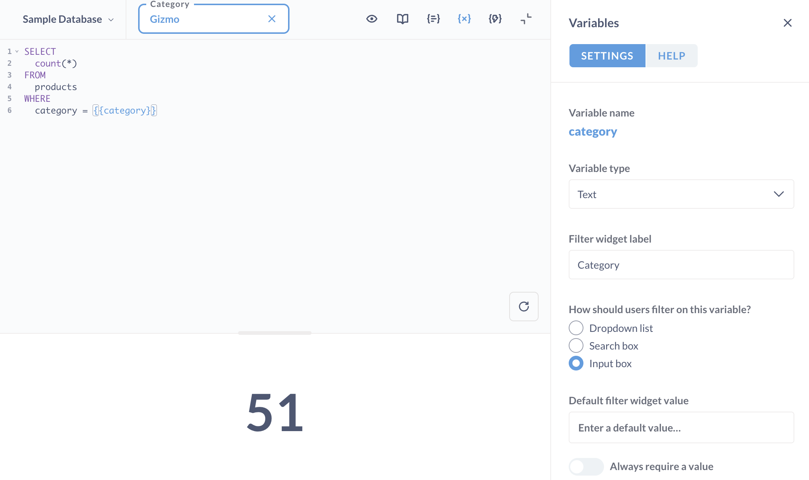

# SQL-Parameter


Sie können SQL-Vorlagen erstellen, indem Sie Variablen zu Ihren SQL-Abfragen im [Native/SQL-Editor][sql-editor] hinzufügen. Diese Variablen erstellen Filter-Widgets, mit denen Sie den Wert der Variablen in der Abfrage ändern können. Sie können auch Parameter zur URL Ihrer Frage hinzufügen, um die Werte der Filter festzulegen, so dass beim Laden der Frage diese Werte in die Variablen eingefügt werden.





## Definieren von Variablen


Die Eingabe von `{{variable_name}}` in Ihrer nativen Abfrage erzeugt eine Variable namens `variabler_name`.


Feldfilter, eine spezielle Art von Filter, haben eine [leicht abweichende Syntax](#field-filter-syntax).


Dieses Beispiel definiert eine **Text** Variable mit dem Namen`Kategorie`:


```sql

SELECT
count(*)
FROM
produkte
WHERE
Kategorie = {{Kategorie}}

```


Metabase liest die Variable und fügt der Abfrage ein Filter-Widget hinzu, mit dem der in die Variable "cat" mit Anführungszeichen eingegebene Wert geändert werden kann. Wenn also jemand "Gizmo" in das Filter-Widget eingibt, würde die Abfrage, die Metabase ausführen würde, lauten


```sql
SELECT
count(*)
FROM
produkte
WHERE
Kategorie = 'Gizmo'
```


Wenn Sie eine native MongoDB-Abfrage schreiben, würde Ihre Abfrage in etwa so aussehen, wobei die Variable "cat" innerhalb der "match" -Klausel definiert wird.


```
[{ $match: { category: {{cat}} } }]
```


## SQL-Variablen setzen


Um eine SQL-Variable auf einen Wert zu setzen, können Sie entweder:


- Geben Sie einen Wert in das Filter-Widget ein und führen Sie die Frage erneut aus, oder
- Fügen Sie einen Parameter in die URL ein und laden Sie die Seite.


Um der URL einen Wert hinzuzufügen, folgen Sie dieser Syntax:


```
?variable_name=wert
```


Um zum Beispiel die Variable "{{cat}}" in einer Frage auf den Wert "Gizmo" zu setzen, würde Ihre URL etwa so aussehen:


```
https://metabase.example.com/question/42-eg-question?cat=Gizmo
```


Um mehrere Variablen zu setzen, trennen Sie die Parameter mit einem Ampersand(`&`):


```
https://metabase.example.com/question/42-eg-question?cat=Gizmo&maxprice=50
```


## SQL-Variablentypen


Wenn Sie eine Variable definieren, wird das Seitenfenster **Variablen** angezeigt. Sie können einen Typ für eine Variable festlegen, der die Art des Filter-Widgets ändert, das die Metabase anzeigt.


Es gibt vier Arten von Variablen:


-**Text**: ein einfaches Eingabefeld.
-**Zahl**: ein einfaches Eingabefeld.
-**Datum**: eine einfache Datumsauswahl. Wenn Sie eine aussagekräftigere Datumsauswahl wünschen, z. B. die Angabe eines Bereichs, sollten Sie einen Feldfilter verwenden.
- **[Feldfilter](#the-field-filter-variable-type)**: verschiedene Filter-Widgets, abhängig vom zugeordneten Feld.---
Titel: SQL-Parameter
redirect_from:
- /docs/latest/users-guide/13-sql-parameters 
---

# SQL-Parameter

Sie können SQL-Vorlagen erstellen, indem Sie Variablen zu Ihren SQL-Abfragen im [Native/SQL-Editor][sql-editor] hinzufügen. Diese Variablen erstellen Filter-Widgets, mit denen Sie den Wert der Variablen in der Abfrage ändern können. Sie können auch Parameter zur URL Ihrer Frage hinzufügen, um die Werte der Filter festzulegen, so dass beim Laden der Frage diese Werte in die Variablen eingefügt werden.


## Definieren von Variablen

Die Eingabe von `{{variable_name}}` in Ihrer nativen Abfrage erzeugt eine Variable namens `variabler_name`.

Feldfilter, eine spezielle Art von Filter, haben eine [leicht abweichende Syntax](#field-filter-syntax).

Dieses Beispiel definiert eine **Text** Variable mit dem Namen`Kategorie`:

```sql

SELECT
count(*)
FROM
produkte
WHERE
Kategorie = {{Kategorie}}

```

Metabase liest die Variable und fügt der Abfrage ein Filter-Widget hinzu, mit dem der in die Variable "cat" mit Anführungszeichen eingegebene Wert geändert werden kann. Wenn also jemand "Gizmo" in das Filter-Widget eingibt, würde die Abfrage, die Metabase ausführen würde, lauten

```sql
SELECT
count(*)
FROM
produkte
WHERE
Kategorie = 'Gizmo'
```

Wenn Sie eine native MongoDB-Abfrage schreiben, würde Ihre Abfrage in etwa so aussehen, wobei die Variable "cat" innerhalb der "match" -Klausel definiert wird.

```
[{ $match: { category: {{cat}} } }]
```

## SQL-Variablen setzen

Um eine SQL-Variable auf einen Wert zu setzen, können Sie entweder:

-  Geben Sie einen Wert in das Filter-Widget  ein und führen Sie die Frage erneut aus, oder
-  Fügen Sie einen Parameter in die URL ein und laden Sie die Seite.

Um der URL einen Wert hinzuzufügen, folgen Sie dieser Syntax:

```
?variable_name=wert
```

Um zum Beispiel die Variable "{{cat}}" in einer Frage auf den Wert "Gizmo" zu setzen, würde Ihre URL etwa so aussehen:

```
https://metabase.example.com/question/42-eg-question?cat=Gizmo
```

Um mehrere Variablen zu setzen, trennen Sie die Parameter mit einem Ampersand(`&`):

```
https://metabase.example.com/question/42-eg-question?cat=Gizmo&maxprice=50
```

## SQL-Variablentypen

Wenn Sie eine Variable definieren, wird das Seitenfenster **Variablen** angezeigt. Sie können einen Typ für eine Variable festlegen, der die Art des Filter-Widgets ändert, das die Metabase anzeigt.

Es gibt vier Arten von Variablen:

-**Text**: ein einfaches Eingabefeld.
-**Zahl**: ein einfaches Eingabefeld.
-**Datum**: eine einfache Datumsauswahl. Wenn Sie eine aussagekräftigere Datumsauswahl wünschen, z. B. die Angabe eines Bereichs, sollten Sie einen Feldfilter verwenden.
- **[Feldfilter](#the-field-filter-variable-type)**: verschiedene Filter-Widgets, abhängig vom zugeordneten Feld.

